# 反向传播算法是如何工作的

在上一章中我们学习了如何用梯度下降算法来学习神经网络的权值和biases。但是，在我们的解释中，依旧存在一个缺陷：我们并没有讨论如何计算代价函数的梯度。我的天！在本章中，我会介绍一个快速计算梯度的算法，亦即*反向传播*（*backpropagation*）算法。

反向传播算法发明于二十世纪七十年代，但其重要性并没有马上得到人们的认可，直到1986年，[David Rumelhart](http://en.wikipedia.org/wiki/David_Rumelhart)、[Geoffrey Hinton](http://www.cs.toronto.edu/~hinton/)和[Ronald Williams](http://en.wikipedia.org/wiki/Ronald_J._Williams)发表了的一篇[著名的论文](http://www.nature.com/nature/journal/v323/n6088/pdf/323533a0.pdf)。这篇论文所介绍的几种神经网络所使用的反向传播算法要比之前的方法快的多，从而使神经网络可以解决之前无法解决的问题。今天，反向传播算法已经成为神经网络学习的主要算法之一。

相比这本书的其他章节，本章包含了更多的数学内容。如果你对数学并不感兴趣的话，你可以直接忽略本章的内容，把反向传播当做一个黑盒的工具，而不需要去了解其中的细节。但是，为什么要花费时间去学习反向传播算法的具体内容呢？

原因，当然，是为了**理解**。反向传播算法的核心，是代价函数 $C$ 关于网络中的任何权值 $w$（或biases $b$）的偏导 $\partial C / \partial w$ 的表达式。这个表达式告诉我们，如果我们改变了权值或者biases，会以何种速率来影响代价。并且当表达式变得复杂的时候，它依旧保留有某种魅力，它的每一部分都有着自然的、直观的解释。而且反向传播不仅仅是一个快速学习的算法。它带给我们一种细节上的理解，当权值和biases改变的时候，是如何影响网络的全局行为。这值得我们花费时间去学习。

所以说，如果你想跳过本章的内容，这不会有什么大问题。如果你把反向传播算法当做一个黑盒的工具，也可以理解本书的剩余部分。当然，我有时候会提到本章的一些结论，你应当理解这些结论，即使你不打算阅读本章。
## 热身：一个快速的基于矩阵的方法去计算神经网络的输出

在介绍反向传播之前，让我们先来个小热身：一个快速的基于矩阵的算法去计算神经网络的输出。我们其实在上一章的末尾已经见过这个算法了，但我只是简单的介绍了一下，在这里我们仔细地重温这个算法。这个热身的另外一个目的是让你提前熟悉相关的数学符号。

让我们先从权值符号开始，用一种没有歧义的方法去表示网络中的权值。我们将使用 $w_{jk}^l$ 来表示连接第 $(l-1)$ 层的第 $k$ 个神经元和第 $l$ 层的第 $j$ 个神经元之间的权值。例如，下图中的 $w_{24}^3$，表示连接网络中第二层的第四个神经元和第三层中的第二个神经元之间的权值：

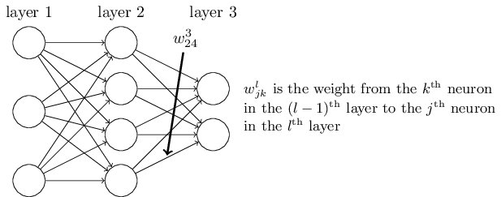

第一次看到这个符号，你也许会感到它很讨厌，需要一些时间去熟悉。但很快你就会觉得这个符号的表示其实是很简单、很自然的。这个符号的一个怪异之处在于 $j$ 和 $k$ 的顺序。你也许会认为如果让 $j$ 来表示输入神经元，让 $k$ 来表示输出神经元，显得更有意义些。我将会在下面解释这样做的原因。

我们将使用类似的符号去表示网络中的biases和激活（activations）。即用 $b_j^l$ 来表示第 $l$ 层的第 $j$ 个神经元的bias。以及用 $a_j^l$ 来表示第 $l$ 层的第 $j$ 个神经元的激活。如下图所示：

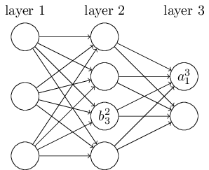

所以，第 $l$ 层的第 $j$ 个神经元的激活 $a_j^l$ 是由上一层的激活经过公式（即上一章中介绍的公式(4)及其相关讨论）得到的，即：
$$
a_j^l = \sigma (\sum_k w_{jk}^l a_k^{l-1} + b_j^l), \tag{23} 
$$
其中求和 $\sum_k$ 遍历了 $l-1$ 层中所有神经元 $k$。为了用矩阵形式重写这个公式，我们对每一层 $l$，定义了一个*权值矩阵*（*weight matrix*） $w^l$。权值矩阵 $w^l$ 的输入是 $l$ 层所有神经元的权值，也就是说，第 $j$ 行和第 $k$ 列表示的是 $w_{jk}^l$。相似地，对于每一层 $l$，我们定义一个*bias向量*（*bias vector*），$b^l$。你也许会好奇这是怎么做到的，其实bias向量中的每一个部分仅仅是 $b_j^l$ 的值。最后，我们定义一个激活向量 $a^l$，它是由激活 $a_j^l$ 构成的。

我们要做的最后一步是用矩阵的形式重写公式(23)，即对例如 $\sigma$ 这样的函数进行向量化。我们在上一章中简单地介绍过向量化，其原因是把函数 $\sigma$ 应用到向量 $v$ 中的每一部分。我们用一个明显的符号 $\sigma (v)$ 来表示这种元素对元素的操作。这也就是说，$\sigma (v)$ 的每一项就是 $\sigma (v)_j = \sigma (v_j)$。例如，对于函数 $f(x) = x^2$，函数 $f$ 的向量化形式拥有如下的效果：
$$
f \left( \left[ \begin{array}{c} 2 \\ 3 \end{array} \right] \right)
= \left [ \begin{array}{c} f(2) \\ f(3) \end{array} \right ]
= \left [ \begin{array}{c} 4 \\ 9 \end{array} \right ],
\tag{24}
$$
这也就是说，向量化的 $f$ 对于向量中的每一项都做了平方操作。

当理解了这些表示之后，公式(23)可以被改写为下面更好看更紧密的向量形式：
$$
a^l = \sigma (w^l a^{l-1} + b^l). \tag{25}
$$
这个表示带给我们一种更为全局理解，即某一层中的激活是如何联系到上一层中的激活的：我们简单地用权值矩阵乘以激活，然后加上bias向量，最后作为 $\sigma$ 函数*的输入。这种全局视角比神经元层面的视角更为简单也更为简洁（省略了很多下标！）。请把它当做一种忽略了烦人的下标，又保留了准确性的表示方法。在实际中，这种表示方法也十分有用，因为有很多的矩阵库提供了快速计算矩阵相乘、向量相加以及向量化等方法。事实上，上一章中的代码已经隐含地使用了这种表示方法。
> *所以说，这就是我们使用 $w_{jk}^l$ 这种奇怪的表示方法的原因。如果我们用 $j$ 来表示输入神经元，用 $k$ 来表示输出神经元，那么我们需要公式(25)中的权值矩阵进行转置操作。这个改变虽然很小，但很烦人，因为我们失去了下面这种说法其容易理解的简洁性：用权值矩阵乘以激活。（apply the weight matrix  to the activations）

当用公式(25)去计算 $a^l$ 的时候，我们计算了中间量 $z^l \equiv w^l a^{l-1} + b^l$，这个中间量非常有用：我们把 $z^l$ 叫做 $l$ 层神经元的*加权输入*（*weighted input*）。我们将在之后的章节中看到 $z^l$ 不可替代的重要作用。公式(25)有时候也写为这样的形式：$a^l = \sigma (z^l)$。$z^l$ 由 $z_j^l = \sum_k w_{jk}^l a_k^{l-1} + b_j^l$ 组成，也就是说，$z_j^l$ 是第 $l$ 层第 $j$ 个神经元的激活函数的加权输入。
## 关于代价函数的两个假设
反向传播的目的是，对于网络中任意的权值 $w$ 或bias $b$，计算代价函数 $C$ 的偏导 $\partial C / \partial w$ 和 $\partial C / \partial b$。对于反向传播，我们需要对代价函数的形式作出两个主要的假设。在介绍这两个假设之前，我们先介绍一个代价函数作为例子。我们将使用上一章中（参照公式(6)）定义的二次代价函数。让我们利用上一节中定义的符号，重写这个代价函数：
$$
C = \frac {1}{2n} \sum_x ||y(x) - a^L(x)||^2, \tag{26}
$$
其中，$n$ 是训练样本的个数；求和 $\sum_x$ 遍历了所有的训练样本 $x$；$y = y(x)$ 是相应的期望输出；$L$ 表示网络中的层数；当网络的输入是 $x$ 时，$a^L = a^L(x)$ 是激活输出向量。

那么，这两个假设到底是什么呢？我们需要的第一个假设是，代价函数可以被写为 $C = \frac {1}{n} \sum_x C_x$。如果代价函数是二次代价函数，那么对于单个训练样本来说，其代价为 $C_x = \frac {1}{2} ||y - a^L||^2$。这个假设对于本书中介绍的其他代价函数都适用。

我们需要这个假设的原因是，反向传播实际上计算的是每一个独立训练样本的偏导 $\partial C_x / \partial w$ 和 $\partial C_x / \partial b$。我们然后用这些偏导的平均值来还原 $\partial C / \partial w$ 和 $\partial C / \partial b$。然后，我们就可以假定训练样本 $x$ 被固定，从而丢弃下标 $x$，把代价 $C_x$ 写为 $C$。我们最终会把 $x$ 放回来，但目前来说，它只是一个符号上的累赘，暂时先隐藏掉吧。

第二个假设是，代价可以被写为神经网络输出的一个函数：

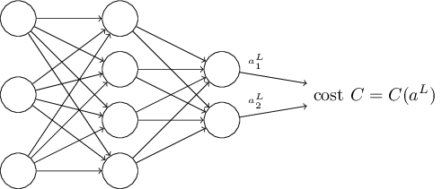

例如，二次代价函数便满足这个假设的要求，对于单个训练样本 $x$，其二次代价可以被写为：
$$
C = \frac {1}{2} ||y - a^L||^2 = \frac {1}{2} \sum_j (y_j - a_j^L)^2, \tag{27}
$$
从而，使其变为输出激活的一个函数。当然，这个代价函数还依赖于期望的输出 $y$，你也许会好奇，为什么我们不把代价看做是 $y$ 的函数。请记住，因为输入的训练样本 $x$ 是固定的，所以其输出 $y$ 也是一个固定的参数。特别地，这并不是一个我们改变权值或biases就可以修改的东西，也就是说，这并不是神经网络可以学习的东西。所以我们说，$C$ 只是输出激活 $a^L$ 的函数，而 $y$ 仅仅是一个帮助我们定义函数的参数。

## 阿达玛积
反向传播算法基于各种常见的线性代数操作，亦即向量相加、用矩阵乘以向量等。但是有一个操作并不常见。特别地，设想 $s$ 和 $t$ 是拥有相同维度的两个向量。我们将使用 $s \odot t$ 来表示两个向量的*元素对元素*（*elementwise*）的积。因此，$s \odot t$ 由 $(s \odot t)_j = s_j t_j$ 构成。下面展示一个例子：
$$
\left [ \begin{array}{c} 1 \\ 2 \end{array} \right ] 
\odot 
\left [ \begin{array}{c} 3 \\ 4 \end{array} \right ] = 
\left [ \begin{array}{c} 1*3 \\ 2*4 \end{array} \right ] = 
\left [ \begin{array}{c} 3 \\ 8 \end{array} \right ]. \tag{28}
$$
这种元素对元素地乘法有时候被叫做*阿达玛积*（*Hadamard product*）或者*舒尔积*（*schur product*）。本书中我将称其为阿达玛积，它在反向传播算法中非常有用。
## 反向传播背后的四个基础公式
反向传播是去理解改变权值和biases给代价函数所带来的影响。这最终体现在计算偏导 $\partial C / \partial w_{jk}^l$ 和 $\partial C / \partial b_j^l$。但在计算它们之前，我们先介绍一个中间量，$\delta_j^l$，我们称其为第 $l$ 层的第 $j$ 个神经元的*误差*（error）。反向传播将首先计算误差 $\delta_j^l$，然后将其与偏导联系起来。

为了理解误差是如何定义的，想象我们的神经网络中有一个恶魔：

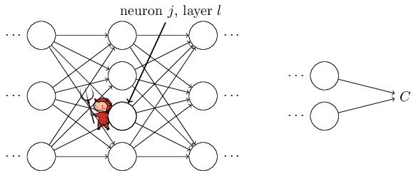

这个恶魔坐在第 $l$ 层的第 $j$ 个神经元上。当输入到达这个神经元，这个恶魔扰乱了神经元的操作。它对神经元的加权输入造成了一个影响 $\Delta z_j^l$。所以这个神经元真实的输出其实是 $\sigma (z_j^l + \Delta z_j^l)$。这个改变传播到网络的其他层，最终对全局代价造成了影响，其值为 $\frac {\partial C}{\partial z_j^l} \Delta z_j^l$。

现在，这个恶魔被招安了，变成一个好恶魔，并且试着去帮助你提升代价，也就是说，它们试着去找到一个合适的 $\Delta z_j^l$，从而让代价更小。设想当 $\frac {\partial C}{\partial z_j^l}$ 是一个很大的值的时候（正负均可），恶魔可以给 $\frac {\partial C}{\partial z_j^l}$ 加上一个相反的值 $\Delta z_j^l$，从而让代价变小一点。相反，如果 $\frac {\partial C}{\partial z_j^l}$ 是一个接近零的值，这个恶魔就不能通过改变加权输入 $z_j^l$ 来让代价获得很大的提升。这也意味着，此时这个神经元已经很接近最优了*。所以在某种意义上说，$\frac {\partial C}{\partial z_j^l}$ 是一个衡量神经元误差的手段。
> *当然，这只是对于一个很小的改变 $\Delta z_j^l$ 来说的。我们假定这个恶魔被限制只能做出很小很小的扰动。

受这个故事的启发，我们定义第 $l$ 层的第 $j$ 个神经元的误差 $\delta_j^l$ 为
$$
\delta_j^l \equiv \frac {\partial C}{\partial z_j^l}. \tag{29}
$$
我们用 $\delta^l$ 来表示第 $l$ 层的误差向量。反向传播将会计算每一层的误差 $\delta^l$，然后把它跟我们真正感兴趣的偏导 $\partial C / \partial w_{jk}^l$ 和 $\partial C / \partial b_j^l$ 联系起来。

你也许会好奇为什么恶魔改变的是加权输入 $z_j^l$ 而不是输出激活 $a_j^l$，因为那样的话，$\frac {\partial C}{\partial z_j^l}$ 将表示误差。事实上，这样表示的话，对结果并没有什么影响，但在表示上显得更为复杂，所以我们依旧用 $\delta_l = \frac {\partial C}{\partial z_j^l}$ 作为我们误差*的度量。
> *在像MNIST这样的分类问题上，“误差”有时候用来表示分类失败率。例如，如果网络的准确度为96.0%，那么其误差就是4.0%。显然，这个表示跟我们的 $\delta$ 向量有着很大的不同。在实际中，你表示误差的时候不应该含有歧义。

**作战计划：**反向传播算法基于四个基础的公式。这些公式告诉我们如何去计算误差 $\delta^l$ 以及代价函数的梯度。我将在下面描述这四个公式。但得提前告诉你，不应该期望马上就可以理解消化这些公式。这样的期望通常会带来失望。事实上，反向传播算法的公式有着很深的内涵，你需要耐心和时间去理解它们。但好消息是，你的耐心将会得到成倍的回报。所以，本节的内容仅仅是一个开始，为了理解这些公式你还需要付出很多的努力。

让我们先预习一下本章随后将会介绍的内容：我会对这些公式给出一个简短地证明；然后我们会用伪代码（pseudocode）的形式来重写这些公式，然后试着把它们写为Python代码；在本章的最后，我们会总结反向传播算法公式的意义，以及它们是如何被发明的。在这个过程中，我们会反复地利用到四个基础公式，在你深入了解这些公式之后，你也许会发现这些公式美丽、自然的一面。

**一个有关输出层误差 $\delta^L$ 的公式：**$\delta^L$ 由如下部分组成：
$$
\delta_j^L = \frac {\partial C}{\partial a_j^L} \sigma ' (z_j^L). \tag{BP1}
$$
这是一个非常自然的表示。等式右边的第一项，$\partial C / \partial a_j^L$，仅仅衡量了对于第 $j$ 个输出激活的函数，其代价变化的有多快。也就是说，$C$ 并不极度依赖于某个特定的输出神经元，然后 $\delta_j^L$ 将会变为一个很小的值，也就是我们所期望的。等式右边的第二项，$\sigma '(z_j^L)$，衡量了激活函数 $\sigma$ 在 $z_j^L$ 处变化的速度。

公式(BP1)中的所有内容都很容易计算。特别是，我们在计算网络的行为的时候同时计算了 $z_j^L$，从它计算出 $\sigma'(z_j^L)$ 是非常简单的。偏导 $\partial C / \partial a_j^L$ 的确切形式，取决于代价函数的形式。如果给定代价函数，那么计算 $\partial C / \partial a_j^L$ 将会变得容易一些。例如，如果我们使用二次代价函数，$C = \frac {1}{2} \sum_j (y_j - a_j^L)^2$，则 $\partial C / \partial a_j^L = (a_j^L - y_j)$， 显然是容易计算的。

公式(BP1)是 $\delta^L$ 的一个分量形式。它是一个非常好的表示，但并不是我们所期望的基于矩阵的形式。当然，把它写为基于矩阵的形式并不困难：
$$
\delta^L = \nabla_a C \odot \sigma' (z^L). \tag{BP1a}
$$
在这里，$\nabla_a C$ 被定义为一个由偏导 $\partial C / \partial a_j^L$ 组成的向量。你可以把 $\nabla_a C$ 看做是一种对于输出激活，衡量其 $C$ 的变化率的表示。很容易看出，公式(BP1a)和公式(BP1)是等价的，并且从现在开始，我们将用(BP1)来表示这两个公式，因为它们是可以互换的。例如，对于二次代价函数，我们有 $\nabla_a C = (a^L - y)$，所以完整的基于矩阵形式的公式(BP1)将表示为
$$
\delta^L = (a^L - y) \odot \sigma' (z^L). \tag{30}
$$
正如你所看到的，这个表示里的每一个部分都有一个漂亮的向量形式，并且可以容易地用例如`Numpy`这样的程序库来计算。

**一个有关误差 $\delta^l$ 及下一层误差 $\delta^{l+1}$ 的公式：**
$$
\delta^l = ((w^{l+1})^T \delta^{l+1}) \odot \sigma' (z^l), \tag{BP2}
$$
其中 $(w^{l+1})^T$ 是第 $(l+1)$ 层的权值矩阵 $w^{l+1}$ 的转置。这个公式看起来很复杂，但是每一部分都有着很好的可解释性。设想我们知道第 $l+1$ 层的误差 $\delta^{l+1}$。当我们对它乘以转置后的权值矩阵 $(w^{l+1})^T$ 的时候，我们可以把这个操作认为是，把误差*反向*传给网络，这给了我们一种度量第 $l$ 层输出误差的方式。然后我们将其与 $\sigma' (z^l)$ 做阿达玛积。这个操作可以认为是把误差反向移动给第 $l$ 层的激活函数，从而得到第 $l$ 层加权输入的误差 $\delta^l$。

利用公式(BP1)和(BP2)，我们就可以计算网络中任何一层的误差 $\delta^l$。我们首先用公式(BP1)计算 $\delta^L$，然后再用公式(BP2)计算 $\delta^{L-1}$，再用公式(BP2)计算 $\delta^{L-2}$，如此反复，最终传播到整个网络。

**一个有关对于网络中任意bias的代价的变化率的公式：**
$$
\frac {\partial C}{\partial b_j^l} = \delta_j^l. \tag{BP3}
$$
这也就是说，误差 $\delta_j^l$ 等于变化率 $\partial C / \partial b_j^l$。这是一个好消息，当公式(BP1)和(BP2)告诉我们如何去计算 $\delta_j^l$ 的时候，我们可以把公式(BP3)简写为
$$
\frac {\partial C}{\partial b} = \delta, \tag{31}
$$
也就是说 $\delta$ 和 $b$ 是在相同神经元上进行估计的。

**一个有关对于网络中任意权值的代价的变化率的公式：**
$$
\frac {\partial C}{\partial w_{jk}^l} = a_k^{l-1} \delta_j^l. \tag{BP4}
$$
这个公式告诉我们如何在已知 $\delta^l$ 和 $a^{l-1}$ 的情况下计算偏导 $\partial C / \partial w_{jk}^l$。这个公式也可以被写为：
$$
\frac {\partial C}{\partial w} = a_{in} \delta_{out}, \tag{32}
$$
其中 $a_{in}$ 是对于权值 $w$ 神经元输入的激活，$\delta_{out}$ 是对于权值 $w$ 神经元输出的误差。让我们把目光集中在权值 $w$ 及与其相关的两个神经元上：

公式(32)告诉我们，当激活 $a_{in} \approx 0$ 是一个很小的值的时候，梯度项 $\partial C / \partial w$ 也将会很小。也就是说，在这种情况下，权值*更新的很慢*，在梯度下降的时候它没有变化很多。换句话说，公式(BP4)告诉我们，当神经元的激活很小的时候，权值将更新的很慢。

当然，从公式(BP1)到(BP4)，我们还有不同的解释。让我们从输出层开始。思考公式(BP1)中的 $\sigma' (z_j^L)$ 项。我们从上一章中定义的sigmoid函数的形式知道，当 $\sigma (z_j^L)$ 接近于 $0$ 或 $1$ 的时候，$\sigma$ 函数将变得非常平，也就是说 $\sigma' (z_j^L) \approx 0$。也就是说，当输出神经元的不论是低激活（$\approx 0$）还是高激活（$\approx 1$），网络中最后一层的权值都将更新的很慢。在这种情况下，我们一般说输出神经元达到了*饱和*（*saturated*）状态，其权值已经停止更新（或者说更新的很慢）。这个解释也适用于输出层的biases。

这个结论对于网络中的其他层也适用。让我们考虑公式(BP2)中的 $\sigma' (z^l)$ 项。这意味着，当神经元接近饱和态的时候，$\delta_j^l$ 也将变得很小。亦即，任何进入到饱和神经元的加权输入都将会更新的很慢*。
> *这个结论不适用于当 $(w^{l+1})^T$ 足够大到可以补偿小 $\sigma' (z_j^l)$ 的时候。但一般来说是适用的。

总的来说，当输入神经元处于低激活，或者输出神经元到达饱和状态的时候，其权值将会更新的很慢。

这些公式可以帮助我们理解当神经网络学习的时候到底发生了什么。这四个基础公式适用于任何激活函数，而不仅仅是标准的sigmoid函数（你会看到，在待会介绍的公式的证明里，并没有用到任何特定的 $\sigma$ 函数）。所以我们可以利用这些公式去*设计*那些拥有我们想要的特性的激活函数。设想我们去选择一个（非sigmoid）激活函数 $\sigma$，它的导数 $\sigma'$ 永远是正数，而且永远不会接近于零。这可以预防传统的sigmoid神经元饱和之后带来的学习速度慢的问题。随后我们将介绍拥有这种特性的激活函数。请记住这四个公式，它们有着很大的作用。

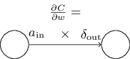


<h4>难题</h4>

- **替换反向传播公式**：我用阿达玛积的形式表示了公式(BP1)和(BP2)。如果不使用阿达玛积呢？这里有一种替换的方式，基于传统的矩阵相乘，也许有的读者会喜欢这种形式。

  1. 证明公式(BP1)可以被写为
  $$
  \delta^L = \sum' (z^L) \nabla_a C, \tag{33}
  $$
  其中 $\sum' (z^L)$ 是一个方阵，对角线的值为 $\sigma' (z_j^L)$，其余值为零。
  2. 证明公式(BP2)可以被重写为
  $$
  \delta^l = \sum' (z^l)(w^{l+1})^T \delta^{l+1}. \tag{34}
  $$
  3. 基于上述两个证明，证明
  $$
  \delta^l = \sum' (z^l)(w^{l+1})^T \dots \sum' (z^{L-1})(w^L) \sum' (z^L) \nabla_a C \tag{35}
  $$
  对于熟悉矩阵相乘的读者来说，这些公式也许会更容易理解。我特别关注于公式(BP1)和(BP2)是因为这样的数学表示在应用它们的时候将会更快。

## 四个基础公式的证明（选读）
我们现在去证明这四个基础公式。所有的公式都受到多元微积分的链式法则的影响。如果你对链式法则还算OK的话，我强烈建议你在读本节之前自己先推导一下。

让我们从公式(BP1)开始，它给了输出误差 $\delta^L$ 的一种表示。为了证明这个公式，让我们重温下面这个定义：
$$
\delta_j^L = \frac {\partial C}{\partial z_j^L}. \tag{36}
$$
如果应用链式法则，我们可以把输出激活加入到公式里：
$$
\delta_j^L = \sum_k \frac {\partial C}{\partial a_k^L} \frac {\partial a_k^L}{\partial a_j^L}, \tag{37}
$$
其中求和 $\sum_k$ 遍历了所有的输出层神经元 $k$。当然，对于第 $k$ 个神经元，其输出激活 $a_k^L$ 只依赖于当 $k = j$ 时的第 $j$ 个神经元的加权输入 $z_j^L$。当 $k \ne j$ 时，$\partial a_k^L / \partial z_j^L$ 将会消失。作为结果，我们可以简化前述的公式
$$
\delta_j^L = \frac {\partial C}{\partial a_j^L} \frac {\partial a_j^L}{\partial z_j^L}. \tag{38}
$$
由于 $a_j^L = \sigma (z_j^L)$，等式右边的第二项可以写为 $\sigma' (z_j^L)$，所以公式变为
$$
\delta_j^L = \frac {\partial C}{\partial a_j^L} \sigma' (z_j^L) , \tag{39}
$$
亦即我们的公式(BP1)。

接下来，让我们证明公式(BP2)，它是一个有关误差 $\delta^l$ 和误差 $\delta^{l+1}$ 的表示。为了做到这一点，我们希望用 $\delta_k^{l+1} = \partial C / \partial \delta_k^{l+1}$ 来重写 $\delta_j^l = \partial C / \partial z_j^l$。我们可以利用链式法则：
$$
\begin{aligned}
\delta_j^l &= \frac {\partial C}{\partial z_j^l}  \\
&= \sum_k \frac {\partial C}{\partial z_k^{l+1}} \frac {\partial z_k^{l+1}}{\partial z_j^l} \\
&= \sum_k \frac {\partial z_k^{l+1}}{\partial z_j^l} \delta_k^{l+1},
\end{aligned}
\tag{40, 41, 42}
$$
在最后一行中我们交换了等式右边两项的顺序，并且把 $\partial C / \partial z_k^{l+1}$ 替换为 $\delta_k^{l+1}$。为了估计最后一行的第一项，我们有：
$$
z_k^{l+1} = \sum_j w_{kj}^{l+1} a_j^l + b_k^{l+1} = \sum_j w_{kj}^{l+1} \sigma (z_j^l) + b_k^{l+1}. \tag{43}
$$
作为区分，我们有：
$$
\frac {\partial z_k^{l+1}}{\partial z_j^l} = w_{kj}^{l+1} \sigma' (z_j^l). \tag{44}
$$
将其带入公式(42)，得到：
$$
\delta_j^l = \sum_k w_{kj}^{l+1} \delta_k^{l+1} \sigma' (z_j^l). \tag{45}
$$
得证。

最后两个需要证明的公式为(BP3)和(BP4)。证明它们也需要用到相似的链式法则。我不再证明它们，而是留给你们当做习题。
<h4>习题</h4>

- 证明公式(BP3)和(BP4)。

到此我们结束了对反向传播的四个基础公式的证明。证明也许看起来有些复杂，但它们确实仅仅只是应用了链式法则之后的结果。我们可以认为反向传播算法是一种运用多元微积分的链式法则来计算代价函数的梯度的方法。这就是反向传播算法！剩下的就只有一些细节了。

## 反向传播算法
反向传播算法给了我们一种计算代价函数梯度的方法。让我们用算法的方式把它写下来：
1. **Input $x$:** 对输入层设置相应的激活 $a^1$。
2. **Feedforward:** 对于每一层 $l = 2, 3, \dots, L$，计算 $z^l = w^l a^{l-1} + b^l$ 以及 $a^l = \sigma (z^l)$。
3. **Output error $\delta^L$:** 计算向量 $\delta^l = \nabla_a C \odot \sigma' (z^L)$。
4. **Backpropagate the error:** 对于每一层 $l = L-1, L-2, \dots, 2$，计算 $\delta^l = ((w^{l+1})^T \delta^{l+1}) \odot \sigma' (z^l)$。
5. **Output:** 代价函数的梯度为 $\frac {\partial C}{\partial w_{jk}^l} = a_k^{l-1} \delta_j^l \text{ and } \frac {\partial C}{\partial b_j^l} = \delta_j^l$。

至此，你应该明白为什么这个算法被称为 *反向传播算法* 了。我们从最后一层开始，向后计算误差向量 $\delta^l$。也许向后计算看起来很奇怪。但是请你仔细想想反向传播算法的证明，反向传播是因为代价是网络的输出的函数。为了理解代价函数是如何变化的，我们需要重复地利用链式法则，反向传播到每一层，从而获得有用的表达。

<h4>习题</h4>

- **对一个修改过的神经元做反向传播**
  设想我们对一个前馈网络中的神经元进行了修改，从而使这个神经元的输出由 $f(\sum_j w_j x_j + b)$ 给出，其中 $f$ 是某个不同于sigmoid的函数。在这种情况下，我们该如何修改反向传播算法？
- **对线性的神经元做反向传播**
  设想我们替换了网络中常用的非线性 $\sigma$ 函数为 $\sigma (z) = z$。在这种情况下，请重写反向传播算法。

就像我前面所说的那样，反向传播算法可以对每一个训练样本的代价函数计算其梯度，$C = C_x$。在实际中，我们通常把随机梯度下降算法和反向传播算法结合起来，所以我们一次对多个训练样本计算其梯度。例如，对于一个拥有 $m$ 个训练样本的mini-batch，下面的算法将梯度下降算法应用在mini-batch上：
1. **输入一系列训练样本**
2. **对于每一个训练样本 $x$：** 设置相应的输入激活 $a^{x,1}$，然后执行下面的步骤：
   - **前馈：** 对于每一层 $l = 2, 3, \dots, L$，计算 $z^{x,l} = w^l a^{x,l-1} + b^l$ 和 $a^{x, l} = \sigma (z^{x, l})$。
   - **输出误差 $\delta^{x, L}$：** 计算向量 $\delta^{x, L} = \nabla_a C_x \odot \sigma' (z^{x, L})$。
   - **反向传播误差：** 对于每一层 $l = L-1, L-2, \dots, 2$， 计算 $\delta^{x, l} = ((w^{l+1})^T \delta^{x, l+1}) \odot \sigma' (z^{x, l})$
3. **梯度下降：** 对于每一层 $l = L, L-1, \dots, 2$，依据规则 $w^l \rarr w^l - \frac {\eta}{m} \sum_x \delta^{x, l} (a^{x, l-1})^T$ 更新其权值，依据规则 $b^l \rarr b^l - \frac {\eta}{m} \sum_x \delta^{x, l}$ 更新其biases。

当然，为了应用随机梯度下降，你还需要一个遍历训练集的外部循环，去生成mini-batch，以及一个控制训练epochs的外部循环。为了简洁性，我省略了这一部分。

## 反向传播算法的代码
***
在宏观的角度上理解了反向传播之后，让我们来理解上一章中用过的反向传播算法的代码。其代码包含在`Network`类的`update_mini_batch`方法和`backprop`方法里。这些方法的代码由我们刚刚介绍的算法直接翻译而来。例如，`update_mini_batch`方法可以通过计算当前`mini_batch`的梯度，从而更新`Network`的权值和biases：
```python
class Network(object):
...
    def update_mini_batch(self, mini_batch, eta):
        """Update the network's weights and biases by applying
        gradient descent using backpropagation to a single mini batch.
        The "mini_batch" is a list of tuples "(x, y)", and "eta"
        is the learning rate."""
        nabla_b = [np.zeros(b.shape) for b in self.biases]
        nabla_w = [np.zeros(w.shape) for w in self.weights]
        for x, y in mini_batch:
            delta_nabla_b, delta_nabla_w = self.backprop(x, y)
            nabla_b = [nb+dnb for nb, dnb in zip(nabla_b, delta_nabla_b)]
            nabla_w = [nw+dnw for nw, dnw in zip(nabla_w, delta_nabla_w)]
        self.weights = [w-(eta/len(mini_batch))*nw 
                        for w, nw in zip(self.weights, nabla_w)]
        self.biases = [b-(eta/len(mini_batch))*nb 
                       for b, nb in zip(self.biases, nabla_b)]
```
大多数的工作由这行代码完成：`delta_nabla_b, delta_nabla_w = self.backprop(x, y)`，它使用`backprop`方法来计算偏导 $\partial C_x / \partial b_j^l$ 和 $\partial C_x / \partial w_{jk}^l$。`backprop`方法和我们上一节中介绍的算法很像，但还有一个小细节不同，我们用一个稍微不同的方式去索引网络的层。这个改变是利用了Python的一个特征，即用复数作为指标来索引列表的末尾，例如，`1[-3]`是列表`1`的倒数第三项。`backprop`的代码如下，还有一些辅助性的函数，用来计算 $\sigma$ 函数，以及它的导数 $\sigma'$ 和代价函数的导数。你应该可以自己理解这些代码的含义。如果你感觉困扰的话，不妨去看看[完整代码](https://mp.csdn.net/mdeditor/85056983#%E5%AE%9E%E7%8E%B0%E6%88%91%E4%BB%AC%E7%94%A8%E6%9D%A5%E5%88%86%E7%B1%BB%E6%95%B0%E5%AD%97%E7%9A%84%E7%BD%91%E7%BB%9C)。
```python
class Network(object):
...
   def backprop(self, x, y):
        """Return a tuple "(nabla_b, nabla_w)" representing the
        gradient for the cost function C_x.  "nabla_b" and
        "nabla_w" are layer-by-layer lists of numpy arrays, similar
        to "self.biases" and "self.weights"."""
        nabla_b = [np.zeros(b.shape) for b in self.biases]
        nabla_w = [np.zeros(w.shape) for w in self.weights]
        # feedforward
        activation = x
        activations = [x] # list to store all the activations, layer by layer
        zs = [] # list to store all the z vectors, layer by layer
        for b, w in zip(self.biases, self.weights):
            z = np.dot(w, activation)+b
            zs.append(z)
            activation = sigmoid(z)
            activations.append(activation)
        # backward pass
        delta = self.cost_derivative(activations[-1], y) * \
            sigmoid_prime(zs[-1])
        nabla_b[-1] = delta
        nabla_w[-1] = np.dot(delta, activations[-2].transpose())
        # Note that the variable l in the loop below is used a little
        # differently to the notation in Chapter 2 of the book.  Here,
        # l = 1 means the last layer of neurons, l = 2 is the
        # second-last layer, and so on.  It's a renumbering of the
        # scheme in the book, used here to take advantage of the fact
        # that Python can use negative indices in lists.
        for l in xrange(2, self.num_layers):
            z = zs[-l]
            sp = sigmoid_prime(z)
            delta = np.dot(self.weights[-l+1].transpose(), delta) * sp
            nabla_b[-l] = delta
            nabla_w[-l] = np.dot(delta, activations[-l-1].transpose())
        return (nabla_b, nabla_w)

...

    def cost_derivative(self, output_activations, y):
        """Return the vector of partial derivatives \partial C_x /
        \partial a for the output activations."""
        return (output_activations-y) 

def sigmoid(z):
    """The sigmoid function."""
    return 1.0/(1.0+np.exp(-z))

def sigmoid_prime(z):
    """Derivative of the sigmoid function."""
    return sigmoid(z)*(1-sigmoid(z))
```
<h4>难题</h4>

- **完整的基于矩阵和mini-batch的反向传播算法**
  我们的随机梯度下降算法用mini-batch的方式遍历了训练样本。我们可以修改反向传播算法，从而使其可以一次性地计算一个mini-batch中所有的训练样本的梯度。即我们不是从单个输入向量 $x$ 开始，而是从一个矩阵 $X = [x_1 x_2 \dots x_m]$ 开始，矩阵的列即是mini-batch中的向量。我们前向地将其乘以权值矩阵，然后加上一个适合的bias矩阵，最后应用到sigmoid函数上。然后我们用相似的方式进行反向传播。请显式地用伪代码写出基于这种方法的反向传播算法。修改`network.py`从而使其使用这种完全基于矩阵的方法。使用这种方法的优点是，我们可以完整地利用现代程序库对于线性代数操作的强大支持，从而大大提升程序执行的速度。（在我的笔记本上，速度提升大约是两倍。）在实际中，大多数的反向传播代码都使用这种基于矩阵的方式，或者其变种。

## 在何种意义上说反向传播是一个很快的算法
***
为什么说反向传播是一个很快的算法？为了回答这个问题，让我们考虑另外一种计算梯度的方法。想象在神经网络研究的早期，大约是五十年代或六十年代，而你是第一个发明用梯度下降算法的人！但是为了让这个想法变为现实，你需要一个计算代价函数的梯度的方法。你回想了一些微积分的知识，然后呢，就觉得很沮丧（-_-）。所以你试着去找到另外一种方法。你打算把代价视为是权值的一个函数 $C = C(w)$ （我们待会讨论biases）。你用 $w_1, w_2, \dots$来表示权值，对于某个特定的权值 $w_j$，你想去计算 $\partial C / \partial w_j$。一种比较明显的方法是使用近似值：
$$
\frac {\partial C}{\partial w_j} \approx \frac {C(w + \epsilon e_j) - C(w)}{\epsilon}, \tag{46}
$$
当 $\epsilon > 0$ 是一个很小的正数的时候，$e_j$ 是 $j$ 方向的单位向量。也就是说，我们可以通过两个稍微不同的 $w_j$ 来计算代价 $C$，从而估计 $\partial C / \partial w_j$，最终应用到公式(46)中。类似的想法可以帮助我们计算 $\partial C / \partial b$。

这个方法看起来很有希望。它在概念上很简单，也很容易去实现，仅仅用了几行代码。看起来比用链式法则计算梯度可靠多了！

不幸的是，虽然它看起来很靠谱，但实际上它慢的要死。为什么呢？设想我们的网络中有一百万个权值。然后对于每一个权值 $w_j$，为了得到 $\partial C / \partial W_j$，我们需要先计算 $C(w + \epsilon e_j)$。这意味着为了计算梯度，我们需要对代价函数计算一百万次，需要一百万次对网络的前向传播（每个样本）。对于计算 $C(w)$ 也是一样的。

而反向传播算法的聪明之处在于，它允许我们在网络的一次前向传播中，同时计算*所有*的偏导值 $\partial C / \partial w_j$，然后一次反向传播到整个网络。大致来说，前向和反向所消耗的计算资源是一样的*。所以反向传播的总消耗大致与两次前向通过网络的消耗相同。相比于公式(46)中介绍的方法，我们的反向传播算法虽然看起来超级复杂，但实际上要快得多得多。
> *这个看起来似乎没什么问题，但需要一个更严谨的分析来做出表述。前向传播时，主要的计算消耗是乘以权值矩阵，反向传播时，需要乘以一个转置后的权值矩阵。所以这两个操作明显拥有相似的计算消耗。

这个快速的方法在1986年开始受到人们的重视，并且极大地扩展了神经网络可以解决的问题的范畴。从而刺激了更多的人来使用和研究神经网络。当然，反向传播算法并不是万能药。即使在八十年代的后期，神经网络的使用还是受到了当时计算机性能的限制，尤其是用反向传播来训练深层神经网络的时候。本书随后还会介绍现代计算机以及某些聪明的想法如何去加速深层神经网络的训练。

## 反向传播：全貌
***
正如我所说的，反向传播算法还有两个奥秘。第一个，算法到底做了什么事情？我们仔细地研究了误差是如何从输出中反向传播的。但是我们能不能更深入一些，从矩阵和向量的乘法的角度上，考虑反向传播算法到底做了什么事情？第二个奥秘是什么呢？（译者注：哼哼，恕我翻译不能，请忽略第二个奥秘，全是废话。）

为了证明算法到底是如何工作的，让我们想象对网络中某个权值 $w_{jk}$ 进行了一个细微的改变 $\Delta w_{jk}^l$：

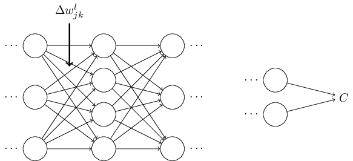

权值的改变将会造成其相应神经元的输出激活 $a_j^l$ 的改变：

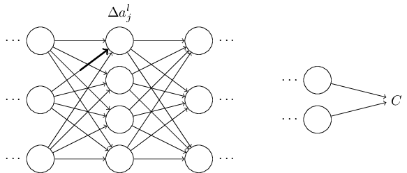

从而，这个改变将会对下一层中*所有的*激活造成影响：

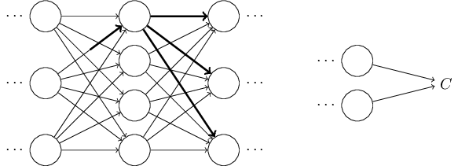

这些改变同样地会对下一层造成影响，然后再下一层，如此传播到随后整个网络，直到最后一层，最终影响了代价函数：

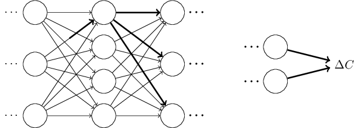

由公式知，这个代价的改变 $\Delta C$ 与权值的改变 $\Delta w_{jk}^l$ 相关：
$$
\Delta C \approx \frac {\partial C}{\partial w_{jk}^l} \Delta_{jk}^l. \tag{47}
$$
这说明了一种计算 $\frac {\partial C}{\partial w_{jk}^l}$ 的可能的方法，即小心地跟踪对于权值的改变 $\Delta w_{jk}^l$ 是如何传播，并最终对 $C$ 造成影响。如果我们这样做，小心地用容易计算的数值去表示这一过程中所有的事情，然后我们也许可以计算出 $\partial C / \partial w_{jk}^l$。

让我们来试试。权值的改变 $\Delta w_{jk}^l$ 对第 $l$ 层的第 $j$ 个神经元的激活造成了影响 $\Delta a_j^l$。这个变化由公式(48)给出：
$$
\Delta a_j^l \approx \frac {\partial a_j^l}{\partial w_{jk}^l} \Delta w_{jk}^l. \tag{48}
$$
对激活的改变 $\Delta a_j^l$ 会对下一层 $(l+1)$ 中*所有的*激活造成影响。让我们仅仅跟踪这些被影响的激活中的一个，例如 $a_q^{l+1}$：

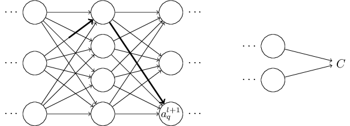

事实上，它会造成下面的影响：
$$
\Delta a_q^{l+1} \approx \frac {\partial a_q^{l+1}}{\partial a_j^l} \Delta a_j^l. \tag{49}
$$
将公式(48)带入，我们得到：
$$
\Delta a_q^{l+1} \approx \frac {\partial a_q^{l+1}}{\partial a_j^l} \frac {\partial a_j^l}{\partial w_{jk}^l} \Delta w_{jk}^l. \tag{50}
$$
显然，$\Delta a_q^{l+1}$ 的改变，将会对下一层中的激活造成影响。事实上，我们可以想象出从 $w_{jk}^l$ 到 $C$ 的所有路径，每一个激活中的改变，影响了下一个激活，如此反复，最终，对输出的代价造成影响。如果这个路径类似于 $a_j^l, a_q^{l+1}, \dots, a_n^{L-1}, a_m^L$，那么最终的表示为：
$$
\Delta C \approx \frac{\partial C}{\partial a^L_m} 
  \frac{\partial a^L_m}{\partial a^{L-1}_n}
  \frac{\partial a^{L-1}_n}{\partial a^{L-2}_p} \ldots
  \frac{\partial a^{l+1}_q}{\partial a^l_j}
  \frac{\partial a^l_j}{\partial w^l_{jk}} \Delta w^l_{jk}, \tag{51}
$$
这就是说，我们对经过的每一个神经元选出一个型为 $\partial a / \partial a$ 的项，就像最后一层，我们选出 $\partial C / \partial a_m^L$。这意味着 $C$ 的改变来自于这个贯穿网络的特定路径的激活的改变。当然，这里有着许多路径，它们都可以通过改变权值 $w_{jk}^l$，进而传播，最终对代价造成影响。我们在这里只考虑一条路径的情况。为了计算对 $C$ 的总的改变，我们应该对位于权值和最终代价之间的所有路径进行求和，亦即：
$$
\Delta C \approx \sum_{mnp \dots q} \frac {\partial C}{\partial a_m^L}
\frac {\partial a_m^L}{\partial a_n^{l-1}}
\frac {\partial a_n^{l-1}}{\partial a_p^{l-2}}
\dots
\frac {\partial a_q^{l+1}}{\partial a_j^l}
\frac {\partial a_j^l}{\partial w_{jk}^l}
\Delta w_{jk}^l, \tag{52}
$$
我们会对所有的可能路径的神经元进行求和。与公式(47)相比，我们得到：
$$
\frac {\partial C}{\partial w_{jk}^l} = 
\sum_{mnp \dots q} \frac {\partial C}{\partial a_m^L}
\frac {\partial a_m^L}{\partial a_n^{l-1}}
\frac {\partial a_n^{l-1}}{\partial a_p^{l-2}}
\dots
\frac {\partial a_q^{l+1}}{\partial a_j^l}
\frac {\partial a_j^l}{\partial w_{jk}^l}. \tag{53}
$$
公式(53)看起来很复杂。其实它有一个很直观的解释。我们计算 $C$ 对于网络权值的变化率。公式告诉我们，网络中每一条连接两个神经元的边，与一个神经元激活的偏导对于另外一个神经元激活的偏导的费率因子（rate factor）有关。来自于第一个权值对第一个神经元的边拥有费率因子 $\partial a_j^l / \partial w_{jk}^l$。一条路径的费率因子来自于这条路径上所有的费率因子的积。而所有的改变率 $\partial C / \partial w_{jk}^l$ 来自于从初始权值到最终代价之间的所有路径的费率因子的和。下图描述了对于单条路径的这个过程：

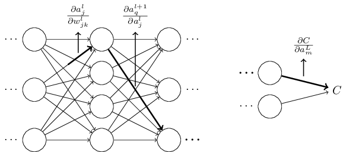
到现在为止，我所描述的都是一种启发式的观点，一种当你改变了网络中某个权值之后，可能会发生的事情。让我指出一个指引你理解这个观点的方向。第一，你可以从公式(53)中获得对于所有独立偏导的显式表达（需要一些微积分的知识）。然后，你可以试着去把所有的遍历下标的表示改写为矩阵相乘的表示。这个过程看起来很繁琐，并且需要一些耐心，但也并不是非常困难。然后，把所有的一切都尽可能地化简，你会发现，你最终得到的正是反向传播算法！从而你可以认为，反向传播算法是，提供了一种方法，让我们可以计算，所有的路径上的费率因子的和。或者，换种想法，反向传播算法提供给我们一种聪明的方式去跟踪一个权值（或者biases）的微小改变，这个改变传播到整个网络，到达输出，最终影响了代价。

就讲到这里为止。如果要去探索所有的细节的话，那将显得非常凌乱，以及需要我们极大的耐心。如果你想要一个挑战的话，那试试吧，也许你会乐于其中。如果不想的话，也没关系，这种程度的理解，已经很好的解释了反向传播算法到底完成了什么样的事情。

（译者又注：哼哼，感觉如何，是不是翻译的不咋样？~~那不能怪我啊，因为原文写的就不咋地！~~ ）
***
**Next:**

**[第三章 提升神经网络学习的效果](https://blog.csdn.net/xovee/article/details/85378694)**