# 提升神经网络学习的效果
当一个人刚开始学习高尔夫球的时候，他花费的大多数时间是在练习挥动球杆的基础技巧。当基本功扎实以后，再去练习其他的技巧。与之相似，到目前为止，我们关注于反向传播算法。它既是我们的“基本功”，是神经网络学习的基础。在本章中，我会介绍更多提升反向传播算法性能的技巧，从而最终提高神经网络学习的效果。

这些技巧包括：更好的代价函数，亦即*交叉熵代价函数*（*cross-entropy*）；四种*正则化方法*（*regularization methods*），包括L1和L2正则化、dropout以及人工扩充训练数据，它们可以帮助我们学到相对于训练数据，更为一般化地特征；一种更好的初始化网络权值的方法；一系列更好的选择模型超参数的启发式方法。我还会简要的介绍一些其他技巧。上述介绍的技巧大多数都是相当独立的，你可以只阅读你所感兴趣的技巧。我们最终会把这些技巧实现为代码，从而提升第一章中识别手写数字问题的结果。

当然，除了这些技巧，神经网络中的技巧还多的是。让我们在众多的技巧中，先深入地学习那些最重要、最实用的技巧。掌握这些技巧不仅可以帮你优化或解决当下的问题，还可以帮助你发现和理解当使用神经网络的时候，会出现什么样的问题。掌握了这些技巧以后，上手其他技巧就容易多了。

## 交叉熵代价函数
我们都不喜欢出错。我第一次学习钢琴，没几天，就对着一名观众进行了一次演奏。我非常紧张，在开始的时候，把一个八度音弹的很低。我感到非常迷惑，以至于不能继续弹下去，直到有人纠正了我的错误。我感到非常非常的尴尬。虽然非常不高兴，但之后我迅速纠正了我的错误。相反，如果错误难以确认，那么我们肯定会学习的很慢。

在理论上来说，我们希望神经网络可以在错误中不断地进行快速学习。实际上是这样吗？为了回答这个问题，让我们设计一个示例。这个例子里只有一个神经元，它只有一个输入：


我们会训练这个神经元去做一个非常简单的事情：如果输入 $1$ 的话，那就输出 $0$。当然，这个任务简直太简单了，我们不需要任何算法，就可以轻松地选择出合适的权值以及bias。当然，我们仍旧使用梯度下降来学习权值和bias。现在来看看神经元到底是如何学习的。

为了定义的更加明确，我将网络的初始权值设置为 $0.6$，初始bias设置为 $0.9$。这两个值并没有什么特殊的含义，你可以选择其他的任何值。神经元的初始输出将是 $0.9$，为了得到想要的输出 $0.0$，我们还有很长的路要走。点击下面的“Run”按钮，去看看神经元是如何学习，从而最终输出 $0$ 的。需要注意的是，这并不是一个提前定义的动画，你的浏览器将会实时计算梯度，然后利用梯度去更新权值和bias，最终展示结果。（译者注：CSDN还不能嵌入H5的Canvas，以及JavaScript代码，所以不能在这里展示啦！我将会用动态图Gif代替，有需要的读者请点击[这里](http://neuralnetworksanddeeplearning.com/chap3.html#the_cross-entropy_cost_function)去原网站观看动画！）学习率设置为 $\eta = 0.15$，这是一个相对低的值，让我们有足够的时间去观察，但也足以在几秒钟的时间内得到一个满意的结果。代价为我们在第一章中介绍过的二次代价函数，$C$。我待会会展示函数的具体形式，所以现在先别回去看定义啦！你可以多次点击“Run”去多次运行这个动画。

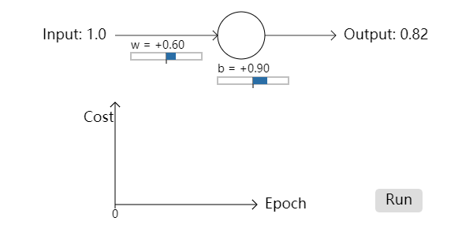

正如你所看到的，神经元迅速地学习了权值和bias，让代价变的非常低，其输出大约为 $0.09$。这虽然不是我们想要的 $0.0$，但也足够好了。如果我们把初始权值和初始bias均设置为 $2.0$，这种情况下初始输出为非常差的 $0.98$。让我们看看这种情况下，神经元是如何进行学习的：


虽然这种情况下，学习率依旧为 $0.15$，但在学习的初始阶段，其速度非常慢。事实上，在前150轮（即epoch），网络的权值和biases基本没有太大的变化。不过随后代价迅速下降，神经元的输出接近于 $0.0$。

相比于人类学习，这种现象看起来非常奇怪。当我们做的非常错误的时候，纠正的过程应该很快。对于我们这个人工神经元来说，一开始它输出的是 $0.98$，非常的差，但是似乎此时它在学习的时候遇到了困难，比错误很小的时候困难的多。事实上，这个问题并不局限于这个例子，它会在很多的更为普遍的网络中出现。那么，为什么学习的这么慢呢？我们能不能找到一种方法来避免？

为了理解这个问题的本质，考虑我们的神经元，它通过改变权值和biases来学习，而改变的速度取决于代价函数的偏导，$\partial C / \partial w$ 和 $\partial C / \partial b$。所以说，“学习的慢”这句话等价于“这些偏导很小”。所以问题变为为什么这些偏导的值很小。为了理解这个问题，让我们来计算偏导。我们此时使用的是二次代价函数，即公式(6)：
$$
C(w, b) \equiv \frac 1{2n} \sum_x ||y(x) - a||^2 \tag{6}
$$
在本例中，即为：
$$
C = \frac {(y - a)^2}{2}, \tag{54}
$$
其中 $a$ 为当输入为 $x = 1$ 时神经元的输出，$y = 0$ 为网络的期望输出。为了用权值和bias的形式将其写的更为明确，我们定义 $a = \sigma(z)$，其中 $z = wx + b$。运用链式法则对权值和bias进行区分，我们得到：
$$
\begin{aligned}
  \frac {\partial C}{\partial w} &= (a - y) \sigma' (z) x = a\sigma' (z) \\
  \frac {\partial C}{\partial b} &= (a - y) \sigma' (z) = a \sigma' (z), 
\end{aligned}
\tag{55, 56}
$$
最右边的式子是用 $x = 1$ 和 $y = 0$ 代入得到。为了理解这些表达式的行为，让我们观察 $\sigma' (z)$ 项。$\sigma$ 函数的形状如下图所示：


由图可知，当神经元的输出接近于 $1$ 的时候，曲线将会变得水平，所以其导数 $\sigma' (z)$ 的值会非常小。由公式(55)和(56)我们知道，$\partial C / \partial w$ 和 $\partial C / \partial b$ 也将会很小。这便是刚开始训练的时候，学习速度非常慢的原因。这个问题不仅仅出现在本例之中，在更为一般地神经网络中也会经常出现。

### 介绍交叉熵代价函数
我们该如何对付学习缓慢这个问题呢？事实证明，如果我们把二次代价替换为另外一个知名的代价函数，交叉熵代价函数，这个问题就迎刃而解了。为了理解什么是交叉熵，让我们换一个示例。设想我们将要训练一个拥有多个输入 $x_1, x_2, \dots$ 的神经元，其对应的权值为 $w_1, w_2, \dots$，以及一个bias $b$：


这个神经元的输出为，$a = \sigma (z)$，其中 $z = \sum_j w_j x_j + b$ 是所有输入的加权和。对于这个神经元，我们定义其交叉熵代价函数为：
$$
C = - \frac 1{n} \sum_x [y \ln a + (1-y) \ln (1-a) ], \tag{57}
$$
其中 $n$ 为训练数据的数量，$\sum_x$ 遍历所有的训练输入 $x$，$y$ 为对应的期望输出。

公式(57)是如何解决学习慢的问题呢？事实上，它看起来都不像一个代价函数！在对付学习慢的问题之前，让我们先来看看交叉熵为什么可以被视为代价函数。

交叉熵有两个特性，可以合理地将其解释为代价函数。
第一，它是非负的，即 $C > 0$。为了说明这一点，请看：（1）公式(57)之中求和号之后的所有单独项都是负的，因为它们的对数值都处于 $0$ 到 $1$ 之间；（2）在公式的前面有一个负号。

第二，如果神经元对于所有的训练输入 $x$，其实际输出都接近于期望输出，那么，交叉熵将会接近于零*。为了说明这一点，设想对于某个输入 $x$，有 $y = 0$ 和 $a \approx 0$。这个例子说明了这个神经元的输出很好。我们看到，当 $y = 0$ 时，公式(57)的第一项为 $0$，第二项 $- \ln (1-a) \approx 0$。当 $y = 1$ 以及 $a \approx 1$ 的时候，情况也是相似的。所以当实际输出接近于期望输出的时候，其对代价的贡献是很小的。
> *为了证明这一点，我将假设所有的期望输出 $y$ 均为 $0$ 或 $1$。在解决分类问题的时候，这是一种常见的情况，例如在计算布尔函数的时候。如果我们不做这个假设，该如何理解呢？详见本节最后的习题。

所以，总的来说，交叉熵为正数，并且当神经元的效果较好的时候（即对于所有的训练输入 $x$，其输出接近于期望输出 $y$），它的值将趋向于零。这些特性正是代价函数所需要的。其实，二次代价也符合这些特性。交叉熵代价函数相对于二次代价函数来说还有一个优点，它避免了学习缓慢的问题。为了说明这一点，让我们从权值的角度来计算交叉熵代价的偏导。我们将 $a = \sigma (z)$ 代入公式(57)，连续运用两次链式法则，得到：
$$
\begin{aligned}
  \frac {\partial C}{\partial w_j} &= - \frac 1{n} \sum_x \left (\frac {y}{\sigma (z)} - \frac {(1-y)}{1-\sigma (z)} \right ) \frac {\partial \sigma}{\partial w_j} \\
  &= - \frac 1{n} \sum_x \left ( \frac y{\sigma (z)} - \frac {(1-y)}{1-\sigma (z)} \right ) \sigma' (z) x_j. 
\end{aligned}
\tag {58, 59}
$$
将括号内的两式合并，得到：
$$
\frac {\partial C}{\partial w_j} = \frac 1{n} \sum_x \frac {\sigma' (z) x_j}{\sigma (z) (1-\sigma (z))} (\sigma (z) - y). \tag {60}
$$
如果使用sigmoid函数，$\sigma (z) = 1 / (1 + e^{-z})$，我们可以得到 $\sigma' (z)  = \sigma (z) (1 - \sigma (z))$。我们可以看到上面公式中的 $\sigma' (z)$ 项和 $\sigma (z) (1 - \sigma (z))$ 相互消掉了，从而简化公式为：
$$
\frac {\partial C}{\partial w_j} = \frac 1{n} \sum_x x_j (\sigma (z) - y). \tag {61}
$$
这是一个漂亮的公式，它告诉我们，权值学习的速度取决于 $\sigma (z) - y$，也就是说，取决于输出的误差。误差越大，学习越快。这正是我们所需要的！特别的，它避免了学习缓慢的问题。当我们使用交叉熵的时候，$\sigma' (z)$ 项不复存在，我们也就不必担心其值变小了。这正是交叉熵代价函数的特殊属性。

相似地，我们可以计算代价对于bias的偏导。我不会写出所有的细节，但你应该可以轻松得到下面的结果：
$$
\frac {\partial C}{\partial b} = \frac 1{n} \sum_x (\sigma (z) - y). \tag {62}
$$
相同的，它避免了公式(56)中二次代价函数的 $\sigma' (z)$ 项所引起的学习缓慢的问题。

<h4>习题</h4>

- 验证 $\sigma' (z) = \sigma (z) (1 - \sigma (z))$

让我们回到本节的第一个例子中，试试看把代价函数替换为交叉熵代价函数会发生什么。作为对比，我们使用的设置与上一次相同，即初始权值为 $0.6$，初始bias为 $0.9$。点击按钮“Run”看看发生了什么：（译者注：点击“[Xovee很帅](http://neuralnetworksanddeeplearning.com/chap3.html#exercise_35813)”回到原网页看看发生了什么）

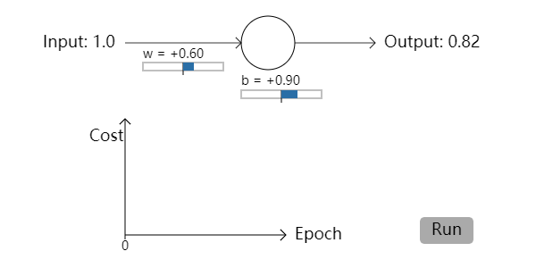

在这个例子中，如我们所预期，神经元学习的非常完美。现在，让我们把初始权值和bias调整为 $2.0$，看看学习效果如何：

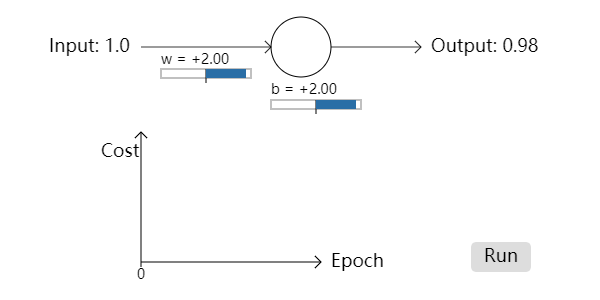

成功！正如我们所希望的，这一次神经元学习的非常快。如果你再观察的仔细些，你会发现，相比于二次代价函数，在这一次学习的初始阶段，其代价曲线的斜率更大，代价下降的更快。这正是交叉熵代价函数的优点，让我们避免在开始学习的时候陷入停滞，使学习过程变得更快。

在刚才的例子中，我并没有指明学习率的大小。早先使用二次代价的时候，学习率设置为 $\eta = 0.15$。在本例中，我们是不是应该使用同样的学习率？事实上，在改变了代价函数之后，我们并不能准确地说是否使用相同的学习率；这就像是比较苹果和橘子一样。对于不同的代价函数，我会用实验的方法来寻找一个合适的学习率。如果你还感到困惑的话，真相是：我使用了 $\eta = 0.005$ 的学习率。

你也许会反对，如果学习率改变了，那么刚才的对比实验就没有意义。但是，当我们的学习率是任意给出的时候，谁会在乎神经元学习的到底有多快？！这个反对意见并没有抓住问题的本质。问题的本质并不在于绝对的学习速度，而在于学习**变化**的速度。尤其是，相比于神经元的输出接近于正确输出的阶段，我们的二次代价函数在一开始误差还比较大的时候，其学习*更慢*；而交叉熵避免了这一缺点。上面的陈述的条件与学习率无关。

我们已经在单个的神经元上学习了交叉熵。当然，将其扩展到多个神经元多层网络中是非常容易的。设想，$y = y_1, y_2, \dots$ 是输出层神经元的期望输出，而 $a_1^L, a_2^L, \dots$ 是真实的输出值。然后我们定义交叉熵为：
$$
C = - \frac 1{n} \sum_x \sum_j \left [ y_j \ln a_j^L + (1 - y_j) \ln (1 - a_j^L) \right ]. \tag {63}
$$
它与公式(57)非常相似，除了多出的 $\sum_j$，它对所有的输出神经元进行了求和。我并不会进行显示的推导，不过使用公式(63)确实可以在很多的神经网络中避免学习缓慢的问题。如果你感兴趣的话，你可以对下面的问题进行推导。

此外，“交叉熵”这个词会让有些读者感到困惑，至少它表面上看起来和其他方法不很相似。特别的，我们可以用两个概率分布 $p_j$ 和 $q_j$ 去定义交叉熵，即 $\sum_j p_j \ln q_j$。如果我们把单个sigmoid神经元看作是其输出一个与神经元的激活 $a$ 以及 $1 - a$ 相一致的概率分布的话，则这个定义将与公式(57)建立起某种联系。

但是，当我们在最后一层拥有很多sigmoid神经元的时候，激活向量 $a_j^L$ 并不总是来自于一个概率分布。因此，形如 $\sum_j p_j \ln q_j$ 这样的定义甚至没有意义，因为我们并不是在和概率分布打交道。相反，你可以把公式(63)当作一种单个神经元交叉熵的集合，而每个神经元的激活则被解释为二元概率分布的一部分*。在这种视角下，公式(63)被看作是概率分布的交叉熵的概括。
> *当然，在我们的网络中并没有概率元素，所以它们并不是真的概率。

那么，我们应该在什么情况下使用交叉熵，而不是二次代价呢？事实上，如果输出神经元是sigmoid的话，交叉熵几乎是所有情况下的更好选择。为了理解其中的原因，设想我们在初始化网络的权值和biases的时候，一般都是随机初始化的。而这种随机初始化，也许对于某些输入数据来说是非常差的。这也就是说，输出神经元将在 $1$ 附近饱和，而它应该是 $0$，反之亦然。这种情况下，我们使用二次代价的话会降低学习的速度。这并不会让学习整个地停止，因为权值会从其他的训练输入中不断地进行学习，但这显然不是我们想要的。

<h4>习题</h4>

- 一个人也许在刚接触交叉熵的时候会感到很困难，因为记住 $y$ 或 $a$ 的各种位置并不容易，$- [y \ln a + (1-y) \ln (1-a)]$ 和 $-[a \ln y + (1-a) \ln (1-y)]$ 哪个是正确的？当 $y = 0$ 或 $1$ 的时候，上面第二个表达式会发生什么？这个问题会与第一个表达式冲突吗？请解释为什么是，或者为什么不是。
- 在本章的开头，我们对单个神经元进行了讨论，我说对于所有的训练输入，当 $\sigma (z) \approx y$ 的时候，交叉熵的值会很小。这个陈述在 $y = 0$ 或 $1$ 的时候成立。在分类问题中，$y$ 通常符合这个要求，但在其他问题（例如回归问题，regression problems）中，$y$ 的值有时候会处于 $0$ 到 $1$ 之间。请证明此时交叉熵的值对于所有训练输入当 $\sigma (z) = y$ 的时候，仍旧是最小化的。在本例中交叉熵拥有如下值：
$$
C = - \frac 1{n} \sum_x \left [ y \ln y + (1 - y) \ln (1 - y) \right ]. \tag {64}
$$
其中分量 $-[y\ln y + (1-y) \ln (1-y)]$ 有时候又被称为[二元熵](http://en.wikipedia.org/wiki/Binary_entropy_function)（*binary entropy*）（译者注：中文翻译不很统一，敬请谅解。）。
<h4>难题</h4>

- **多层多神经元网络**
  如上章所介绍的，输出层中，权值对于二次代价的偏导为：
  $$
  \frac {\partial C}{\partial w_{jk}^L} = \frac 1{n} \sum_x a_k^{L-1} (a_j^L - y_j) \sigma' (z_j^L). \tag {65}
  $$
  当输出神经元在错误的值附近饱和的话，$\sigma' (z_j^L)$ 项将会造成学习缓慢。证明对于交叉熵代价，对于单个训练样本 $x$ 的输出误差 $\delta^L$ 为
  $$
  \delta^L = a^L - y. \tag {66}
  $$
  用这个表达式证明，输出层代价对于权值的偏导为：
  $$
  \frac {\partial C}{\partial w_{jk}^L} = \frac 1{n} \sum_x a_k^{L-1} (a_j^L - y_j). \tag {67}
  $$
  $\sigma' (z_j^L)$ 项被抵消了，所以交叉熵避免了学习缓慢的问题。结论对于biases也适用。如果你想证明一下，o(￣ヘ￣o＃)，请便！
- **当我们在输出层使用线性神经元的时候，应用二次代价函数**
  设想我们有一个多层多神经元网络，其中输出层的所有神经元都是*线性神经元*（*linear neurons*），即神经元没有sigmoid激活函数，其输出是简单的 $a_j^L = z_j^L$。证明当我们使用二次代价函数的时候，对于每一个训练样本 $x$，其输出误差 $\delta^L$ 为
  $$
  \delta^L = a^L - y \tag {68}
  $$
  与之前的问题相似，用这个表达式去证明，输出层中代价对于权值和biases的偏导分别为
  $$
  \begin{aligned}
    \frac {\partial C}{\partial w_{jk}^L} &= \frac 1{n} \sum_x a_k^{L-1} (a_j^L - y_j) \\
    \frac {\partial C}{\partial b_j^L} &= \frac 1{n} \sum_x (a_j^L - y_j).
  \end{aligned} \tag {69, 70}
  $$
  这证明了当输出层的神经元为线性神经元的时候，二次代价函数并不会引起任何学习缓慢的问题。所以在这种情况下，二次代价函数，是一种合适的代价函数。
### 使用交叉熵去分类MNIST数字
我们的程序使用了梯度下降算法和反向传播算法，在其中实现交叉熵是非常容易的。相对于之前的分类手写数字的程序`network.py`，我们随后将开发一个改进的版本。这个新版本叫做`network2.py`，其中不仅仅包括交叉熵，还有一些其他的技巧（代码可以在[GitHub](https://github.com/mnielsen/neural-networks-and-deep-learning/blob/master/src/network2.py)上找到）。现在，让我们看看新程序在分类MNIST数字上的表现。类似于第一章的例子，我们使用的网络包含30个隐藏神经元，mini-batch的大小为10，学习率设置为 $\mu = 0.5$*，总共训练30个epochs。`network2.py`的接口与`network.py`有一些小小的不同，但看起来应该还是比较明确的。你可以在Python Shell中用类似`help(network2.Network.SGD`的命令来获取关于`network2.py`程序的接口文档。
> *在第一章中，我们使用二次代价函数，学习率设置为 $\mu = 3.0$。正如前面所讨论的，如果代价函数发生了改变，去准确地说出是否使用“相同”的学习率是不可能的。对于不同的代价函数，应该用实验的方法去寻找最佳的学习率。
> 这里有一个比较粗糙的方法，把交叉熵和二次代价的学习率联系起来。正如我们前面讨论的，二次代价的梯度项中有一个额外的项 $\sigma' = \sigma (1 - \sigma)$，如果我们对 $\sigma$ 的值进行平均，$\int_0^1 d\sigma \sigma(1-\sigma) = 1/6$，我们将看到在相同的学习率下，二次代价比交叉熵（大约）慢6倍。这个估计远远的不够严谨，所以请不要严肃的对待它。不过，在选取初始值的时候，也许是一个不错的选择。

```python
>>> import mnist_loader
>>> training_data, validation_data, test_data = \
... mnist_loader.load_data_wrapper()
>>> import network2
>>> net = network2.Network([784, 30, 10], cost=network2.CrossEntropyCost)
>>> net.large_weight_initializer()
>>> net.SGD(training_data, 30, 10, 0.5, evaluation_data=test_data, 
... monitor_evaluation_accuracy=True)
```

本代码中，`net.large_weight_initializer()`命令和第一章中所描述的初始化权值和biases的方法是相同的。使用这个命令的原因是，随后我们将使用不同的初始化权值的方法。本例的最终结果大约是95.49%的准确度，与第一章中使用二次代价函数的结果95.42%非常接近。

让我们保持其他参数不变，使用100个隐藏神经元，其结果大约是96.82%。与第一章的96.59%相比，这是一个相对比较大的提升。这也许看起来只是一个很小的变化，但是错误率已经从3.41%降到了3.18%。这意味着相对于原始的错误率，我们已经降低了大约十四分之一，这是一个不小的提升了。

这意味着交叉熵代价相对于二次代价有着相似的甚至更好的表现。但这并不能证明交叉熵总是一个更好的选择。因为我们在超参数的选择上还不够完善。但这个初步的结果加强了我们之前对交叉熵的理论上的论断，即大多数情况下，交叉熵相比于二次代价是一个更好的选择。

我们还会开发更多的技巧，实现它们，并且得到“更好”的结果。这样的“提升”当然很好，但我们应当意识到，它有时候是不完善的，除非我们对所有的超参数进行了详细且完整的对比实验。这样的实验需要耗费很多的精力和时间，我们并不会总是这样做。所以，你应当记住，类似的实验缺少一种精确的证明，如果你的结论被推翻，请不要惊讶。

到现在为止，我们已经对交叉熵进行了比较详细的讨论。一般来说，它带来的提升并不多。待会我们会介绍另外一个技巧，正则化（regularization），它可以带来巨大的效果提升！那为什么要在交叉熵上花很多时间呢？因为交叉熵是一个广泛使用的代价函数，理解它是值得的。其实还有更重要的原因，即在神经网络中，神经元的饱和是一个非常重要的问题，一个我们会在整本书里不断讨论的问题。而交叉熵正是我们理解神经元饱和，解决神经元饱和的一个很好的开始。

### 交叉熵意味着什么？它从何而来？
我们对于交叉熵的讨论集中于代数分析和实际应用。这很有用，但遗漏了一些更为抽象的概念问题，例如：交叉熵到底意味着什么？有没有什么直观的方法去理解交叉熵？交叉熵是如何被发明的？

让我们从最后一个问题开始，到底是什么激励了我们去发明交叉熵？设想我们已经发现了学习缓慢的问题，并且发现问题是由公式(55)和(56)中的 $\sigma' (z)$ 项引起的。我们会自然而然地想到，可不可以用一种代价函数，使 $\sigma' (z)$ 项消失掉呢？在这种情况下，对于单个训练样本 $x$，代价 $C = C_x$ 满足：
$$
\begin{aligned}
  \frac {\partial C}{\partial w_j} &= x_j (a - y) \\
  \frac {\partial C}{\partial b} &= (a - y)
\end{aligned}
\tag {71, 72}
$$
如果我们能找到一种代价函数，满足上述式子，那么神经元的初始误差越大，它将学习的更快，即解决了学习缓慢的问题。从这些公式开始，让我们首先利用链式法则：
$$
\frac {\partial C}{\partial b}  = \frac {\partial C}{\partial a} \sigma' (z). \tag {73}
$$
把 $\sigma' (z) = \sigma (z) (1 - \sigma (z)) = a (1 - a)$ 带入公式，得到：
$$
\frac {\partial C}{\partial b}  = \frac {\partial C}{\partial a} a (1 - a). \tag {74}
$$
把公式(72)带入上式，我们有：
$$
\frac {\partial C}{\partial a} = \frac {a - y}{a (1 - a)}. \tag {75}
$$
将这个表达式对 $a$ 积分，得到：
$$
C = - [y \ln a + (1 - y) \ln (1 - a) ] + \text {constant}, \tag {76}
$$
这便是对于单个训练样本 $x$，其对代价的影响。为了得到完整的代价函数，我们对所有的训练数据求平均，得到：
$$
C = - \frac 1{n} \sum_x [y \ln a + (1 - y) \ln (1 - a) ] + \text {constant}, \tag {77}
$$
这里的常数是对所有单个训练样本的常数进行求和再平均。正如我们所看到的，公式(71)和(72)确定了交叉熵代价函数的形式。所以说，交叉熵并不是一种神秘的方法，而是一种简单的、自然的方法。

那么，交叉熵的直观含义是什么？我们该如何去理解它？详细的介绍这个问题并不值得。但是，有一点我们应该认识到，即交叉熵的概念来自于信息论（information theory）。粗略的说，交叉熵是一种衡量惊讶（surprise）的方法。例如，我们的神经元试着去计算 $x \rarr y = y(x)$，但实际上它计算的是 $x \rarr a = a(x)$，设想 $a$ 的含义是神经元认为 $y = 1$ 的概率，$1 - a$ 是神经元认为 $y = 0$ 的概率。而交叉熵衡量了，我们到底有多“惊讶”，当我们学习到了 $y$ 的真实值。即当实际输出等于期望输出的时候，我们不很“惊讶”，而实际输出偏离了期望输出的时候，我们将会非常“惊讶”。我还没有明确的说，“惊讶”代表着什么，上面的陈述似乎没什么意义。但事实上，“surprise”在信息论里有着精确的定义。不幸的是，我并没有在网上找到一个很好的资源去解释它。如果你想了解的更多的话，Wikipedia有一个[简单的总结](http://en.wikipedia.org/wiki/Cross_entropy#Motivation)也许可以帮助到你。其中一些细节你可以在[Cover and Thomas](http://books.google.ca/books?id=VWq5GG6ycxMC)所写的书的第五章的关于卡夫不等式的材料中找到。
<h4>难题</h4>

- 我们已经讨论了很多当使用二次代价函数，神经元饱和的时候可能导致的学习缓慢的问题。还有另外一个阻碍学习的因素，即公式(61)中的 $x_j$ 项，当输入 $x_j$ 趋向于零的时候，相应的权值 $w_j$ 会更新的很慢。请解释，为什么不能通过更换代价函数的方式，去消掉 $x_j$ 项。
### Softmax
在本章中，我将在大多数情况下使用交叉熵代价去解决学习缓慢问题。此外，我还想简单的介绍另外一种解决这个问题的方法，即神经元的*Softmax*层。在本章的随后部分，我们并不会真的使用Softmax层，所以如果你着急的话，你可以跳过本节。不过Softmax值得我们去学习一下，因为它真的非常有意思，而且在第六章中，我们将会使用它。

Softmax的想法是为我们的神经网络定义一种新的输出层。与sigmoid层相似，它从构造加权输入* $z_j^L = \sum_k w_{jk}^L a_k^{L-1} + b_j^L$ 开始。当然，我们并不会使用sigmoid函数来获得输出。相反，在softmax层中，我们用*Softmax函数*去处理 $z_j^L$。根据这个函数，第 $j$ 个神经元的激活 $a_j^L$ 为：
$$
a_j^L = \frac {e^{z_j^L}}{\sum_k e^{z_k^L}}, \tag {78}
$$
在分母部分，我们遍历了所有的输出神经元。
> *在描述softmax的时候，我们会频繁地用到上一章中介绍的数学符号。如果你有点忘记的话，可以去复习一下。

如果你还不熟悉softmax函数的话，公式(78)看起来不很直观。使用这个函数的理由并不明显，它是如何解决学习缓慢问题的呢？为了更好的理解公式(78)，设想我们的网络拥有四个输出神经元，以及四个相应的加权输入，表示为 $z_1^L, z_2^L, z_3^L, z_4^L$。下面展示的是可以移动的滑动条，表示加权输入的可能的值，以及对应的输出激活。你可以试着去增大 $z_4^L$ 的值，看看会发生什么：
（译者注：下面是我录制的Gif图片！CSDN不支持JavaScript！想看原网页的！请点击后面的链接！[Xovee非常帅！](http://neuralnetworksanddeeplearning.com/chap3.html#softmax)）

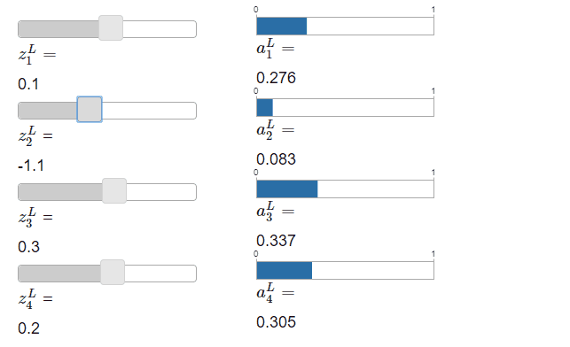

当你增加 $z_4^L$ 的时候，你会看到对应的 $a_4^L$ 的值增加了，但是其他输出激活的值都减少了。相似的，如果你减少 $z_4^L$ 的值，$a_4^L$ 也会减少，其他的输出激活会增加。事实上，如果你观察仔细的话，你会发现，其他所有激活的变化值正好拟补了 $a_4^L$ 的变化值。因为在本例中，输出激活的值的总和永远为 $1$。这一点我们可以用公式(78)和一些代数知识来证明：
$$
\sum_j a_j^L = \frac {\sum_j e^{z_j^L}}{\sum_k e^{z_k^L}} = 1. \tag {79}
$$
所以，$a_4^L$ 的增加值正好等于其他输出激活的减少值的和，从而保证所有输出激活的值的和为 $1$。除了 $a_4^L$，对其他激活也适用。

从公式(78)中我们可以看到，所有的输出激活都是正数，因为指数函数都为正。从而我们知道，softmax层的输出是一系列和为 $1$ 的正数。换句话说，softmax层的输出可以看做是一种概率分布。

输出是一种概率分布是一个很好的特性。我们可以把输出激活 $a_j^L$ 解释为，网络认为正确输出是 $j$ 的概率。对于很多问题，这个解释非常的实用。例如，在手写识别数字问题中，我们可以把 $a_j^L$ 解释为，网络认为这个数字为 $j$ 的概率。

如果输出层是sigmoid层的话，我们并不能认为激活是一种概率分布。我不会去证明这一点，sigmoid层的输出不会生成一种概率分布应该是显然易见的。sigmoid层的输出并没有一种简单的可解释性。

<h4>习题</h4>

- 构建一个简单的模型，证明网络使用sigmoid输出层的话，其输出激活 $a_j^L$ 的和并不总等于 $1$。

我们开始建立一种对softmax函数的直观感觉。回想我们刚刚做的：公式(78)中的指数部分保证了所有的输出激活都为正数。以及公式(78)中分母部分的和，保证了softmax输出的和为 $1$。所以，公式(78)看起来并不是很神秘了：而且还有一种自然的美感，让输出激活服从一种概率分布。你可以把softmax当做是一种调节 $z_j^L$ 的方法，从而使其服从于一种概率分布。

<h4>习题</h4>

- **Softmax的单调性**
  证明 $\partial a_j^L / \partial z_k^L$ 在 $j = k$ 的情况下为正数，$j \ne k$ 的情况下为负数。从而保证增加 $z_j^L$ 可以增加 $a_j^L$，并且使其他的输出激活减少。我们在滑动条那里经过了一些实验，但这是一个严谨的证明。
- **Softmax的非局部性**（**Non-locality**）
  sigmoid层的一个优点是，输出 $a_j^L$ 是对应的加权输入的函数，即 $a_j^L = \sigma (z_j^L)$。请解释为什么在softmax层中：任何一个输出激活 $a_j^L$ 取决于*所有的*加权输出。

<h4>难题</h4>

- **反转Softmax层**
  设想我们的网络拥有一个softmax输出层，激活 $a_j^L$ 已知，证明其对应的加权输入拥有如下的形式 $z_j^L = \ln a_j^L + C$，其中的常数 $C$ 独立于 $j$。


**学习缓慢问题**：我们现在对神经元的softmax层已经非常熟悉了，但是我们还没有看到softmax层是如何解决学习缓慢问题的。为了理解这一点，我们先定义一个*对数似然*代价函数（*log-likelihood* cost function），用 $x$ 来表示网络的训练输入，$y$ 表示网络的期望输出，从而对数似然代价定义为：
$$
C \equiv -\ln a_y^L. \tag {80}
$$
所以，如果我们对MNIST图片进行训练，输入的数字为 $7$ 的话，其对数似然代价为 $-\ln a_7^L$，这是一种直观的形式。设想我们的网络工作的很好，即它认为这个图片是 $7$。在这种情况下，它估计的概率 $a_7^L$ 的值将接近于1，从而代价 $- \ln a_7^L$ 将会很小。相反，如果网络做的不好的话，概率 $a_7^L$ 将会很小，从而代价 $- \ln a_7^L$ 将会很大。所以对数似然代价函数拥有我们想要的性质。

那么它又是如何解决学习缓慢问题的呢？为了说明这一点，让我们考虑学习缓慢问题的关键，即 $\partial C / \partial w_{jk}^L$ 和 $\partial C / \partial b_j^L$。我并不会从导数方面进行分析，而是引出下面这个问题*：
$$
\begin{aligned}
  \frac {\partial C}{\partial b_j^L} &= a_j^L - y_j \\
  \frac {\partial C}{\partial w_{jk}^L} &= a_k^{L-1} (a_j^L - y_j)
\end{aligned}
\tag {81, 82}
$$
> *在这里，$y$ 与我们之前使用的 $y$ 有一些不同。在上一段我们用 $y$ 来表示网络的期望输出，即对于数字 $7$ 我们实际输出 “$7$”。但是在这里，$y$ 表示输出激活向量，这个向量表示 $7$，即除了第七位为 $1$ 以外，其他位均为 $0$。

这些公式与我们在分析交叉熵时分析的公式很像。例如，公式(82)与公式(67)非常相似。正如我们之前所讨论的，这些公式可以让我们避免学习缓慢问题。事实上，对数似然代价加softmax输出层，与交叉熵代价加sigmoid输出层有着很多共同点。

基于这种相似性，我们到底该使用交叉熵加sigmoid输出层呢，还是使用对数似然加softmax输出层？事实上，在很多情况下，两种方法都工作的很好。	在本章的随后部分，我们将使用交叉熵代价和sigmoid输出层。在第六章，我们有时候会使用对数似然代价和softmax输出层。做这种改变的原因是让我们的网络与某些重要的学术论文中使用的网络相似。作为一种更一般的原则，如果你希望把输出激活当做一种概率，那么对数似然加softmax是值得使用的。
<h4>难题</h4>

- 推导公式(81)和公式(82)
- **“Softmax”这个名字从何而来？**
  如果我们改变softmax函数，从而使输出激活为：
  $$
  a_j^L = \frac {e^{cz_j^L}}{\sum_k e^{cz_k^L}}, \tag {83}
  $$
  其中 $c$ 是一个正数。如果 $c = 1$，该公式即是标准的softmax函数。如果使用不同的 $c$，我们将获得不同的函数。证明在这种情况下，输出激活依旧服从一种概率分布，就像通常的softmax一样。假如我们允许 $c$ 是一个很大的数，也就是说 $c \rarr \infin$。输出激活 $a_j^L$ 的极限值为多少？在解决这几个问题之后，你应该就能理解，为什么在 $c = 1$ 的情况下，该函数被当做是最大化函数的“柔化（softened）”版本。这便是“softmax”这个名字的由来。
- **使用softmax和对数似然代价的反向传播算法**
  在上一章中我们证明了使用sigmoid层的反向传播算法。为了将其推广到softmax层，我们需要对输出层的误差 $\delta_j^L \equiv \partial C / \partial z_j^L$ 定义一个表达式。证明这个合适的表达式为：
  $$
  \delta_j^L = a_j^L - y_j. \tag {84}
  $$
  使用这个表达式，我们可以把反向传播算发推广到softmax输出层和对数似然代价。

## 过拟合和正则化

曾获得过诺贝尔物理学奖的科学家Enrico Fermi有一次被问到他对一些学者提出的一种解决某个重要的物理学问题的数学模型有何意见。这个模型的实验效果非常好，但是Fermi有些怀疑，于是他问到，这个模型有几个自由参数（free parameters）？提问者回答：“四个。”Fermi说：“我记得我的朋友Johnny von Neumann曾经说过，如果有四个参数，我可以让一个人拟合一个大象，如果有五个，我可以让他挥动鼻子。”
> *这个典故来自于[Freeman Dyson](http://www.nature.com/nature/journal/v427/n6972/full/427297a.html)的一篇有趣的文章，他是flawed model的发明者之一。四个参数大象的相关故事你可以在[这里](http://www.johndcook.com/blog/2011/06/21/how-to-fit-an-elephant/)找到。

这个故事告诉我们，如果一个模型有着很多的自由参数，那么它可以描述任何现象。这是说，就算一个模型在已有的数据上表现的很好，但这并不能证明它是一个好的模型，也就是说它并不能抓住现象的本质。这样的模型在已有的数据上表现的很好，但是如果有新的场景出现，它也许就会表现的很差。一个真正好的模型，应该在那些它没有遇到过的场景上也表现的很好。

Fermi和Neumann对拥有四个参数的模型表示怀疑。而我们拥有30个隐藏神经元的神经网络，它有大约24,000个参数！这个数字已经非常大了。如果网络拥有100个隐藏神经元，那它将有大约80,000个参数，对于某些最先进的深度神经网络，这个数字甚至达到了数十亿。我们应该相信这样的结果吗？

让我们构建一个场景，在这个场景上，模型在应对新的数据上表现的很差。我们的网络拥有30个隐藏神经元，共包括23,860个参数。不过我们并不会对所有的50,000张MNIST图片都进行训练，而是选取前1,000张训练图片。使用受限制的数据集合会让这个泛化问题更加的明显。我们会用相似的方法去训练这个网络，即使用交叉熵代价函数，学习率设置为 $\eta = 0.5$，mini-batch的大小为 $10$。这一次，我们会训练400个epochs，这个数字要比以前多很多，因为我们并没有使用相同数量的训练数据。让我们用`network2`看看代价函数是如何变化的：
```python
>>> import mnist_loader
>>> training_data, validation_data, test_data = \
... mnist_loader.load_data_wrapper()
>>> import network2
>>> net = network2.Network([784, 30, 10], cost=network2.CrossEntropyCost)
>>> net.large_weight_initializer()
>>> net.SGD(training_data[:1000], 400, 10, 0.5, evaluation_data=test_data, 
... monitor_evaluation_accuracy=True, monitor_training_cost=True)
```
使用程序运行的结果，我们可以画出网络的代价变化的情况*：


> *这张图片以及下面的四张图片由`overfitting.py`程序生成。

这看起来非常不错，如我们所期望的，代价在光滑的下降。在图片里，我只展示了后200次epochs，这让我们可以更好的观察，在学习的后半段时间发生的事情。

现在让我们看看，在测试数据上的分类准确度随时间变化的情况：


图中展示的依旧是后200个epochs的情况。在前200个epochs里，准确度提升到了大约82%。然后学习的进度就开始慢了下来。最终，在大约280轮左右，分类准确度开始停止增长。之后的epochs里，准确度开始随机的抖动。对比之前的图片，训练数据的代价在不断光滑地下降。如果我们只观察代价，模型似乎在不断地“变好”。但是测试准确度的结果证明这种提升只是幻觉。正如Fermi不喜欢的那个模型一样，我们的模型在280轮之后，便不能在测试数据上得到提升了。所以这并不是一个有价值的学习。我们说，这个网络在280轮之后开始*过拟合*（*overfitting*），或者*过度训练*（*overtraining*）。

你也许会感到奇怪，为什么我在训练数据上用的是*代价*指标，而在测试数据上用的*分类准确度*指标。这是不是说，我们也许在用苹果和橘子做对比。如果我们在训练数据和测试数据上都用代价指标，或者都用准确度指标，会发生什么？事实上，不管我们用什么做比较，现象都是相同的。只是在细节上有一些不同。例如，让我们看看测试数据上的代价的变化：


我们可以看到，在大约15轮之后，测试数据上的代价就开始停止增长，甚至开始变的很差（此时训练数据上的代价在不断下降）。这是我们模型开始过拟合的另外一个标志。当然，模型是在15轮开始还是280轮开始过拟合还有争论。不过，从实际的角度来看，我们真正在乎的是在测试数据上提升其分类准确度。所以认为从280轮开始出现过拟合是比较合适的。

出现过拟合的另外一个标志可以从训练数据上的分类准确度看到：


我们可以看到，准确度一直提升直到100%。这意味着我们的网络可以对这1,000张图片全部正确分类！与此同时，我们的测试准确度最高只有82.27%。这也证明了我们的网络确实从训练数据中学到了一些东西。但也说明，我们网络似乎只是很好的记忆了训练数据，并没有学到足够好的泛化能力，从而更好的准确分类测试数据。

过拟合在神经网络中是一个非常严重的问题。尤其是在最新的拥有大量权值和biases的模型中。为了训练的有效性，我们需要一种检测过拟合出现的方法，从而避免过度的训练。此外，我们还需要一些技巧，去减轻过拟合的影响。

一种有效的避免过拟合的方法是跟踪测试集上准确度的变化。如果我们看到测试集的准确度不再提升，那么我们应该停止训练。当然，严格的说，这并不能保证网络出现了过拟合。也许测试集和训练集上的准确度同时停止了提升。但这不失为一个有效的方法。

事实上，我们使用的是这个策略的一个变种。回想我们在导入数据的时候，将MNIST数据集分割为三个数据集：
```python
>>> import mnist_loader
>>> training_data, validation_data, test_data = \
... mnist_loader.load_data_wrapper()
```
到现在为止，我们仅仅使用了`training_data`和`test_data`，而忽略了`validation_data`的存在。`validation_data`包含有10,000张图片，并且与训练集和测试集中的图片不同。与使用`test_data`来避免过拟合相比，我们将使用`validation_data`。在每一个epoch结束之后，我们会计算`validation_data`上的分类准确度，如果`validation_data`上的准确度开始停止增长，我们就停止训练。这种策略被称为*早停*（*early stopping*）。当然，在实际中我们并不会马上知道准确度什么时候会到达饱和。相反，我们会持续训练，直到我们肯定准确度已经饱和了*。
> *这里需要一些判断来确认该何时停止。在前面的图片中，我们判断大约在280轮的时候准确度开始饱和。这似乎太过于悲观了。神经网络在训练中有时候会停滞一段时间，然后继续提升。如果网络在400轮之后可以继续进行学习，我并不会感到惊讶。只不过这种现象发生的概率太小了。我们的早停需要一些或多或少更为激进的策略。

为什么要用`validation_data`来避免早停，而不是`test_data`呢？事实上，这是一种更为一般的策略的一部分，我们使用`validation_data`来评估网络所使用的超参数，例如训练的轮次、学习率和网络的结构等。我们用这样的评估来寻找最好的超参数。

当然，这并不能回答我们为什么要使用`validation_data`来避免早停，而不是`test_data`。事实上，问题的本质在于，为什么我们要用`validation_data`来选择更好的超参数，而不是`test_data`？为了理解其中的原委，设想这样一种情况：在设置超参数的时候，我们会尝试各种各样的组合，如果我们设置超参数的策略基于`test_data`的表现，那么我们选择的超参数最终会在`test_data`上发生过拟合。这也就是说，我们最终选择的超参数仅仅拟合了`test_data`的特征，而无法将相同的结果泛化到其他数据上。如果我们选择`validation_data`来评估超参数的话，最终得到的`test_data`上的准确率，我们可以认为其真正衡量了模型的泛化能力。换句话说，你可以认为验证集是一种特殊的训练集，帮助我们学习到好的超参数。这种寻找超参数的方法，有时候也被称为*hold out*，即`validation_data`是从`training_data`里*hold out*出来的。

在实际中，就算我们在评估了`test_data`的表现之后，我们也可能会改变之前的想法，尝试其他的超参数等等。如果我们这样做，是不是意味着最终还是会在`test_data`上发生过拟合？我们是不是需要更多的数据集合，从而保证模型的泛化能力？这个担忧是一个更深更难的问题。但是对于我们实际的目标，我们不应该太过于担忧这个问题。使用基本的hold out策略就好，即使用`training_data`、`validation_data`和`test_data`。

我们之前一直关注于1,000个训练数据上的过拟合。如果我们使用完整的50,000个训练集，会发生什么？让我们保持其他参数不变（30个隐藏神经元，学习率为 $\eta = 0.5$，mini-batch大小为10），用50,000张图片训练30个epochs。下图展示了训练集和测试集上的分类准确度。在这里我使用的是测试集而不是验证集，是为了与之前的实验做更直接的对比。


如你所看到的，训练集和测试集上的准确度更为接近了。现在训练集上的分类准确度为97.86%，比测试集上的分类准确度仅仅高2.53%，在之前的实验里，这个数字是17.73%。过拟合依旧存在，但是已经大大减少了。我们的模型从训练集到测试集上的泛化能力大大增强。所以一般来说，减少过拟合的一种有效的方式是，增加训练集的数量。如果训练数据足够多的话，过拟合就很难发生了。不幸的是，训练数据有时候很难获取，所以这并不总是一个行之有效的方法。

### 正则化	

增加训练数据是减少或避免过拟合的一种有效的方法。有没有其他方法可以达到这种效果呢？一种可能的方法是减少网络的复杂性（大小）。但是大的网络显然要比小的网络更有潜力，这是一种我们不是很情愿去尝试的选择。

当然，还有其他的技巧帮助我们减少过拟合，同时保持网络结构和训练数据不变。这个技巧叫做*正则化*（*regularization*）。在本节中我将介绍一种最常使用的正则化技巧，有时候也被称为*权重衰减*（*weight decay*）或*L2 正则化*（*L2 regularization*）。L2正则化的思想是在代价函数之后增加一个额外的*正则化项*（*regularization term*）。下面给出正则化过后的交叉熵代价：
$$
C = - \frac 1{n} \sum_{xj} \left [ y_j \ln a_j^L + (1 - y_j) \ln (1 - a_j^L) \right ] + \frac {\lambda}{2n} \sum_w w^2. \tag {85}
$$
公式第一项即为常规的交叉熵表达式。其后我们增加了第二项，叫做对于网络中所有权值的平方和。它由因子 $\lambda / 2n$ 进行缩放，其中 $\lambda > 0$ 被称为*正则化系数*（*regularization parameter*），$n$ 是训练集的大小。随后我会讨论如何选择 $\lambda$。公式中并*没有*包括任何biases，待会我也会讨论这个问题。

去正则化其他代价函数也是可以的，例如二次代价：
$$
C = \frac 1{n} \sum_x ||y - a^L||^2 + \frac {\lambda}{2n} \sum_w w^2. \tag {86}
$$
即我们可以把正则化过后的代价函数写为：
$$
C = C_0 + \frac {\lambda}{2n} \sum_w w^2, \tag {87}
$$
其中 $C_0$ 是初始的、未正则化的代价函数。

直观地说，正则化的作用是让网络更倾向于学习小的权值。很大的权值只有在它们可以显著地提高代价函数的第一项的时候才被允许。换句话说，正则化可以被看为是在寻找小的权值和最小化代价之间的一种妥协。妥协的程度取决于 $\lambda$ 的值：当 $\lambda$ 很小的时候，我们倾向于最小化原始的代价函数，当 $\lambda$ 很大的时候我们倾向于小的权值。

为什么这样的妥协可以减少过拟合呢？我们将在下一节中证明它。让我们先通过一个例子来说明，正则化确实可以减少过拟合。

为了构建这样的例子，我们先来看看随机梯度下降学习算法如何应用到一个正则化后的网络上，即我们需要知道如何对网络的权值和biases计算偏导 $\partial C / \partial w$ 和 $\partial C / \partial b$。对公式(87)计算偏导，得到：
$$
\begin{aligned}
  \frac {\partial C}{\partial w} &= \frac {\partial C_0}{\partial w} + \frac {\lambda}{n} w \\
  \frac {\partial C}{\partial b} &= \frac {\partial C_0}{\partial b}
\end{aligned}
\tag {88, 89}
$$
其中 $\partial C / \partial w$ 和 $\partial C / \partial b$ 项可以通过反向传播计算得到。我们看到计算一个正则化的代价函数的梯度是容易的：使用反向传播算法，然后在权值项的后面增加一个 $\frac {\lambda}{n}$ 项即可。因为biases没有经过正则化，所以对biases的梯度下降学习规则没有改变：
$$
b \rarr b - \eta \frac {\partial C_0}{\partial b}.  \tag {90}
$$
而对于权值的学习规则变为：
$$
\begin{aligned}
  w &\rarr w - \eta \frac {\partial C_0}{\partial w} - \frac {\eta \lambda}{n} w \\
  &= \left ( 1 - \frac {\eta \lambda}{n} \right ) w - \eta \frac {\partial C_0}{\partial w}.
\end{aligned}
\tag {91, 92}
$$
这几乎与原始的梯度下降学习规则相同，除了我们对权值 $w$ 进行了因子为 $1 - \frac {\eta \lambda}{n}$ 的缩放。这种缩放有时候被称作*权值衰减*（*weight decay*），因为它经常让权值变得更小。第一眼看上去，似乎这意味着权值会不断地减少，直到为零。其实这是不对的，因为还有另外一项可能会让权值增加。

这是梯度下降工作的方式。如果是随机梯度下降呢？其实与未正则化的随机梯度下降相似，我们可以对mini-batch中的 $m$ 个训练样本进行平均，进而估计 $\partial C_0 / \partial w$。所以对于随机梯度下降的正则化学习规则为*：
$$
w \rarr \left (1 - \frac {\eta \lambda}{n} \right ) w - \frac \eta m \sum_x \frac {\partial C_x}{\partial w}, \tag {93}
$$

其中 $\sum_x$ 遍历了mini-batch中的训练样本 $x$，$C_x$ 是对于每个训练样本 $x$（未正则化）的代价。其与原始随机梯度下降的规则几乎相同，除了权值衰减因子 $1 - \frac {\eta \lambda}{n}$。
> *参考公式(20)
> $$
> w_k \rarr w_k' = w_k - \frac \mu m \sum_j \frac {\partial C_{X_j}}{\partial w_k} \tag {20}
> $$
>

为了完整性，让我在这里写出对于biases的正则化学习规则，与原始的未正则化的规则完全相同*：
$$
b \rarr b - \frac \eta m \sum_x \frac {\partial C_x}{\partial b}, \tag {94}
$$
其中 $\sum_x$ 对mini-batch中的训练样本 $x$ 进行了遍历。
> *参考公式(21)
> $$
> b_l \rarr b_l' = b_l - \frac \mu m \sum_j \frac {\partial C_{X_j}}{\partial b_l}
> $$
>

让我们看看正则化是如何改变了我们的神经网络的表现。我们依旧会使用拥有30个隐藏神经元、mini-batch大小为10、学习率为0.5、使用交叉熵代价函数的网络。正则化系数的值设置为 $\lambda = 0.1$。需要注意的是，代码中我们用`lmbda`来表示这个变量，因为在Python中`lambda`是一个不相关的保留字。而且我会使用`test_data`，而非`validation_data`。严格的说，我们应该使用`validation_data`，但是为了与之前的实验进行更好的对比，我们在这里还是使用`test_data`。你可以试着去使用`validation_data`，并且你会发现结果是相似的。
```python
>>> import mnist_loader 
>>> training_data, validation_data, test_data = \
... mnist_loader.load_data_wrapper() 
>>> import network2 
>>> net = network2.Network([784, 30, 10], cost=network2.CrossEntropyCost)
>>> net.large_weight_initializer()
>>> net.SGD(training_data[:1000], 400, 10, 0.5,
... evaluation_data=test_data, lmbda = 0.1,
... monitor_evaluation_cost=True, monitor_evaluation_accuracy=True,
... monitor_training_cost=True, monitor_training_accuracy=True)
```
与之前类似，训练集上的代价持续减少：


但是`test_data`上的准确度在400个epochs里持续地增长：


显然，使用正则化可以抑制过拟合的发生，以及，准确度得到了可观的提高，最高达到了87.1%，而之前未正则化的模型是82.27%。而且，我们几乎可以肯定，如果在400个epochs之后继续训练，这个数字还会继续增长。所以，凭经验地说，正则化可以让我们网络的泛化性能得到提高，并且极大地减小了过拟合。

如果我们使用完整的包含50,000个图片（而不是1,000个）的训练集会发生什么？在之前，我们已经看到，使用更多的训练数据可以避免过拟合。使用正则化可以做的更好吗？让我们保持超参数不变——30个epochs，0.5的学习率，大小为10的mini-batch。当然，我们需要改变正则化系数，因为训练数据已经从 $n = 1,000$ 变为 $n = 50,000$，这意味着权值衰减因子 $1 - \frac {\eta \lambda}{n}$ 发生了改变。如果我们仍旧使用 $\lambda = 0.1$ 的话，权值衰减因子就太小了，从而正则化效果不足。我们将其设置为 $\lambda  = 5.0$。

Okay，让我们开始训练网络，先对权值进行重新初始化：
```python
>>> net.large_weight_initializer()
>>> net.SGD(training_data, 30, 10, 0.5,
... evaluation_data=test_data, lmbda = 5.0,
... monitor_evaluation_accuracy=True, monitor_training_accuracy=True)
```
结果如下：


图里包含了很多好消息。第一，我们的分类准确度得到了增加，从未正则化网络的95.49%提升到了正则化过后的96.49%。这是一个巨大的提升。第二，我们看到训练集和测试集的结果相比以往接近了很多，不到一个百分点。虽然这个差距并不很小，但是我们跨出了减少过拟合效果的一大步。

最后，让我们使用100个隐藏神经元，正则化系数设置为 $\lambda = 5.0$，看看此时网络表现的如何。这个实验的目的并不是去减少过拟合，只是找点乐子，看看在新技巧（交叉熵、L2正则化）加持下的网络可以达到什么样的效果。
```python
>>> net = network2.Network([784, 100, 10], cost=network2.CrossEntropyCost)
>>> net.large_weight_initializer()
>>> net.SGD(training_data, 30, 10, 0.5, lmbda=5.0,
... evaluation_data=validation_data,
... monitor_evaluation_accuracy=True)
```
最终在验证集上的分类准确度达到了97.92%，效果要比使用30个隐藏神经元要好的多。事实上，如果我们在参数 $\eta = 0.1$ 、$\lambda = 5.0$ 的设置下训练60个epochs，结果可以超过98%，最终达到98.04%。对于这个只有152行代码的程序来说，这个结果已经很好了！

正则化可以作为一种避免过拟合以及增加分类准确度的技巧。事实上，正则化还有其他的好处。在实验中，我发现对于某些随机初始化的权值，未正则化的模型有时候会陷入停滞（stuck），停滞在代价函数的局部最小值。这意味着程序运行的结果可能会发生很大的变化。与之相比，带有正则化的模型可以提供更稳定、可重现的结果。

这是为什么呢？我猜测，没有经过正则化的代价函数，其权值向量的大小会倾向于不断增加。随着程序的运行，权值向量可能会变得很大。这也就是说，权值向量会在某个方向上陷入停滞，因为梯度下降每一次只会给方向带来很小的影响，尤其是权值向量很大的时候。我相信这就是我们的学习算法难以在权值空间里进行探索的原因，从而导致网络难以找到一个好的代价函数的最小值。

### 为什么正则化可以帮助减轻过拟合现象？

我们在实验中已经看到正则化可以帮助减轻过拟合效果。虽然结果很好，但是我们还不知道其中的原因。这里有一种解释：小的权值，意味着更少的复杂性，从而可以对数据做出更简单、更强大的解释，所以我们应该使用小的权值。这个解释虽然很短，但还藏着一些不清不明不白不楚的说辞，让我们来仔细看看。设想有一个很简单的数据集，我们希望对它进行建模（同样的CSDN不支持SVG，我就简单的用PNG图片表示了）：

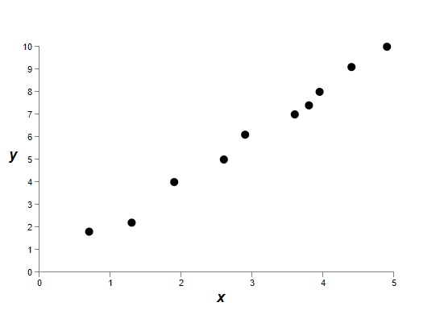

假想我们在这里学习某个现实世界中的现象，$x$ 和 $y$ 表示现实世界的数据。我们的目标是构建一个模型，从而预测 $y$ 是 $x$ 的函数。我们可以用神经网络来构建这个模型，不过在这里我会使用一个更简单的方法：我会试着把 $y$ 当做 $x$ 的一个多项式。使用多项式要比使用神经网络更为清晰透明。在我们理解多项式之后，再来转换到神经网络。现在，上面的图片中有十个点，这意味着我们可以找到一个唯一的九阶多项式 $y = a_0 x^9 + a_1 x^8 + \dots + a_9$，它可以对数据进行精确的拟合。下面是这个多项式的图像*：

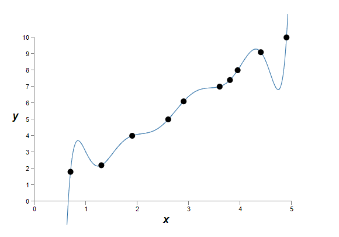


> *我没有展示公式的系数，你可以很容易地用例如Numpy的`polyfit`函数等得到这些系数。如果你好奇的话，你可以在[源代码](http://neuralnetworksanddeeplearning.com/js/polynomial_model.js)中看到公式的确切形式。它定义在程序的第14行的`p(x)`函数里。

这个多项式提供了一个完美的拟合。当然，使用一个线性模型 $y = 2x$ 也可以得到一个不错的结果：

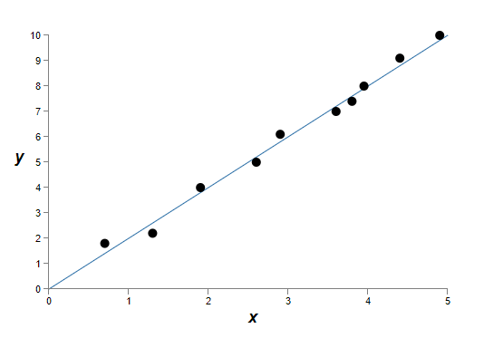

你认为这两个模型哪个更好？哪一个更可能是真实的模型？哪一个模型在真实世界的现象里有着更好的泛化能力？

这些问题很难回答。如果没有更多的数据的话，我们无法确切地回答上面任何一个问题。但是让我们考虑两种可能性：（1）九阶的多项式是真实世界现象的正确模型，它有着更好的泛化能力；（2）$y = 2x$ 是正确的模型，但是在测量的时候有一些噪音，这是模型无法完全拟合数据的原因。

这里并没有一种先验的可能性去说哪种假设是正确的。（也许还有第三种假设呢。）从逻辑上说，它们可能都是对的。这并不是一个微不足道的不同。在提供的数据上，这两个模型只是有着一些小小的不同。但是设想，我们将要对某个包含数量极多的 $x$ 的数据集预测 $y$，这两个模型的表现可能就大大不同了。对于九阶多项式，它会被 $x^9$ 项支配，而对于线性模型，嗯，它还是线性的。

有一种观点表示，对于科学来说，我们应该使用更简单的模型，除非不得不使用复杂的模型。当我们找到一个简单的模型，它也许可以解释更多的数据点。当然，我们不应该只因为它简单就去相信它。我们应当怀疑模型的背后隐藏着一些关于现象的真理。在这个例子里，模型 $y = 2x + \text{noise}$ 要比模型 $y = a_0 x^9 + a_1 x^8 + \dots$ 简单的多。似乎这种简洁性不只是种巧合，我们怀疑 $y = 2x + \text{noise}$ 之后表达着某种潜在的真相。在这种观点下，九阶模型只是学习了一些局部的噪音，而不是真相。所以九阶模型虽然在这10个特定的点上拟合的非常好，但它将在其他数据点上拟合的很差，而我们带有噪音的线性模型将会拥有更好的预测能力。

让我们看看这种观点在神经网络上意味着什么。设想我们的正则化网络，其大多数权值都很小。这说明网络的行为比较稳定。如果我们对输入进行一些随机的改变，网络并不会变化很多。这意味着网络并不会被噪音数据造成太大影响。事实上，一个正则化过后的网络，对那些经常在训练数据中出现的现象比较敏感。而一个没有进行过正则化的网络，其权值较大，输入中的一些微小变化，就可能对其造成很大影响。所以没有正则化的网络，它可以学习一个复杂的模型，而且对那些训练数据中的噪音也进行了学习。一个经过正则化的网络，它被抑制为构建一个简单的模型，只学习那些经常出现在训练数据中的特征。这迫使网络去学习那些真正的现象，从而拥有更好的泛化性能。

这种倾向于简单模型的想法可能让你感到困惑。人们有时候把这种想法叫做“奥卡姆剃刀”（Occam's Razor），认为其拥有某种普遍的科学原理。但是，这并不是一种普遍的科学原理。这里并没有一种*先验的*逻辑原则去证明简单的模型比复杂的模型更好。事实上，有时候复杂的模型要更好。

让我来举一个复杂模型的例子。在二十世纪四十年代，有一个物理学家叫做Marcel Schein，他宣称发现了一种新的自然粒子。他所任职的公司通用电气非常高兴，把这个发现到处传播。但是另外一个物理学家Hans Bethe对这个发现表示怀疑。于是他拜访了Schein，Schein给他展示了一些新粒子的跟踪样本。但是Bethe指出这些样本中的数据都有一些问题，不能证明Schein的发现。最后，Schein终于找到一个样本，看起来非常可信。Bethes认为这只是一种巧合。Schein说：“对，这可能只是一种巧合，但甚至根据你的公式来看，这种概率都有五分之一！”Bethe说：“但我们看过的早就超过五个了！”最后，Schein说：“在我的所有样本里，每一个好的样本，每一个好的图片，你都用另外一种不同的理论解释，而我拥有一种假设，可以解释所有的样本，所以这是一种[新的例子]！”Bethe回应到：“我的理论和你的理论唯一不同的地方就是，你的是错的，而我的多重解释是对的！”随后的工作证明，Bethe是对的，而Schein的新粒子并不存在*。
> *这个故事来自于历史学家Charles Weiner对物理学家Richard Feynman的一个[采访](https://www.aip.org/history-programs/niels-bohr-library/oral-histories/5020-4)。

还有第二个粒子。在1859年，天文学家Urbain Le Verrier观察到，水星的运行轨道与牛顿的引力理论所推导的轨道并不相同。但是还有很多现象证明牛顿的理论是正确的，只是需要一些小小的修正。在1916年，爱因斯坦发现，这个轨道的偏差用他的相对论可以完美解释，而相对论与牛顿的理论有非常大的区别，前者有着非常复杂的数学形式。在今天，虽然相对论要复杂的多，但人们已经普遍认为它是对的，而牛顿的理论，就算是修缮过后的版本，也是错的。这是部分因为，爱因斯坦的理论解释了许多牛顿的理论所不能解释的现象，而且爱因斯坦的理论成功预测了许多牛顿理论完全不能预测的现象！如果一个人仅仅用模型的简单与否来做判断，那么他也许会认为牛顿的理论更有吸引力。

这些故事给我们三个启示。第一，去判断哪种理论“更简单”是一个非常微妙的选择。第二，就算我们可以判定哪个模型更简单，那么更简单的模型是不是更好，需要我们仔细的研究。第三，对一个模型好或不好，并不能依赖于其“简单与否”，而是看它可不可以预测新的现象。

在实际中，正则化过后的模型一般来说，比未正则化的模型拥有更好的泛化性能。所以在本书的剩余部分，我们会频繁地使用正则化。上面介绍的几个故事，仅仅是为了说明，现在还没有一种完整的理论，来证明正则化是如何帮助网络提升其泛化能力的。相关的研究人员一直在尝试不同的正则化技巧，试着去解释为什么某些正则化技巧表现的很好，而某些表现的很差。你可以把正则化当做一种不成熟的技巧，虽然它经常表现的不错，但并不意味着我们需要对其有一个完整的令人满意的解释。

这里还有一个范围更深的问题，即我们如何泛化的问题。正则化可以帮助网络泛化的更好，但我们并不知道隐藏在泛化之后的原则，也不知道最好的泛化技巧是什么*。
> *这个问题也就是[归纳的问题](http://en.wikipedia.org/wiki/Problem_of_induction)。苏格兰哲学家David Hume在他的一篇广为人知的文章《[An Enquiry Concerning Human Understanding](http://www.gutenberg.org/ebooks/9662)》（1748）里对其进行了讨论。David Wolpert和William Macready在1997年提出的“[没有免费的午餐理论](http://ieeexplore.ieee.org/xpl/articleDetails.jsp?tp=&arnumber=585893)”给这个归纳问题一个现代的机器学习的形式。

这是一个令人讨厌的问题，因为人类总结现象的能力非常好。给几张大象的照片，一个小孩子也会很快的学会如何去辨别其他的大象。当然，他们有时候也会犯错误，例如把犀牛认成大象，但是一般来说这个过程运作的非常好。我们拥有一个系统，人类大脑，其中有数量庞大的“自由参数”。给它展示几张训练图片，它就可以很快的学习去辨认其他图片。我们的大脑，在某种程度上来说，泛化能力出奇的好！我们是如何做到这一点的？现在我们还不知道。我希望在接下来的几年中，人们可以发明出新的更强大的正则化技巧，从而让我们的神经网络可以在很少的数据里泛化的更好。

其实，我们的网络已经泛化的不错了。一个拥有100个隐藏神经元的网络大约拥有80,000个参数。我们的训练集有50,000个图片。这相当于用80,000阶多项式去拟合50,000个数据点。一般来说，这应该过拟合的非常糟糕。但实际上，我们的网络做的不错。这是为什么呢？我们现在还不知道。人们推测*这是因为“梯度下降学习在多层网络下的动态变化拥有一种‘自正则化’效果”。这非常的幸运，但令人不安的是，我们依旧不知道其中的原因。我们会在需要的时候使用这个实用技巧，它可以让神经网络变得更好。
> *参考Yann LeCun、Léon Bottou、Yoshua Bengio和Patrick Haffne在1998年发表的论文《[In Gradient-Based Learning Applied to Document Recognition](http://yann.lecun.com/exdb/publis/pdf/lecun-01a.pdf)》。

让我用一个还没过有解释的细节对本节做个总结：即L2正则化还*没有*对biases做出限制。当然，对biases应用正则化是非常简单的。但是在实际中，对biases应用正则化通常对结果没有什么影响。相比于权值来说，神经元对于或大或小的biases并不敏感。所以我们并不需要担心过大的biases会让网络学习到不必要的噪音。同时，大的biases可以让我们的网络的行为更为灵活，例如，让神经元更容易去饱和，这有时候很有用。基于这些原因，一般来说我们不对bias项进行正则化。
### 其他的正则化技巧
除了L2正则化，还有一些其他的正则化技巧。事实上，这些技巧多的我都总结不过来。在本节中，我主要介绍三种对抗过拟合的技巧：L1正则化、dropout和人工增加数据集大小。我并不会详细地探讨它们，而只是介绍其核心理念。

**L1正则化**：它会在未正则化的代价函数之后添加一项所有权值的绝对值的和：
$$
C = C_0 + \frac \lambda n \sum_w |w|. \tag {95}
$$
这与L2正则化很相似，都对大的权值进行了惩罚，从而偏好于小的权值。当然，L1和L2正则化所添加的项是不同的，所以它们有着不同的行为。让我们来试着理解使用L1正则化的网络与使用L2正则化的网络有什么不同。

首先是代价函数的偏导，我们得到：
$$
\frac {\partial C}{\partial w} = \frac {\partial C_0}{\partial w} + \frac \lambda n \text{sgn}(w), \tag {96}
$$
其中 $\text{sgn} (w)$ 是 $w$ 的符号，即如果 $w$ 为正，其值为 $+1$，如果 $w$ 为负，其值为 $-1$。使用这个表达式，我们可以轻松的对反向传播算法做出修改，然后使用L1正则化过后的随机梯度下降算法。最终，L1正则化过后的网络的更新规则为：
$$
w \rarr w' = w - \frac {\eta \lambda}{n} \text {sgn} (w) - \eta \frac {\partial C_0}{\partial w}, \tag {97}
$$
就像以前一样，我们可以通过mini-batch来估计 $\partial C_0 / \partial w$。与L2正则化的更新规则*相比：
$$
w \rarr w' = w \left (1 - \frac {\eta \lambda}{n} \right )  - \eta \frac {\partial C_0}{\partial w}. \tag {98}
$$
> *参考公式(93)：
> $$
> w \rarr \left (1 - \frac {\mu \lambda}{n} \right ) w - \frac \mu m \sum_x \frac {\partial C_x}{\partial w}, \tag {93}
> $$
>

这两个公式的目的都是限制权值的大小。但是权值被限制的方法不同。在L1正则化中，权值被一个接近于0 的常数限制。在L2正则化中，权值被一个和 $w$ 成比例的数限制。所以，如果一个特定的权值拥有很大的值，$|w|$，L1正则化对其缩减的值要小于L2正则化所缩减的值。相反，当 $|w|$ 相对比较小的时候，L1正则化缩减的值比L2正则化要多。对于网络的行为来说，L1正则化倾向于保留相对大的权值，而让其他权值接近于零。

在上面的叙述中我故意遗漏了一个细节，即当 $w = 0$ 的时候如何处理偏导 $\partial C / \partial w$。函数 $|w|$ 在 $w = 0$ 的时候不可微。这个问题很好解决，我们在 $w = 0$ 的时候使用原始（非正则化的）规则去应用随机梯度下降算法。正则化的目的是缩小权值，那么，当权值等于零的时候，自然就不需要缩减了。所以当 $w = 0$ 的时候，$\text {sgn}(0) = 0$。

**Dropout**：Dropout相对于正则化来说非常不同。不像L1和L2正则化，dropout并不对代价函数进行修改，相反，dropout对网络本身进行修改。让我先来描述dropout工作的基本机制，然后介绍其为什么可以减轻过拟合效果。

设想我们将要训练这样一个网络：


假设我们有一个训练输入 $x$，和相应的期望输出 $y$。一般来说，我们首先前向传播 $x$，然后把其对网络的影响反向传播回来。如果dropout存在的话，这个过程将会有一些不同。我们首先随机地（也是暂时地）删除一半隐藏神经元，保持输入神经元和输出神经元不变。然后我们得到下面这个网络（dropout掉的神经元只是暂时被隐藏了，并不是永久的删除）：


我们在这个修改过后的网络中前向传播输入 $x$，然后把结果反向传播回来。如此操作一个mini-b之后，我们对网络更新合适的权值和biases。我们然后重复这个过程，把隐藏的dropout神经元恢复，再重新随机地选择一些新的神经元集合，隐藏它们，训练网络，更新参数。

不断地重复这个过程一遍又一遍，我们的网络最终会学习到一组权值和biases。当然，这个结果是在有一半的隐藏神经元被dropout掉后学习到的。

Dropout过程看起来非常*奇怪*和*ad hoc*。这是如何减轻过拟合的呢？为了解释这一点，我们现在先不要想dropout，而是考虑标准的神经网络（没有dropout）。设想我们将要训练几个不同的神经网络，使用相同的训练集。当然，在训练之后，这几个网络会输出不同的结果。我们可以用类似于求平均，或者投票等方式来决定使用哪个结果。例如，假设我们训练了五个网络，如果其中有三个网络把数字分类为3，那么这个数字可能真的是3。这种求平均的方式在解决过拟合的时候可能非常有效（也更复杂），因为不同的网络可能有着不同的过拟合，这种求平均的方式可以帮助减轻过拟合。

那么dropout又是怎么做的呢？其思想是，当我们dropout掉不同的隐藏神经元的时候，其实是在训练不同的网络。所以dropout过程综合了许多不同网络的效果。这些不同的网络有着不同的过拟合效果，从而dropout也许可以帮助减轻过拟合。

对于dropout还有一种相关的解释*：“这个技巧减轻了神经元之间的复杂的互相依赖，一个神经元不能依赖于另外一个或几个特定的神经元。这也就是说，强迫它学习更多更稳健的特征，这些特征对连接不同的神经元子集有着很大的用处。”换句话说，如果我们认为我们的网络是一种进行预测的模型，那么我们可以把dropout当做一种保证模型在丢失了很多个体信息之后还能保证模型的稳定性的方法。这在某种程度上与L1和L2正则化很像，后者通过缩减权值，从而让网络在丢失很多个体信息之后仍旧保持robust。
> *[ImageNet Classification with Deep Convolutional Neural Networks](https://papers.nips.cc/paper/4824-imagenet-classification-with-deep-convolutional-neural-networks.pdf), by Alex Krizhevsky, Ilya Sutskever, and Geoffrey Hinton (2012).

当然，dropout真正的强大之处在于它可以提升很多模型的表现。提出dropout的那篇论文*对很多实验应用了dropout技巧，包括我们感兴趣的MNIST，当时最好的结果是98.4%的分类准确度，而在应用了dropout以及L2正则化之后，分类精确度可以达到98.7%。在其他的一些任务里，例如图像处理、语音识别、自然语言处理等，dropout也取得了非常好的效果。现在看来，对于那些容易发生过拟合、庞大的、深层的网络来说，dropout的效果非常出众。

> *[Improving neural networks by preventing co-adaptation of feature detectors](http://arxiv.org/pdf/1207.0580.pdf) by Geoffrey Hinton, Nitish Srivastava, Alex Krizhevsky, Ilya Sutskever, and Ruslan Salakhutdinov (2012). 这篇论文讨论了很多我在这个简短地介绍里忽略了的细节问题。

**人工增加训练数据**：在之前的实验中，如果我们仅适用1,000个训练图片，我们的MNIST分类准确度下降的十分厉害，大约只有百分之八十多。这个结果并不意外，少的数据意味着网络能学习到的数字的特征就少。让我们来试试改变训练数据的大小，网络的表现是如何变化的。网络的参数依旧是30个隐藏神经元，mini-batch的大小为10，学习率 $\eta = 0.5$，正则化系数 $\lambda = 5.0$，以及交叉熵代价函数。以完整的训练集对比30个epochs，如果训练集的大小发生改变，那么训练的轮数按比例进行调整。为了保证不同的数据集有着合适的权值衰减因子，当使用完整训练集的时候，$\lambda = 5.0$，对于其他的数据集大小，正则化系数按比例调整*。
> *下面的三张图片由程序`more_data.py`生成


上图显示，当数据集越来越大的时候，分类准确度有着非常大的提升。如果我们使用更多的数据，效果会不会提升的更多呢？从图中的结果来看，其似乎已经接近饱和了。让我们用对数来表示训练集的大小，可以得到如下的图片：


似乎准确度还在持续增长。如果我们使用更多更多的数据，也许是百万，甚至是数十亿数据，而非50,000个，我们也许可以得到更好的结果。

获得更多的数据似乎是个好主意，但在实际中往往代价过大，可行性不高。还有另外一种办法，就是人工增加训练数据。设想，我们从MNIST训练集中拿出一个图片：

然后对其旋转一个角度，例如15度：

这个数字看起来依旧是同样的数字5。但是从像素的角度来说，这个图片与训练集中的任何一个图片都不一样。把这个旋转过后的图片添加到训练集中，似乎可以帮助我们的网络去更好的学习。以及，显然我们并没有被限制只能添加一个图片。我们可以添加*许多许多*经过细微改变的图片到训练集中，然后用这个扩大的训练集来提升我们网络的表现。

这个技巧非常的强大，得到了广泛的应用。有一篇论文*把这个技巧的几个变种应用到MNIST，让我们看看其结果如何。他们使用的网络结构与我们相似，其拥有800个隐藏神经元，使用的是交叉熵代价函数。使用标准的MNIST训练集，这个网络可以达到98.4%的准确度。但是如果使用扩增的训练集，包括但不限于旋转、平移、扭曲等，准确度可以达到98.9%。他们还尝试了一种叫做“弹性扭曲（elastic distortion）”的方法，这个方法的灵感来自于人类手臂肌肉的随机振动。使用经过弹性扭曲扩大的数据集，他们实现了更高的准确度，99.3%。
> *[Best Practices for Convolutional Neural Networks Applied to Visual Document Analysis](http://dx.doi.org/10.1109/ICDAR.2003.1227801), by Patrice Simard, Dave Steinkraus, and John Platt (2003).

这个想法可以应用于很多学习任务去提升其效果，不仅仅是手写数字识别。其中的普遍原则是，用可以反映现实世界真实情况的操作来扩大数据集。设想，你打算构建一个用于语音识别的神经网络。人类可以在有噪音的情况下，听懂各种语音。类似的，你可以在训练语音中添加背景噪音。同样的，人类可以识别或快或慢的语音，你也可以用这种方法来扩大数据集。当然，这些技巧并不是总是被使用，例如，与添加噪音来扩增数据集不同，对网络的输入进行去噪处理也是一个很好的想法。总之，把人工增加训练数据这个想法放在脑子里，在有机会的时候去应用它。
<h4>习题</h4>

- 就像我们前面讨论过的，一种扩大MNIST数据集的方法是稍微旋转图片。那么，如果我们随意的旋转图片，可能会发生什么问题？

**大数据的旁白，以及它对比较分类准确度到底意味着什么**：让我们再次看看，数据集大小的改变，对于神经网络的准确度造成的影响：


设想我们不使用神经网络，而用其他的机器学习方法去分类数字。例如，让我们试试在第一章中讨论过的支持向量机（SVM）。如果你不了解SVM，不要担心，我们不需要了解它的细节。相反，我们使用[scikit-learn library](http://scikit-learn.org/stable/)来实现它。下图*展示了SVM的表现是训练集大小的函数。


> *图片是由程序`more_data.py`生成。

从图片中我们知道，神经网络在所有的不同大小的训练集上的表现都超过了SVM！当然，先别太高兴，我们只是使用了默认的SVM参数。如果我们做的更公平一点的话，在同样的大小为50,000的训练集上，一个经过参数优化的SVM可以达到94.48%的分类准确度，而我们的神经网络只有93.24%。

还有更有趣的事。设想我们准备用两种机器学习的算法来解决一个问题，算法A和算法B。下面的事情很可能发生：算法A在某个数据子集上比算法B好，而算法B可能在另外一个数据子集上比算法A好。虽然我们还没有碰到过这样的事情，但这确实可能发生*。所以，如果有人问你:“算法A和算法B哪个好？”，你可以回答：“这取决于你使用的数据集！”
> *这里有一个惊人的例子，你可以在这篇Michele Banko和Eric Brill在2001年写的论文《[Scaling to very very large corpora for natural language disambiguation](http://dx.doi.org/10.1109/ICDAR.2003.1227801)》里看到。

不管是在开发程序的时候，还是在阅读论文的时候，这些都是我们需要注意的问题。许多论文都聚焦于如何开发新的技巧去提升标准benchmark（基准）数据集的表现。“我们超级惊人的技巧可以在标准benchmark数据集Y上提升X个百分点！”，这是一个非常标准的研究声明。这些声明虽然都很有趣，但是他们得明白，这个声明是基于某个特定的数据集上得到的。也许对于一个更大的数据集，或者换一个数据集，这种所谓的“提升”可能就消失了。换句话说，这种提升也许只是一个巧合。所以我们应当知道，尤其是在实际应用中，我们想要的是更好的算法*和*更好的训练数据。寻找更好的算法当然很好，但是不要忘了去寻找更好的训练数据。

<h4>难题</h4>

- **（研究难题）** 我们如何去推断机器学习算法在非常大的数据集上的表现呢？（我们暂时还没有这样大的数据集）对于任何一个给定的算法，我们非常自然地想到去定义一个渐进（asymptotic）的表现。一个很快但也很取巧的方法是去拟合图片中的曲线。这种方法的一个反对意见是：不同方法可能拟合出来不同的代表渐进表现的曲线。你能找到一种对于某个特定曲线的公正的拟合原则吗？如果是的话，比较不同机器学习算法的渐进表现。

**总结**：我们完成了对过拟合和正则化的讨论！当然，我们后面还会继续进行探索。我已经提醒过很多次，过拟合是神经网络中的一个非常重要的问题，尤其是当计算机变得越来越强大，我们有能力去训练大型网络的时候。所以如何对抗过拟合是一个非常迫切的问题，也是最近学界研究的热点。

## 权值初始化

当我们创建神经网络的时候，需要对它的权值和biases进行初始化。到现在为止，我只在第一章的时候进行过一个简短的讨论。当时我们初始化权值和biases用的是标准的独立高斯随机变量，期望为0，标准差为1。虽然这个方法运作的很好，但它似乎有一点*ad hoc*，我们能不能找到一种更好的初始化方法，来提升网络的性能呢？

事实证明我们可以在标准高斯分布的基础上做的更好。设想，我们的网络拥有一个很大的输入层，比如1,000个输入神经元。然后我们用标准高斯分布去初始化权值。现在，让我们暂时只关注于输入层和第一个隐藏层之间的权值：


为了简单性，让我们把一半的训练输入 $x$ 设置为0，另外一半设置为1。也许有人会认为这种设置不够一般化，不过你会从这个特殊的例子中理解到要点的。让我们考虑权值和 $z = \sum_j w_j x_j$，其中有500项消掉了，因为 $x_j = 0$。所以 $z$ 是501个高斯随机变量的和，其中500个是权值项，剩下的那个是bias项。所以 $z$ 自己作为高斯分布，其期望为零，标准差为 $\sqrt {501} \approx 22.4$。$z$ 有一个非常宽的高斯分布，其顶点很低：

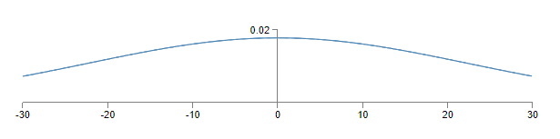

在图中我们可以看到，不管是 $z \gg 1$ 或者 $z \ll -1$，$|z|$ 都将很大。从而隐藏神经元的输出 $\sigma (z)$ 将会非常接近于1或0，这意味着隐藏神经元已经达到饱和。而当它饱和的时候，我们知道，权值的微小改变，只会对隐藏神经元的激活造成极其微小的变化，进而网络中的其他神经元，甚至是代价函数，也几乎不会受到影响。所以，当我们使用梯度下降算法的时候，这些权值将会学习的非常慢*。这与我们在本章的前面部分的讨论很类似，即当输出神经元在错误的值上饱和的时候，会造成学习缓慢问题，这个问题可以用另外一种代价函数解决，但不幸的是，它只对饱和的输出神经元有用，而对饱和的隐藏神经元并没有什么作用。

> *我们在第二章中对此进行了更详细的讨论，即当使用反向传播公式的时候，饱和神经元的权值学习的很慢。

我已经讨论了到第一层隐藏层的加权输入。当然，对于其他隐藏层，也有相似的现象：如果之后的隐藏层的权值也用高斯分布来初始化，那么它们的激活有很大概率接近于0或1，从而导致学习缓慢问题。

有没有其他方法去初始化权值和biases，从而避免这种饱和问题，避免学习缓慢问题呢？设想我们有一个神经元，它有 $n_{in}$ 个输入权值。然后我们可以用期望为0，标准差为 $1 / \sqrt {n_{in}}$ 的高斯随机变量来初始化这些权值。这也就是说，我们会挤压高斯分布，从而让神经元有更小的几率去饱和。对于bias的选择，我们依旧使用期望为0，标准差为1的高斯分布，原因我们后面会说到。在这种情况下，权值和 $z = \sum_j w_j x_j$ 仍旧是期望为0的高斯随机变量，但它将会比以前更陡，设想，有500个输入是0，500个输入是1，我们将会看到，$z$ 的高斯分布的期望是0，标准差是 $\sqrt {3/2} \approx 1.22$。如下图所示，它比以前要陡的多，我甚至需要去调整y轴去展示它：

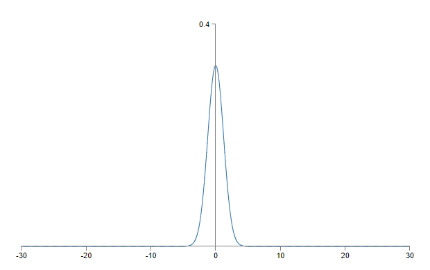

这样的神经元将会有更小的几率去饱和，从而极大的避免了学习缓慢问题。

<h4>习题</h4>

- 证明 $z = \sum_j w_j x_j$ 的标准差为 $\sqrt {3/2}$。这也许可以帮助你去理解：（a）独立随机变量的和的方差，是个体随机变量的方差的和；（b）方差是标准差的平方。

我在上面提到，我们没有改变bias的初始化方式，依旧为期望为0，标准差为1的高斯随机变量。这是可以的，因为bias让神经元饱和的可能性非常低。事实上，不管我们怎么样初始化bias，对解决饱和问题都没什么影响。有些人把所有的biases都初始化为0，然后依赖于梯度下降去更新合适的biases。但这种方法与之前相比，似乎并没有很大的区别。

让我们在MNIST数字分类问题上，比较一下不同的初始化方法对结果有什么影响。网络有30个隐藏神经元，大小为10的mini-batch，正则化系数为 $\lambda = 5.0$，使用交叉熵代价函数。学习率从 $\eta = 0.5$ 调整为 $0.1$，这样可以让结果在图中更好的展示。首先用旧的初始化方法：
```python
>>> import mnist_loader
>>> training_data, validation_data, test_data = \
... mnist_loader.load_data_wrapper()
>>> import network2
>>> net = network2.Network([784, 30, 10], cost=network2.CrossEntropyCost)
>>> net.large_weight_initializer()
>>> net.SGD(training_data, 30, 10, 0.1, lmbda = 5.0,
... evaluation_data=validation_data, 
... monitor_evaluation_accuracy=True)
```
然后使用新的初始化方法。这非常简单，因为`network2`默认使用新的初始化方法。我们可以省略对`net.large_weight_initializer()`的调用：
```python
>>> net = network2.Network([784, 30, 10], cost=network2.CrossEntropyCost)
>>> net.SGD(training_data, 30, 10, 0.1, lmbda = 5.0,
... evaluation_data=validation_data, 
... monitor_evaluation_accuracy=True)
```
画出结果*，我们得到：


> *生成图片的程序是`weight_initialization.py`。

这两种方法最终的结果大约都在96%左右。但新的初始化技巧要快的多。在第一个epoch结束后，旧的权值初始化方法的分类准确率不到87%，而我们的新方法已经达到了93%。似乎新的方法可以帮助网络更快的到达好的结果，如果我们使用100个隐藏神经元的话，情况也是类似的：


在这个例子里，两个曲线并没有交叉。当然，也许训练更多的轮数，两种方法的最终表现将会相同。这些实验似乎表明，优化权值初始化，只能加快学习速度，而不能改善最终结果。然而，在第四章中，我们将会看到一些例子，使用 $1/\sqrt {n_{in}}$ 来初始化权值会得到更好的结果。这说明改变权值初始化有时候不仅仅能加快训练速度，还可以提升最终表现。

使用 $1/\sqrt{n_{in}}$ 去初始化权值可以帮助提升网络学习的过程。还有许多其他的初始化权值的技巧，我在这里不会对它们进行详细的讨论或实验，因为 $1/\sqrt {n_{in}}$ 已经表现的非常好了。如果你有兴趣的话，我推荐你去看看Yoshua Bengio写的论文*，相关的讨论位于14页和15页。
> *[Practical Recommendations for Gradient-Based Training of Deep Architectures](http://arxiv.org/pdf/1206.5533v2.pdf), by Yoshua Bengio (2012).

<h4>难题</h4>

- **将优化的权值初始化方法与正则化建立联系**
  L2正则化有时候与这个新的权值初始化方法表现的非常相似。设想我们在使用旧的权值初始化方法。这里有一些启发式的讨论：（1）如果 $\lambda$ 不是非常的小，那么第一轮的训练将主要受到权值衰减的影响；（2）如果 $\eta \lambda \ll n$，对于每一个epoch，权值将会受到因子为 $\text {exp}(-\eta \lambda / m)$ 的衰减；（3）如果 $\lambda$ 不是很大的话，当权值大约变小到 $1 / \sqrt {n}$ 的时候，权值衰减效果将会减弱，其中 $n$ 是网络中权值的总数。证明这些条件在本章中的所有例子中都满足。

## 重温手写数字识别：代码

让我们来实现本章讨论过的技巧。与第一章中使用的`network.py`程序不同，我们将开发一个新的改进程序，`network2.py`。如果你还没有看过`network.py`程序的话，花几分钟看一下吧，它很容易理解，只有74行代码。

`network2.py`的核心是`Network`类，我们用它去表示神经网络。首先用一个表示网络的层的列表`sizes`初始化一个`Network`的实例，然后选择将使用的`cost`类型，默认为交叉熵：
```python
class Network(object):

    def __init__(self, sizes, cost=CrossEntropyCost):
        self.num_layers = len(sizes)
        self.sizes = sizes
        self.default_weight_initializer()
        self.cost=cost
```
代码中`__init__`方法的前两行与之前的`network.py`程序没有变化，你应该很容易理解。但是下两行是新加入的，我们需要理解它们到底做了什么事情。

首先从`default_weight_initializer`方法开始。它利用了我们新的初始化权值的技巧。在这个技巧里，输入到神经元中的**权值**由期望为0，标准差为1除以根号下直接连接的神经元的数量的**高斯随机变量**来初始化，biases则由期望为0，标准差为1的高斯随机变量初始化。下面展示了代码：
```python
    def default_weight_initializer(self):
        self.biases = [np.random.randn(y, 1) for y in self.sizes[1:]]
        self.weights = [np.random.randn(y, x)/np.sqrt(x) 
                        for x, y in zip(self.sizes[:-1], self.sizes[1:])]
```
代码中的`np`是可以做线性代数计算的Numpy库，我们在程序的一开始`import`这个库。需要注意的是，我们并没有对第一层的神经元初始化任何biases，因为第一层是输入层，其中的神经元用不到biases。这与`network.py`程序相同。

除了`default_weight_initializer`，我们还有一个`large_weight_initializer`方法作为补充。这个方法对权值和biases的初始化与第一章中介绍的老方法相同，即使用期望为0，标准差为1的高斯随机变量。其代码与`default_weight_initializer`只有一点不同：
```python
    def large_weight_initializer(self):
        self.biases = [np.random.randn(y, 1) for y in self.sizes[1:]]
        self.weights = [np.random.randn(y, x) 
                        for x, y in zip(self.sizes[:-1], self.sizes[1:])]
```
`large_weight_initializer`方法大多数情况下只是用来做比较，我不建议你在实际应用里去使用它。

第二个不同之处在于，`Network`类的`__init__`方法中，我们新增了一个`cost`属性。为了理解它是如何工作的，让我们来看看表示交叉熵代价的类的代码*：
```python
class CrossEntropyCost(object):

    @staticmethod
    def fn(a, y):
        return np.sum(np.nan_to_num(-y*np.log(a)-(1-y)*np.log(1-a)))

    @staticmethod
    def delta(z, a, y):
        return (a-y)
```
> *如果你还不熟悉Python的静态方法的话，你可以忽略`@staticmethod`，把`fn`和`delta`当做普通的方法。如果你对细节感到困惑的话，`@staticmethod`是告诉Python解释器，它后面的方法并不依赖于其所在的类。这就是为什么`self`没有给`fn`和`delta`方法传递参数的原因。

我们观察到的第一件事情是，就算交叉熵，从数学的角度上来说，是一个函数，但我们把它实现为一个Python类，而不是Python函数。为什么要这样做呢？因为在我们的程序中，代价扮演了两个不同的角色。第一个，也是比较明显的角色是：它是一种衡量输出激活`a`与期望输出`y`的手段。这个角色由`CrossEntorpyCost.fn`方法实现。（`CorssEntropyCost.fn`调用的`np.nan_to_num`保证了Numpy可以正确处理非常接近于零的对数）代价函数在我们的网络中还扮演了另外一种角色。回想在第二章中，当运行反向传播算法的时候，我们需要计算网络的输出误差，$\delta^L$。而输出误差的形式依赖于代价函数的形式：对于不同的代价函数，有着不同的输出误差。在公式(66)*中我们知道，对于交叉熵代价函数，输出误差为：
$$
\delta^L = a^L - y. \tag {99}
$$
> *公式(99)与公式(66)完全相同。

由于这个原因，我们定义了第二个方法，`CrossEntropyCost.delta`，其目的是告诉我们的网络如何计算输出误差。然后我们把这两个方法打包到一个类中，其中囊括了我们网络对代价函数所需要知道的一切信息。

相似的，`network2.py`中也包含有表示二次代价函数的类。我们大多数情况下使用交叉熵代价函数，偶尔使用二次代价来做一些对比实验。代码如下，其中`QuadraticCost.fn`方法直接对实际输出`a`和期望输出`y`做了计算，而`QuadraticCost.delta`的返回值则基于表示二次代价输出误差的公式(30)*：
```python
class QuadraticCost(object):

    @staticmethod
    def fn(a, y):
        return 0.5*np.linalg.norm(a-y)**2

    @staticmethod
    def delta(z, a, y):
        return (a-y) * sigmoid_prime(z)
```
> *参考公式(30)
> $$
> \delta^L = (a^L - y) \odot \sigma' (z^L) \tag {30}
> $$
>

现在我们理解了`network2.py`和`network.py`程序的主要差别。其实都是一些相当简单的东西。这里还有一些其他的变化，我待会对其进行讨论，包括L2正则化的应用。在这之前，我们先来看看`network2.py`的完整代码。你不需要仔细的阅读所有的代码，但是了解一下它的结构是值得的，我建议你看看代码的文档，这样你就会理解程序的每一部分是用来做什么的。当然，如果你想仔细的钻研，那就更好了！如果你遇到困难的话，你也可以继续阅读本书，然后再回来看看代码。
```python
"""network2.py
~~~~~~~~~~~~~~

An improved version of network.py, implementing the stochastic
gradient descent learning algorithm for a feedforward neural network.
Improvements include the addition of the cross-entropy cost function,
regularization, and better initialization of network weights.  Note
that I have focused on making the code simple, easily readable, and
easily modifiable.  It is not optimized, and omits many desirable
features.

network.py程序的改进版本，实现了对前馈神经网络的随机梯度下降算法。
改进的部分包括交叉熵代价函数，正则化，以及更好的权值初始化方法。
我尽量使代码写的简单易懂可修改，所以在效率上并没有优化，
并且忽略了许多特征。
"""

#### Libraries 库
# Standard library 标准库
import json
import random
import sys

# Third-party libraries 第三方库
import numpy as np


#### Define the quadratic and cross-entropy cost functions
#### 定义了二次代价函数和交叉熵代价函数

class QuadraticCost(object):

    @staticmethod
    def fn(a, y):
        """Return the cost associated with an output ``a`` and desired output ``y``.
        """
        return 0.5*np.linalg.norm(a-y)**2

    @staticmethod
    def delta(z, a, y):
        """Return the error delta from the output layer. """
        return (a-y) * sigmoid_prime(z)


class CrossEntropyCost(object):

    @staticmethod
    def fn(a, y):
        """Return the cost associated with an output ``a`` and desired output
        ``y``.  Note that np.nan_to_num is used to ensure numerical
        stability.  In particular, if both ``a`` and ``y`` have a 1.0
        in the same slot, then the expression (1-y)*np.log(1-a)
        returns nan.  The np.nan_to_num ensures that that is converted
        to the correct value (0.0).

        """
        return np.sum(np.nan_to_num(-y*np.log(a)-(1-y)*np.log(1-a)))

    @staticmethod
    def delta(z, a, y):
        """Return the error delta from the output layer.  Note that the
        parameter ``z`` is not used by the method.  It is included in
        the method's parameters in order to make the interface
        consistent with the delta method for other cost classes.

        """
        return (a-y)


#### Main Network class
class Network(object):

    def __init__(self, sizes, cost=CrossEntropyCost):
        """The list ``sizes`` contains the number of neurons in the respective
        layers of the network.  For example, if the list was [2, 3, 1]
        then it would be a three-layer network, with the first layer
        containing 2 neurons, the second layer 3 neurons, and the
        third layer 1 neuron.  The biases and weights for the network
        are initialized randomly, using
        ``self.default_weight_initializer`` (see docstring for that
        method).

        """
        self.num_layers = len(sizes)
        self.sizes = sizes
        self.default_weight_initializer()
        self.cost=cost

    def default_weight_initializer(self):
        """Initialize each weight using a Gaussian distribution with mean 0
        and standard deviation 1 over the square root of the number of
        weights connecting to the same neuron.  Initialize the biases
        using a Gaussian distribution with mean 0 and standard
        deviation 1.

        Note that the first layer is assumed to be an input layer, and
        by convention we won't set any biases for those neurons, since
        biases are only ever used in computing the outputs from later
        layers.

        """
        self.biases = [np.random.randn(y, 1) for y in self.sizes[1:]]
        self.weights = [np.random.randn(y, x)/np.sqrt(x)
                        for x, y in zip(self.sizes[:-1], self.sizes[1:])]

    def large_weight_initializer(self):
        """Initialize the weights using a Gaussian distribution with mean 0
        and standard deviation 1.  Initialize the biases using a
        Gaussian distribution with mean 0 and standard deviation 1.

        Note that the first layer is assumed to be an input layer, and
        by convention we won't set any biases for those neurons, since
        biases are only ever used in computing the outputs from later
        layers.

        This weight and bias initializer uses the same approach as in
        Chapter 1, and is included for purposes of comparison.  It
        will usually be better to use the default weight initializer
        instead.

        """
        self.biases = [np.random.randn(y, 1) for y in self.sizes[1:]]
        self.weights = [np.random.randn(y, x)
                        for x, y in zip(self.sizes[:-1], self.sizes[1:])]

    def feedforward(self, a):
        """Return the output of the network if ``a`` is input."""
        for b, w in zip(self.biases, self.weights):
            a = sigmoid(np.dot(w, a)+b)
        return a

    def SGD(self, training_data, epochs, mini_batch_size, eta,
            lmbda = 0.0,
            evaluation_data=None,
            monitor_evaluation_cost=False,
            monitor_evaluation_accuracy=False,
            monitor_training_cost=False,
            monitor_training_accuracy=False):
        """Train the neural network using mini-batch stochastic gradient
        descent.  The ``training_data`` is a list of tuples ``(x, y)``
        representing the training inputs and the desired outputs.  The
        other non-optional parameters are self-explanatory, as is the
        regularization parameter ``lmbda``.  The method also accepts
        ``evaluation_data``, usually either the validation or test
        data.  We can monitor the cost and accuracy on either the
        evaluation data or the training data, by setting the
        appropriate flags.  The method returns a tuple containing four
        lists: the (per-epoch) costs on the evaluation data, the
        accuracies on the evaluation data, the costs on the training
        data, and the accuracies on the training data.  All values are
        evaluated at the end of each training epoch.  So, for example,
        if we train for 30 epochs, then the first element of the tuple
        will be a 30-element list containing the cost on the
        evaluation data at the end of each epoch. Note that the lists
        are empty if the corresponding flag is not set.

        """
        if evaluation_data: n_data = len(evaluation_data)
        n = len(training_data)
        evaluation_cost, evaluation_accuracy = [], []
        training_cost, training_accuracy = [], []
        for j in xrange(epochs):
            random.shuffle(training_data)
            mini_batches = [
                training_data[k:k+mini_batch_size]
                for k in xrange(0, n, mini_batch_size)]
            for mini_batch in mini_batches:
                self.update_mini_batch(
                    mini_batch, eta, lmbda, len(training_data))
            print "Epoch %s training complete" % j
            if monitor_training_cost:
                cost = self.total_cost(training_data, lmbda)
                training_cost.append(cost)
                print "Cost on training data: {}".format(cost)
            if monitor_training_accuracy:
                accuracy = self.accuracy(training_data, convert=True)
                training_accuracy.append(accuracy)
                print "Accuracy on training data: {} / {}".format(
                    accuracy, n)
            if monitor_evaluation_cost:
                cost = self.total_cost(evaluation_data, lmbda, convert=True)
                evaluation_cost.append(cost)
                print "Cost on evaluation data: {}".format(cost)
            if monitor_evaluation_accuracy:
                accuracy = self.accuracy(evaluation_data)
                evaluation_accuracy.append(accuracy)
                print "Accuracy on evaluation data: {} / {}".format(
                    self.accuracy(evaluation_data), n_data)
            print
        return evaluation_cost, evaluation_accuracy, \
            training_cost, training_accuracy

    def update_mini_batch(self, mini_batch, eta, lmbda, n):
        """Update the network's weights and biases by applying gradient
        descent using backpropagation to a single mini batch.  The
        ``mini_batch`` is a list of tuples ``(x, y)``, ``eta`` is the
        learning rate, ``lmbda`` is the regularization parameter, and
        ``n`` is the total size of the training data set.

        """
        nabla_b = [np.zeros(b.shape) for b in self.biases]
        nabla_w = [np.zeros(w.shape) for w in self.weights]
        for x, y in mini_batch:
            delta_nabla_b, delta_nabla_w = self.backprop(x, y)
            nabla_b = [nb+dnb for nb, dnb in zip(nabla_b, delta_nabla_b)]
            nabla_w = [nw+dnw for nw, dnw in zip(nabla_w, delta_nabla_w)]
        self.weights = [(1-eta*(lmbda/n))*w-(eta/len(mini_batch))*nw
                        for w, nw in zip(self.weights, nabla_w)]
        self.biases = [b-(eta/len(mini_batch))*nb
                       for b, nb in zip(self.biases, nabla_b)]

    def backprop(self, x, y):
        """Return a tuple ``(nabla_b, nabla_w)`` representing the
        gradient for the cost function C_x.  ``nabla_b`` and
        ``nabla_w`` are layer-by-layer lists of numpy arrays, similar
        to ``self.biases`` and ``self.weights``."""
        nabla_b = [np.zeros(b.shape) for b in self.biases]
        nabla_w = [np.zeros(w.shape) for w in self.weights]
        # feedforward
        activation = x
        activations = [x] # list to store all the activations, layer by layer
        zs = [] # list to store all the z vectors, layer by layer
        for b, w in zip(self.biases, self.weights):
            z = np.dot(w, activation)+b
            zs.append(z)
            activation = sigmoid(z)
            activations.append(activation)
        # backward pass
        delta = (self.cost).delta(zs[-1], activations[-1], y)
        nabla_b[-1] = delta
        nabla_w[-1] = np.dot(delta, activations[-2].transpose())
        # Note that the variable l in the loop below is used a little
        # differently to the notation in Chapter 2 of the book.  Here,
        # l = 1 means the last layer of neurons, l = 2 is the
        # second-last layer, and so on.  It's a renumbering of the
        # scheme in the book, used here to take advantage of the fact
        # that Python can use negative indices in lists.
        for l in xrange(2, self.num_layers):
            z = zs[-l]
            sp = sigmoid_prime(z)
            delta = np.dot(self.weights[-l+1].transpose(), delta) * sp
            nabla_b[-l] = delta
            nabla_w[-l] = np.dot(delta, activations[-l-1].transpose())
        return (nabla_b, nabla_w)

    def accuracy(self, data, convert=False):
        """Return the number of inputs in ``data`` for which the neural
        network outputs the correct result. The neural network's
        output is assumed to be the index of whichever neuron in the
        final layer has the highest activation.

        The flag ``convert`` should be set to False if the data set is
        validation or test data (the usual case), and to True if the
        data set is the training data. The need for this flag arises
        due to differences in the way the results ``y`` are
        represented in the different data sets.  In particular, it
        flags whether we need to convert between the different
        representations.  It may seem strange to use different
        representations for the different data sets.  Why not use the
        same representation for all three data sets?  It's done for
        efficiency reasons -- the program usually evaluates the cost
        on the training data and the accuracy on other data sets.
        These are different types of computations, and using different
        representations speeds things up.  More details on the
        representations can be found in
        mnist_loader.load_data_wrapper.

        """
        if convert:
            results = [(np.argmax(self.feedforward(x)), np.argmax(y))
                       for (x, y) in data]
        else:
            results = [(np.argmax(self.feedforward(x)), y)
                        for (x, y) in data]
        return sum(int(x == y) for (x, y) in results)

    def total_cost(self, data, lmbda, convert=False):
        """Return the total cost for the data set ``data``.  The flag
        ``convert`` should be set to False if the data set is the
        training data (the usual case), and to True if the data set is
        the validation or test data.  See comments on the similar (but
        reversed) convention for the ``accuracy`` method, above.
        """
        cost = 0.0
        for x, y in data:
            a = self.feedforward(x)
            if convert: y = vectorized_result(y)
            cost += self.cost.fn(a, y)/len(data)
        cost += 0.5*(lmbda/len(data))*sum(
            np.linalg.norm(w)**2 for w in self.weights)
        return cost

    def save(self, filename):
        """Save the neural network to the file ``filename``."""
        data = {"sizes": self.sizes,
                "weights": [w.tolist() for w in self.weights],
                "biases": [b.tolist() for b in self.biases],
                "cost": str(self.cost.__name__)}
        f = open(filename, "w")
        json.dump(data, f)
        f.close()

#### Loading a Network
def load(filename):
    """Load a neural network from the file ``filename``.  Returns an
    instance of Network.

    """
    f = open(filename, "r")
    data = json.load(f)
    f.close()
    cost = getattr(sys.modules[__name__], data["cost"])
    net = Network(data["sizes"], cost=cost)
    net.weights = [np.array(w) for w in data["weights"]]
    net.biases = [np.array(b) for b in data["biases"]]
    return net

#### Miscellaneous functions
def vectorized_result(j):
    """Return a 10-dimensional unit vector with a 1.0 in the j'th position
    and zeroes elsewhere.  This is used to convert a digit (0...9)
    into a corresponding desired output from the neural network.

    """
    e = np.zeros((10, 1))
    e[j] = 1.0
    return e

def sigmoid(z):
    """The sigmoid function."""
    return 1.0/(1.0+np.exp(-z))

def sigmoid_prime(z):
    """Derivative of the sigmoid function."""
    return sigmoid(z)*(1-sigmoid(z))
```

代码中的一个有趣的变化是增加了L2正则化。虽然它很重要，但是在代码里你可能很容易就忽略了它。它所做的大部分工作是给一些方法传递`lambda`参数，尤其是`Network.SGD`方法。实际上只用到了一行代码，位于方法`Network.update_mini_batch`的倒数第四行。在这里我们对梯度下降算法的更新规则做了修改，添加了权值衰减。虽然这个改动很小，但是它对结果的影响很大。

虽然我们花了大量的篇幅来介绍各种新的技巧，看起来很复杂，但是在实现它们的时候，其实都是一些不起眼的很少的代码！

另外一个很小但是很重要的改变是`Network.SGD`方法新增了一些可选的标志（flags）。这些标志可以让我们监视训练集上代价或者准确度的变化。在本章中我们经常用到这些标志，让我用一个例子来展示如何使用它们：
```python
>>> import mnist_loader
>>> training_data, validation_data, test_data = \
... mnist_loader.load_data_wrapper()
>>> import network2
>>> net = network2.Network([784, 30, 10], cost=network2.CrossEntropyCost)
>>> net.SGD(training_data, 30, 10, 0.5,
... lmbda = 5.0,
... evaluation_data=validation_data,
... monitor_evaluation_accuracy=True,
... monitor_evaluation_cost=True,
... monitor_training_accuracy=True,
... monitor_training_cost=True)
```
在这里，我们把`validation_data`赋值给`evaluation_data`，当然不仅仅是验证集，我们还可以监视其他数据集，例如测试集。我们还有四个标志，可以用来监视`evaluation_data`或者`training_data`上的代价或者准确度。这些标志在默认情况下设置为`False`。`network2.py`程序的`Network.SGD`方法会返回一个四元的元组，表示监视的结果。我们可以这样去使用这些结果：
```python
>>> evaluation_cost, evaluation_accuracy, 
... training_cost, training_accuracy = net.SGD(training_data, 30, 10, 0.5,
... lmbda = 5.0,
... evaluation_data=validation_data,
... monitor_evaluation_accuracy=True,
... monitor_evaluation_cost=True,
... monitor_training_accuracy=True,
... monitor_training_cost=True)
```
在这里，`evaluation_cost`表示为一个长度为30的列表，包含每一个epoch结束之后的数据集上的代价。这些信息在理解网络的行为的时候非常有用。例如，它们可以用来绘制网络学习进度的图像。本章中的那些图片都是这样绘制的。当然，如果标志没有被设置的话，那么返回的元组中相应的元素将是一个空的列表。

代码中还有一些小的改变，包括方法`Network.save`，它可以把网络`Network`存储到硬盘上，以及一个加载的函数`load`，可以把网络从硬盘中加载回来。保存和加载网络所使用的数据格式是JSON，而不是Python中经常使用的`pickle`或者`cPicke`模块。使用JSON将会比使用`pickle`或`cPickle`需要更多的代码。为什么我要使用JSON呢？设想如果在将来，我们打算把网络中使用的sigmoid神经元替换掉。为了做到这一点，我们需要改变`Network.__init__`方法中的一些属性。如果我们使用`pickle`的话，会导致我们的`load`函数发生错误。使用JSON去做这样的序列化操作，可以保证我们旧的`Network`可以正确加载。

在`network2.py`中还有一些微不足道的次要改变，这里就不介绍了。最终我们74行的程序扩展到了152行！

<h4>难题</h4>

- 为上面的代码新增L1正则化，然后使用L1正则化去训练网络。你能找到一个合适的正则化系数，从而其结果比未正则化的网络要好吗？
- 看看`network.py`程序中的`Network.cost_derivative`方法。这个方法是为二次代价写的。请你用交叉熵代价改写这个方法。在这个交叉熵代价的版本中，你能给自己出一道难题吗？在`network2.py`中，我删掉了`Network.cost_derivative`方法，用`CrossEntropyCost.delta`方法代替了它的作用。你是如何用它来解决你刚刚发现的难题的？

## 如何选择神经网络的超参数？

我还没有介绍过如何选择模型的超参数，例如学习率 $\eta$，正则化系数 $\lambda$ 等等。我直接提供了表现还不错的参数值。但是当你使用神经网络去解决实际问题时，找到好的超参数并不简单。设想，你第一次面对MNIST问题，完全不知道该如何选择超参数。之前的实验里，我们使用了这样的参数：30个隐藏神经元，大小为10的mini-batch，用交叉熵训练30个epochs。但在一开始，我们可能选择了如下的超参数：学习率 $\eta = 10.0$，正则化系数为 $\lambda = 1000.0$。下面是实验结果：
```python
>>> import mnist_loader
>>> training_data, validation_data, test_data = \
... mnist_loader.load_data_wrapper()
>>> import network2
>>> net = network2.Network([784, 30, 10])
>>> net.SGD(training_data, 30, 10, 10.0, lmbda = 1000.0,
... evaluation_data=validation_data, monitor_evaluation_accuracy=True)
Epoch 0 training complete
Accuracy on evaluation data: 1030 / 10000

Epoch 1 training complete
Accuracy on evaluation data: 990 / 10000

Epoch 2 training complete
Accuracy on evaluation data: 1009 / 10000

...

Epoch 27 training complete
Accuracy on evaluation data: 1009 / 10000

Epoch 28 training complete
Accuracy on evaluation data: 983 / 10000

Epoch 29 training complete
Accuracy on evaluation data: 967 / 10000
```
我们的实验准确率甚至还不如随机猜测的好！我们的网络表现的像个智障！

“哼，这个问题很好解决”你也许会说，“只要降低学习率和正则化系数就可以了！”不幸的是，你并没有这样的先验知识。也许对于这个网络来说，无论使用什么样的超参数，它的效果都不会好。如果使用100个隐藏神经元呢？或者多隐藏层网络？或者一种不同的处理输出的方法？也许我们的网络仍在学习，只是需要训练更多的轮数？也许mini-batch太小了？也许我们该使用二次代价函数？也许我们该换一种权值初始化的方法？这样的问题有很多很多，寻找超参数并不是一件简单的事情，尤其是你的网络很大的时候，或者训练数据很多的时候，执行一次训练可能需要非常长的时间，并且可能会得到毫无意义的结果。如果这样的事情持续发生，它会摧毁你的信心。也许神经网络并不是解决这个问题的最好方法？或者你可能不适合这个职业，还是回去养蜂吧！

在本节中我会介绍一些启发式的寻找神经网络超参数的技巧。其目的是帮助你建立起一个工作流，从而让你在寻找超参数的过程中做的更好。当然，我并不会介绍所有的寻找超参数的办法。这是一个非常大的领域，也许永远也不会有一个通用的寻找超参数的方法。

**广泛的策略**：当使用神经网络去解决一个新问题的时候，第一个挑战是得到*任何*有意义的结果，也就是说，我们的网络要比随机猜测得来的结果表现的要好。当面对一个新问题的时候，达到这一的结果有时候都很难。如果你遇到了这样的问题的话，有下面一些策略可以利用。

设想，你在第一次面对MNIST问题。你热情地开始了尝试，但是得到了一个略微打击信心的结果。一种解决的办法是把问题分解为子问题。先不要使用完整的训练集和验证集图片，从其中提取出标签为0和1的图片作为我们的新的数据集。只识别数字0和1，比识别全部十种数字要简单的多，而且数据集的大小大约只有原来的20%，也就是说，训练的速度要快五倍！

你也可以把网络修改为更简单的网络来加快实验速度。例如把网络的结构改为 `[784, 10]`，这样的网络要比 `[784, 30, 10]` 速度更快，你也可以在之后将其调整回去。

你可以增加监视的频率去加速实验。在`network.py`中，我们在每轮训练之后监视一次表现。而每轮需要处理50,000个图片，这可能花费很多时间（在我的笔记本上，一轮大约要10秒左右）之后才能得到结果。当然，10秒并不长，不过如果你打算尝试几十种超参数的组合的话，这也很烦人，如果有几百种超参数组合的话，你可能会疯掉。我们可以调整获得反馈的频率，例如每过1,000个验证集图片，就返回一次验证集准确度。当然，我们也可以把大小为10,000的验证集缩减为仅包含100张图片。这些改变，目的都是为了看到，网络有没有真正学习到什么，并且得到一个好的、粗糙的表现估计。`network2.py`并没有做这样的监视，不过，作为一个不成熟的尝试，让我们先仅仅使用1,000张训练图片。（为了保持代码的简单性，我还没有应用只使用数字0和1的想法）
```python
>>> net = network2.Network([784, 10])
>>> net.SGD(training_data[:1000], 30, 10, 10.0, lmbda = 1000.0, \
... evaluation_data=validation_data[:100], \
... monitor_evaluation_accuracy=True)
Epoch 0 training complete
Accuracy on evaluation data: 10 / 100

Epoch 1 training complete
Accuracy on evaluation data: 10 / 100

Epoch 2 training complete
Accuracy on evaluation data: 10 / 100
```
结果似乎，非常的差！不过有一个很大的进步：与之前的10秒相比，我们得到反馈的时间甚至都不到1秒。这让我们可以在相同的时间里做更多的实验，甚至还可以同步进行。

在上面的例子中，$\lambda = 1000.0$。当我们改变训练集大小的时候，我们应该同时修改 $\lambda$，从而保证权值衰减没有改变。让我们把 $\lambda$ 设置为 $20.0$。然后看看结果如何：
```python
>>> net = network2.Network([784, 10])
>>> net.SGD(training_data[:1000], 30, 10, 10.0, lmbda = 20.0, \
... evaluation_data=validation_data[:100], \
... monitor_evaluation_accuracy=True)
Epoch 0 training complete
Accuracy on evaluation data: 12 / 100

Epoch 1 training complete
Accuracy on evaluation data: 14 / 100

Epoch 2 training complete
Accuracy on evaluation data: 25 / 100

Epoch 3 training complete
Accuracy on evaluation data: 18 / 100
...
```
哈！相比之前来说，效果不错！这并不是一个没有意义的结果。我们可以从这个基础上，选择其他的超参数去得到更好的结果。也许我们的学习率应该设置的高一点。（这个“也许”并没有道理，全靠你的直觉。）把 $\eta$ 设置为 $100.0$，看看结果如何：
```python
>>> net = network2.Network([784, 10])
>>> net.SGD(training_data[:1000], 30, 10, 100.0, lmbda = 20.0, \
... evaluation_data=validation_data[:100], \
... monitor_evaluation_accuracy=True)
Epoch 0 training complete
Accuracy on evaluation data: 10 / 100

Epoch 1 training complete
Accuracy on evaluation data: 10 / 100

Epoch 2 training complete
Accuracy on evaluation data: 10 / 100

Epoch 3 training complete
Accuracy on evaluation data: 10 / 100
```
结果很差！这说明我们的猜测是错的，问题并不是学习率太低。那么，相反，我们调低学习率，例如 $\mu = 1.0$，看看效果如何：
```python
>>> net = network2.Network([784, 10])
>>> net.SGD(training_data[:1000], 30, 10, 1.0, lmbda = 20.0, \
... evaluation_data=validation_data[:100], \
... monitor_evaluation_accuracy=True)
Epoch 0 training complete
Accuracy on evaluation data: 62 / 100

Epoch 1 training complete
Accuracy on evaluation data: 42 / 100

Epoch 2 training complete
Accuracy on evaluation data: 43 / 100

Epoch 3 training complete
Accuracy on evaluation data: 61 / 100

...
```
这个结果很好！我们可以在这个结果上继续实验，独立地尝试其他的超参数，逐步获得更好的结果。一旦我们得到了一个好的 $\eta$，我们可以继续寻找一个好的 $\lambda$。然后去寻找更好的网络结构，也许是让其拥有10个隐藏神经元。然后继续调整 $\eta$ 和 $\lambda$。再然后使用20个隐藏神经元。再调整其他的超参数。如此反复，在每一个阶段根据验证集的结果评估我们网络的表现，根据评估再去寻找更好的超参数。如果我们按着这个过程继续，每次实验的时间会逐渐增加，所以我们可以逐步减少监视的频率。

我们广泛的策略看起来似乎非常的有效。但是我想回到我们寻找超参数的初始阶段——寻找让网络开始有效学习的超参数。事实上，上面的讨论有时候其实过于乐观了。网络有时候可能会一直进行无意义的学习。也许你寻找了好几天超参数，但是没有得到任何有意义的结果。所以我要强调，在初始阶段，你需要保证你可以快速地得到实验结果。把问题简单化，把网络简单化，并不会阻碍你的脚步，而会加快你的步伐。一旦你获得一个有意义的结果，在寻找超参数的路上你会越走越快。道理是想通的，万事开头难！

这就是**broad strategy**！让我们来看看其他的寻找超参数的技巧。下面我将主要聚焦于学习率 $\eta$，L2正则化系数 $\lambda$，以及mini-batch的大小。当然，还有许多其他的超参数可以设置，例如网络结构，L1正则化系数等等，在本书的后面我们还会遇到其他超参数，例如动量系数（momentum co-efficient）。

**学习率**：设想我们用三种不同的学习率来运行MNIST网络：$\eta = 0.025, \eta = 0.25, \eta = 2.5$。其他的超参数与之前的实验相同，跑30个epochs，mini-batch的大小为10，$\eta = 0.5$。我们回到完整的训练集上，包含50,000个图片。下图*展示了网络的代价变化：


> *图片由程序`multiple_eta.py`生成。

当 $\eta = 0.025$ 的时候，代价在持续光滑地下降。当 $\eta = 0.25$ 的时候，代价一开始就下降的很快，但是在大约20个epochs之后陷入了停滞，之后的结果大致上只是很小的随机抖动。当 $\eta = 2.5$ 的时候，代价从开始到结束都在无意义的随机抖动。为了理解抖动的原理，让我们回到随机梯度下降算法。随机梯度下降算法是让我们在代价函数的峡谷里逐渐地下降：


如果 $\eta$ 过大，我们可能会越过谷底，再次爬上去。这似乎就是造成代价抖动的原因。当我们选择 $\eta = 0.25$ 或 $\eta = 0.025$ 的时候，我们会在最小值的附近进行更小的抖动。当然，$\eta$ 并不是越小越好，这会降低随机梯度下降的速度。其实还有一种更好的方法，在前20轮，使用 $\eta = 0.25$，之后使用 $\eta = 0.025$。我们会在之后讨论这种变化的学习率设置方法。

我们可以这样去设置 $\eta$：第一，我们估计能使代价开始下降的 $\eta$ 的阈值。这个估计值并不需要很精确。你可以从十的数量级上开始估计：一开始也许设置为 $\eta = 0.01$，如果代价下降了的话，接着试试 $\eta = 0.1, 1.0, \dots$，直到你找到了一个代价增加或开始抖动的值。如果 $\eta = 0.01$ 的时候代价开始抖动或者增加，你可以试试 $\eta = 0.001, 0.0001, \dots$，直到你找到一个使代价下降的 $\eta$ 值。依据这个过程，我们可以得到 $\eta$ 的阈值的量级的估计范围。你也可以精炼你的估计，找到一个在开始的时候代价下降最大的 $\eta$，也许是 $\eta = 0.5$ 或 $\eta = 0.2$，不需要太过于精确。

显然，你要使用的 $\eta$ 值不应该超出其估计的范围（阈值）。在MNIST例子中，根据这个策略，我们估计的 $\eta$ 的阈值的量级为 $0.1$。在更多的精炼之后，我们估计的阈值为 $\eta = 0.5$。

上面的过程看起来都很直接。当然，使用训练代价去估计 $\eta$ 看起来非常奇怪。我们之前不是说要用验证集来做类似的估计吗？事实上，在选择正则化系数、mini-batch大小、网络层数、隐藏神经元数量等超参数的时候，我们会使用验证集的代价。但是为什么在估计学习率的时候使用训练集的代价呢？坦白的说，这是我的个人喜好。调整其他的超参数是为了提升测试集上的最终分类准确度，所以使用验证集是合理的。而学习率一般来说对最终结果影响很小。其主要的目的是控制梯度下降的步长，而监视训练代价是探测步长是不是太大的最佳方法。在学习过程的早期，如果验证集准确度提升的话，训练代价一般来说是减小的。

**使用早停（early stopping）去确认训练的轮数：** 如我们之前讨论过的，早停意味着每轮训练之后，我们都需要计算验证集上的分类准确度。当分类准确度不再上升的时候，停止训练！这个方法使我们确认训练的轮数非常方便。特别是，我们不再需要担心如何去计算依赖于其他超参数的轮数。相反，这一切都是自动确认的。并且，早停还能自动地预防发生过拟合。这当然很好，不过在实验的早期阶段，还是先不要使用早停，这样的话你可以看到过拟合的现象，从而对模型使用正则化。

为了应用早停，我们需要更准确地定义，分类准确率停止增长的概念。如我们之前看到的，就算总体的表现在提升，准确度都可能发生随机的变化。如果我们在准确度第一次下降之后就停止训练，那几乎可以说，我们失去了非常多的提升机会。一种更好的办法是，在一段很长的时间内，如果最好的分类准确度没有变化的话，就停止训练。设想，我们在做MNIST实验。我们可以在分类准确度连续十次没有发生变化之后，停止训练。这可以保证我们不会停的太早。毕竟我们不能为一个没有把握的提升等得太久。

这种“十次没有提升就停止”的策略对于初学者来说很不错。有时候，网络可能会在一个地方停留很久，然后开始再次提升。如果你需要得到一个非常非常好的结果，那么“十次不提升”可能就不够了。在这种情况下，我建议在初始阶段，使用“十次”法，在你越来越熟悉网络之后，逐渐应用更多的宽松规则：例如“二十次”、“五十次”等等。当然，这可能要求我们去优化新的超参数。在实际中，寻找这些超参数一般来说并不难。对于其他不同于MNIST的任务来说，“十次法”有时候过于激进，有时候又过于不激进，所以到底选择哪种策略，需要具体问题区别对待。一般来说，经过一些简单的试验，我们就能找到一种较好的早停的策略。

到现在为止，我们还没有在MNIST程序中应用早停。其原因是我们一直在做一些对比实验。对于对比实验，使用一个确定的训练轮数会更好。

<h4>难题</h4>

- 修改`network2.py`，应用“ $n$ 次不增长就停止”策略，其中 $n$ 是一个可以设置的参数。
- 你能一个更好的早停策略吗？在理想情况下，这个策略应该在训练结果与训练时间之间取得一个平衡。把你的策略应用到`network2.py`之中，然后做三次实验，比较你的策略和“十次法”。

**学习率设置：** 在之前的实验里，学习率 $\eta$ 是一个固定的常数。对学习率进行动态的调整有着很多好处。在学习过程的早期，权值还需要较大的调整。所以使用一个大的学习率让权值快速地更新。之后，我们可以逐渐减小学习率，从而更细致地微调权值。

那么我们该如何调整学习率呢？这里有很多方法。一种方法与早停的思想类似，首先使用一个固定的学习率，在验证集的准确度开始变差的时候，减少学习率，比如减少两倍或十倍。我们重复这个过程，直到当前学习率低至某个值（例如初始学习率的  $1/1024​$），然后停止训练。

动态调整学习率可以提升表现，但是有时候如何对其进行调整也是个让人头疼的选择。我建议在实验的初期先使用单个的固定学习率，在大致得到一个好的结果以后，再使用动态学习率*。

> *这里有一篇2010年的论文阐述了在MNIST任务中应用动态学习率有什么好处：[Deep, Big, Simple Neural Nets Excel on Handwritten Digit Recognition](http://arxiv.org/abs/1003.0358)，作者是Dan Claudiu Ciresan，Ueli Meier, Luca Maria Gambardella和 Jürgen Schmidhuber。

<h4>习题</h4>

- 修改`network2.py`程序，应用动态学习率（learning schedule）：在每当验证集上的最好分类准确度十次没有变化的时候，将学习率减半；在学习率降到初始值的 $1/128$ 的时候停止训练。

**正则化系数，$\lambda$**：我建议在一开始的时候不要使用正则化（$\lambda = 0$），而是先确定 $\eta$ 的值，之后再用验证数据去寻找一个好的 $\lambda$ 值。首先从 $\lambda = 1$* 开始，之后尝试增加十分之一或者减少十分之一，一旦你找到一个好的量级的时候，再进行细微的调整。之后，再对 $\eta$ 进行优化。

> *我还没有一个好的原则去设置正则化系数的初始值。如果有人知道如何去设置 $\lambda$ 的初始值，请告诉我：(mn@michaelnielsen.org) 

<h4>习题</h4>

- 用梯度下降算法来学习超参数听起来似乎不错。你能想到用梯度下降算法来确认 $\lambda$ 或 $\eta$ 有什么困难吗？

**我在本书的前面部分选择超参数的方法：** 如果你使用本节中推荐的方法去选择超参数，例如 $\eta$ 和 $\lambda$，你会发现得到的值和我之前使用的可能并不相同。其原因是本书在叙事上受到了限制，优化超参数在某种程度上是不现实的。试想我们之前比较过的方法，例如二次和交叉熵代价函数，不同的权值初始化方法，使用或不适用正则化等等。为了让这些比较的结果有意义，我经常让超参数保持不变（或者把它们限制在一个合适的范围）。不同的方法当然有着不同的合适的超参数，所以我之前设置的固定的超参数是一种妥协。

事实上，我试过为每种方法都选择好的超参数。结果虽然更好，更公正，但是其耗费了很多精力和资源。所以我放弃了这个尝试。

**Mini-batch大小：** 我们该如何设置mini-batch的大小？为了回答这个问题，先设想我们正在做一个*在线学习（online learning）*，也就是说，mini-batch的大小为 $1$。

在线学习似乎有一个明显的缺点，即当mini-batch中只有一个训练样本的时候，会给我们估计的梯度值造成显著的错误。事实上，这并不是一个大问题。因为单个的梯度估计并不需要有多准确，我们需要的只是一个让梯度下降的估计。就像你打算去地磁北极旅个游一样，尽管你的指南针每次都不太准，漂移个多少度，但是平均来说，指南针指的还是正确的方向，你最终还是会到达地磁北极。

在这个讨论的基础上，似乎我们应该接受在线学习。真实的情况要比这复杂的多。在上一章中我指出，把所有的样本都装在一个mini-batch中进行梯度更新并不是不可能。根据你机器的硬件和线性代数库，相比于对100个样本分开计算mini-batch的梯度值，把这100个样本一次性装入一个mini-batch进行训练要快得多。这样做花费的时间只是单个样本训练花费的时间的五十倍（举例来说），而不是一百倍。

似乎在线学习并不能帮助我们很多。当mini-batch的大小为100的时候，权值的更新规则就像这样：
$$
w \rarr w' = w - \eta \frac 1 {100} \sum_x \nabla C_x, \tag{100}
$$
其中的求和遍历了mini-batch中所有的训练样本。而在线学习的权值更新规则就像这样：
$$
w \rarr w' = w - \eta \nabla C_x, \tag{101}
$$
就算前者需要花费五十倍的时间来做更新，它看起来还是比在线学习要好，因为我们更新的更为频繁。当我们给学习率乘以一百，更新规则将变为
$$
w \rarr w' = w - \eta \sum_x \nabla C_x. \tag{102}
$$
这似乎相当于在学习率 $\eta$ 的情况下做了一百次独立地在线学习。但和在线学习并不相同，因为mini-batch中的 $\nabla C_x$ 是在相同的权值下进行评估的。使用大的mini-batch显然会加快训练速度。

在了解了这些之后，选择一个最好的mini-batch大小其实是一种折中的选择，太小的话，不能够充分利用线性代数库和硬件的加速优点，太大的话，权值又更新的不够。你需要选择一个折中的值来最大化学习速度。幸运的是，mini-batch的大小一般来说与其他超参数相对独立（除了总体的网络结构），所以你不需要在选定mini-batch后再去优化其他的超参数。一般的做法是选择一些可以接受的（不需要是最优的）其他超参数，再尝试一系列不同的mini-batch大小，调整 $\eta$ 值，画出随时间变化的验证准确度（是时间！不是epoch！），最后选择那个可以带给你最快提升表现的mini-batch大小。在选定mini-batch大小之后，你可以接着优化其他超参数。

当然，我没有在本书中尝试这样的优化。事实上，我们的程序实现根本就没有用到哪些最快的方法。我在几乎所有的例子中都用了大小为10的mini-batch。在实际的应用中，我们会使用最快的方法去做mini-batch更新，选取最好的mini-batch大小，从而最大化总体速度。

**自动化技术**：除了手动调节超参数之外，我们还可以使用自动化技术。一种常用的技术是*网格搜索（grid search）*，它可以系统地在一个包含超参数空间的网格中进行搜索。网格搜索的优点和局限（以及一些容易实现的变种）可以在这篇2012年发表的论文\*中找到。还有一些更为复杂的方法，我在这里不再叙述它们，如果你感兴趣的话，可以看看这篇同样是发表于2012年的论文\*，它使用贝叶斯来自动优化超参数。论文的代码可以在[这里](https://github.com/jaberg/hyperopt)获取。
> *[Random search for hyper-parameter optimization](http://dl.acm.org/citation.cfm?id=2188395), by James Bergstra and Yoshua Bengio (2012).

> *[Practical Bayesian optimization of machine learning algorithms](http://papers.nips.cc/paper/4522-practical-bayesian-optimization-of-machine-learning-algorithms.pdf), by Jasper Snoek, Hugo Larochelle, and Ryan Adams.

**总结**：根据我所总结的经验法则，尽管不会绝对地带给你最好的结果，但一般来说会让你有一个好的开始及一些基本提升。在讨论超参数的时候，我一般把它们独立对待。在实际中，超参数之间也有着一些关系。也许你刚得到一个非常好的 $\eta$ 值，然后开始优化 $\lambda$ 值，你会发现，在改变 $\lambda$ 值之后，$\eta$ 的最优值也发生了改变。在实际中，我们通常需要反复进行试验，逐渐找到一组好的超参数。当然，你要记住，我所描述的技巧都是经验法则，而不是金规铁律。具体问题具体对待，你需要时刻关心模型的表现，尤其是测试集准确度。

这个世界上有着越来越多的选择超参数的方法，这有时候并没有让选择超参数变得简单，还加剧了其难度。数不尽的研究论文、软件程序都提出了它们优化超参数的方法（很多都是相互矛盾的）。这里有一小部分优秀的论文可供你参考：Yoshua Bengio在2012年发表的论文\*对训练神经网络时的反向传播和梯度下降方法提出了许多实际的建议，包括深度神经网络；Yann LeCun、Leon Bottou、Genevieve Orr和Klaus-Robert Muller在1998年发表的论文\*也极具参考价值。还有一本出版于2012年的书籍\*收集了非常多的在训练神经网络时可以用到的技巧。这本书非常昂贵，但是其中许多篇目由它们各自的作者公开在了互联网上，你可以在搜索引擎上找到它们。
> *[Practical recommendations for gradient-based training of deep architectures](http://arxiv.org/abs/1206.5533), by Yoshua Bengio (2012).

> *[Efficient BackProp](http://yann.lecun.com/exdb/publis/pdf/lecun-98b.pdf), by Yann LeCun, Léon Bottou, Genevieve Orr and Klaus-Robert Müller (1998)

> *[Neural Networks: Tricks of the Trade](http://www.springer.com/computer/theoretical+computer+science/book/978-3-642-35288-1), edited by Grégoire Montavon, Geneviève Orr, and Klaus-Robert Müller.

在你致力于实验和调参的过程中，你会发现，超参数调优至今都是一个没有被完全解决的问题。永远会有其他的方法可以提升表现。作家们经常说书籍没有写完的那一刻，只有放弃的那一刻。在神经网络中也是：超参数空间是那么的大，以至于你永远也不可能调到最优，只好把这个神经网络传给你的后代。所以你的目标应该设为快速地得到一个较好的优化结果。在确有必要的情况下，再去做细致的优化工作。

调参的复杂性让很多人对神经网络产生了抱怨，抱怨其相比于其他机器学习方法不够好。我听到过许许多多不同种类的抱怨：“也许一个调参调的很好的神经网络可以到达最好的效果，但是，我用随机森林（或者SVM，或者或者，随便你）也工作的很好！”当然，从实际的角度来看，有一个容易实现的方法很好。尤其当你刚接触到一个问题的时候，这个问题能否用机器学习来解决并不明显。另一方面，如果得到一个非常好的结果很重要，那么你也许就需要尝试更多复杂的技巧了，毕竟，简单的机器学习方法很好，但好的机器学习方法，不一定简单。

## 其他技巧


在本章中我们所开发的各种技巧都有其特定的价值，但这并不是我介绍它们的唯一原因，我想让你们熟悉神经网络中可能出现的各种问题，以及熟悉解决这些问题的思路和分析方法。在某种意义上，我们已经学习了如何对神经网络进行思考。在本章的剩余部分，我将简要地概括一些其他的技巧，它们在某些情况下非常有用。

### 随机梯度下降的变种
对于MNIST问题，利用反向传播算法的随机梯度下降表现的非常好。当然，还有很多其他的方法去优化代价函数，这些方法在某些时候甚至超越了使用mini-batch的随机梯度下降算法。在本节中我将会介绍两个方法，海塞（Hessian）和动量（momentum）技巧。

**海塞技巧**：在开始讨论之前，我们先把神经网络放在一边。试想最小化一个代价函数 $C$，它拥有许多变量，$w = w_1, w_2, \dots$，即 $C = C(w)$。根据泰勒公式，在 $w$ 点附近的代价函数可以被近似为：
$$
\begin{aligned}
  C(w + \Delta w) &= C(w) + \sum_j \frac {\partial C}{\partial w_j} \Delta w_j \\
  &\;\;\;\;+ \frac 1 2 \sum_{jk} \Delta w_j \frac {\partial^2 C}{\partial w_j \partial w_k} \Delta w_k + \dots
\end{aligned}
\tag{103}
$$
我们可以把公式改写为更紧凑的形式：
$$
C(w + \Delta w) = C(w) + \nabla C \cdot \Delta w + \frac 1 2 \Delta w^T H \Delta w + \dots , \tag{104}
$$
其中 $\nabla C$ 通常是梯度向量，以及 $H$ 是一个海塞矩阵，其中第 $jk$ 个元素是 ${\partial^2 C} / {\partial w_j \partial w_k}$。设想我们忽略掉由 $\dots$ 表示的高阶项：
$$
C(w + \Delta w) \approx C(w) + \nabla C \cdot \Delta w + \frac 1 2 \Delta w^T H \Delta w . \tag{105}
$$
利用微积分的知识，我们知道，可以将公式右边的式子最小化*，只需要选取：
$$
\Delta w = - H^{-1} \nabla C. \tag{106}
$$

>*严格地说，为了保证结果的最小化，而不是单单一个极值，我们需要确保海塞矩阵是正定的。直观地说，这要求函数 $C$ 看起来像一个山谷，而不是像一座山或者像一个马鞍。

在得到像公式（105）这样的代价函数的近似后，从点 $w$ 开始移动一段距离：$w + \Delta w = w - H^{-1} \nabla C$ 应该可以显著地降低代价函数的值。这提供了一种有效降低代价的可行算法：
- 选择一个起始点 $w$。
- 更新 $w$ 到一个新的点 $w' = w - H^{-1} \nabla C$，其中海塞矩阵 $H$ 和 $\nabla C$ 是在点 $w$ 处计算的。
- 更新 $w;$ 到一个新的店 $w'' = w' - H'^{-1} \nabla' C$，其中海塞矩阵 $H'$ 和 $\nabla' C$ 是在点 $w'$ 处计算的。
- $\dots$

在实际中，公式（105）只是一个近似，所以最好每次只移动一小步。我们通过重复地改变 $w$ 的值，大约为 $\Delta w = -\eta H^{-1} \nabla C$，其中 $\eta$ 为*学习率*。

这种最小化代价函数的方法被称为*海塞技巧（Hessian technique）*或者*海塞优化（Hessian optimization）*。理论和实际表现都证明了海塞方法可以比随机梯度下降更快地收敛于最小值。特别地，在结合代价函数中的二阶变化之后，海塞方法可以避免许多梯度下降方法容易面临的问题。此外，反向传播算法也可以用于计算海塞矩阵。

那么，如果海塞方法如此优越，为什么我们在前述的神经网络中不使用它呢？虽然海塞方法有着很多我们渴望的优点，不幸的是，它也有很多我们讨厌的缺点：它在实际中通常难以应用。其中一个原因是海塞矩阵的规模。设想一个拥有 $10^7$ 个权值和biases的神经网络，其相应的海塞矩阵将会包含 $10^7 \times 10^7 = 10^{14}$ 个元素。这可真是牛皮！这意味着计算 $H^{-1} \nabla C$ 在实际中将会变得极度困难。有一些方法利用了海塞方法的思想，并且避免了过大的矩阵计算。让我们了解另外一种技巧：基于动量的梯度下降。

**基于动量的梯度下降**：直观地看，海塞优化的优点在于它不仅利用了梯度的信息，还利用了梯度如何变化的信息。基于动量的梯度下降也利用了这一优点，并且避免了计算超大矩阵的二阶偏导。为了理解动量技巧，回想我们一开始介绍梯度下降的时候，我们将其设想为一个球从上滚到谷底。动量技巧对梯度下降做了两处重要的修改，使其与真实的物理情况更为相似。第一，它引入了一种我们试着去优化的参数，速率（velocity），即梯度试着改变的是速率，而不是“位置”，这与真实的物理作用力更为相似，后者改变的是速率，而不是位置。第二，动量方法引入了一个摩擦力项，它可以逐渐地减少速率。

让我们给出一个更精确的数学表示。我们引入了速率变量 $v = v_1, v_2, \dots​$，每一个速率变量都有对应的 $w_j​$ 变量（在神经网络中变量 $w_j​$ 包含所有的权值和biases）。然后我们把梯度下降更新规则 $w \rarr w' = w - \eta \nabla C​$ 变为：
$$
\begin{gathered}
  v \rarr v' = \mu v - \eta \nabla C \\
  w \rarr w' = w + v'.

\end{gathered}
\tag{107, 108}
$$
公式中 $\mu$ 是一个超参数，控制着阻尼的大小，或者系统中摩擦力的大小。为了更好的理解公式，我们先假定 $\mu = 1$，即没有摩擦力。在这种情况下，观察公式我们可以看到，速率 $v$ 是由“力” $\nabla C$ 来控制的，并且速率控制着 $w$ 变化的大小。直观地讲，我们对速率不断地添加梯度项，这意味着如果梯度在数轮学习中都大致朝着相同的方向下降，我们可以在这个方向上移动一大段距离。设想，如果我们不断地超谷底移动，会发生什么事情：


每一次移动之后，速率都会变得更大，我们将会越来越快地接近谷底。这意味着动量方法可以比梯度下降更快地到达谷底。当然，这里有一个问题，即我们到达谷底之后，会越过谷底，滑到上面去，即，如果梯度改变的太快了，我们也许会跑到错误的方向上去。这便是我们在公式（107）中引入超参数 $\mu$ 的原因。$\mu$ 控制着系统中摩擦力的大小；更为精确地说，$1-\mu$ 才是系统中摩擦力的大小。当 $\mu = 1$ 的时候，意味着没有摩擦力，速率将完全由梯度 $\nabla C$ 控制。相反，当 $\mu = 0$ 的时候，意味着摩擦力非常的大，公式（107）和（108）便退化为传统的梯度下降，$w \rarr w' = w - \eta \nabla C$。在实际中，选取一个介于 $0$ 到 $1$ 的 $\mu$ 值可以让我们更好地控制速率（哼，翻译成速度似乎也没什么问题！），避免越过“谷底”。我们可以通过验证集来选取一个合适的 $\mu$，就像我们选取 $\eta$ 和 $\lambda$ 一样。

至此，我还没有解释超参数 $\mu$ 名字的由来。其原因是它的标准名称起的很烂：它叫做*动量系数（momentum co-efficient）*。这使人非常困惑，因为 $\mu$ 的作用与物理学中的动量并不相同。相反，它与摩擦力的概念更为相近。不管怎么样，动量系数这个名称已经被广泛使用了，我们就这么凑合用吧！

关于动量技巧的一个非常nice的事情是，我们在应用它的时候几乎不用费什么力气，我们仍旧可以用反向传播算法来计算梯度，随机采样mini-batches。至此，我们即利用了海塞技巧的优点，即使用了梯度如何变化的信息，又避免了海塞技巧的缺点。在实际中，动量技巧被广泛的使用，通常可以加快学习的速度。

<h4>习题</h4>

- 如果 $\mu > 1$，会发生什么事情？
- 如果 $\mu < 0$，会发生什么事情？

<h4>难题</h4>

- 将基于动量的随机梯度下降算法应用于`network2.py`。

**其他最小化代价函数的方法**：还有许多其他的最小化代价函数的方法被人们开发出来，至于哪一种是最好的方法，还没有定论。在不断深入了解神经网络的过程中，你可以尝试其他的技巧，理解它们是如何工作的，它们的优点和缺点是什么，以及如何将它们应用于实际项目中。我前面提过的一篇论文*对许多技巧进行了介绍和比较，包括共轭梯度下降（conjugate gradient descent）和BFGS方法（以及一个非常相近的方法，有限存储（limited-memory）的BFGS方法，通常称为[L-BFGS](http://en.wikipedia.org/wiki/Limited-memory_BFGS)）。还有一个最近展现威力的技巧\*是涅斯捷罗夫的加速梯度（Nesterov's accelerated gradient）技巧，它可以提升动量技巧的表现。当然，对于很多任务来说，原始的随机梯度下降算法已经工作的够好了，所以在本书的剩余部分，我们仍将使用随机梯度下降。
> *[Efficient BackProp](http://yann.lecun.com/exdb/publis/pdf/lecun-98b.pdf), by Yann LeCun, Léon Bottou, Genevieve Orr and Klaus-Robert Müller (1998).

> *See, for example, [On the importance of initialization and momentum in deep learning](http://www.cs.toronto.edu/~hinton/absps/momentum.pdf), by Ilya Sutskever, James Martens, George Dahl, and Geoffrey Hinton (2012).

### 人工神经元的其他模型
到目前为止，我们在构建神经网络的时候使用的是sigmoid神经元。一般来说，由sigmoid神经元构建的网络可以计算任何函数。当然，在实际中，还有一些其他类型的神经元可以使用，在某些特定的任务上，它们的效果要比sigmoid网络更好。可能训练的更快，也可能对训练数据拟合的更好，或者两者皆有。

也许最简单的变种是tanh神经元（发音为“tanch”，嗯，跟坦克差不多），它将sigmoid函数替换为双曲线正切函数（hyperbolic tangent function）。对于一个输入为 $x$，权值向量为 $w$，bias为 $b$ 的tanh神经元来说，其输出为：
$$
\text{tanh}(w \cdot x + b), \tag{109}
$$
其中 $\text{tanh}$ 为双曲线正切函数。它看起来与sigmoid函数非常相似。$\text{tanh}$ 函数定义为：
$$
\text{tanh}(z) \equiv \frac {e^z - e^{-z}}{e^z + e^{-z}}. \tag{110}
$$
经过一点点代数变换之后，我们得到：
$$
\sigma(z) = \frac {1 + \text{tanh}(z/2)}{2}, \tag{111}
$$
这也就是说，$\text{tanh}$ 只是sigmoid函数的一个缩放版本。从图像中我们也可以看到，其与sigmoid函数的相似性：

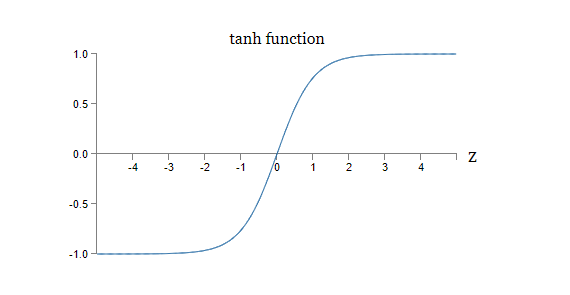

tanh函数与sigmoid函数的一个不同之处在于，tanh的输出范围是 $[-1, 1]$，而不是 $[0, 1]$。这意味着如果你要使用tanh神经元，你可能需要去标准化所期望的输出。

与sigmoid神经元相似，使用tanh神经元的网络在原则上可以计算任何函数\*。反向传播和随机梯度下降算法也可以非常容易地应用于其中。
> *有一些评论认为，无论是对于tanh神经元，sigmoid神经元，还是纠正线性神经元（rectified linear neurons），这个陈述并不成立。不过，在某种程度上这样认为，并没什么问题啦！

<h4>习题</h4>

-  证明公式（111）

那么，我们该使用哪种神经元呢？这个问题的答案，嗯，不好说。不过有一些研究表明，无论是从理论上，还是实际上，tanh比sigmoid表现的更好一点\*。让我简要地陈述一下理由。设想我们在使用sigmoid神经元，网络中所有的激活都是正数。让我们考虑第 $l+1$ 层中第 $j$ 个神经元的加权 $w_{jk}^{l+1}$ 输入。反向传播的规则告诉我们，其关联的梯度是 $a_k^l \delta_j^{l+1}$。因为激活都是正数，所以梯度和 $\delta_j^{l+1}$ 同正负。这意味着当 $\delta_j^{l+1}$ 为正的时候，*所有的*权值 $w_{jk}^{l+1}$ 在梯度下降的过程中将会变小。如果 $\delta_j^{l+1}$ 为负，那么 *所有的* 权值将会在梯度下降的过程中变大。换句话说，对于一个神经元，其所有的权值在梯度下降的过程中必须一直增加或者一直减小。这是一个比较棘手的问题，因为也许在某个权值下降的时候，其他权值需要变大。这种情况只有在输入激活中既有正又有负的时候才会发生。而tanh函数恰好可以解决这个问题，它允许正的和负的激活同时出现。事实上，因为 $\text{tanh}$ 是关于 $0$ 对称的，即 $\text{tanh}(-z) = - \text{tanh}(z)$，我们甚至可以期望，隐藏层中的激活可以大致相同地平衡于正数和负数之间。这将帮助我们确保在权值更新的时候没有系统性地偏差。

> *[Efficient BackProp](http://yann.lecun.com/exdb/publis/pdf/lecun-98b.pdf), by Yann LeCun, Léon Bottou, Genevieve Orr and Klaus-Robert Müller (1998)

> *[Understanding the difficulty of training deep feedforward networks](http://jmlr.org/proceedings/papers/v9/glorot10a/glorot10a.pdf), by Xavier Glorot and Yoshua Bengio (2010)

那么，我们该如何对待这个观点呢？这个观点并没有严格地证明tanh神经元要比sigmoid神经元好。也许sigmoid还有其他不为人知的特性可以拟补上述的“缺点”？事实上，在实际中，在很多任务里，tanh只有极其微小地提升，甚至相比于sigmoid没有任何提升。对于一个特定的任务，到底该选择什么样的神经元呢？现在还没有一个一般的原则。

Sigmoid神经元的另外一个变种是*rectified linear neuron（纠正线性神经元）*，也称作*rectified linear unit（纠正线性单元）*。对于一个输入为 $x$，权值向量为 $w$，bias为 $b$ 的纠正线性单元，其输出为：
$$
\text{max}(0, w \cdot x + b). \tag{112}
$$
纠正线性函数 $\text{max}(0, z)$ 的图像如下：

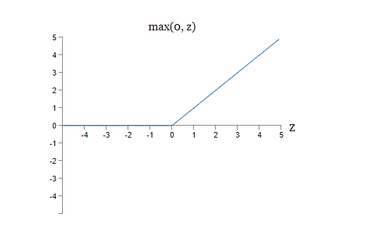

这个神经元与sigmoid和tanh神经元有着明显的不同。纠正线性单元也可以用来计算任何函数，同时使用反向传播和随机梯度下降算法。

我们在什么情况下应该使用纠正线性单元，而不是sigmoid或者tanh神经元呢？最近一些在图像识别*的工作表明，使用纠正线性单元有着非常可观的好处。当然，与tanh神经元类似，我们对其还没有一个深度的理解，即应该什么时候使用纠正线性单元，更别说为什么了。回想，sigmoid神经元在饱和的时候会停止学习，即当它们的输出接近于 $0$ 和 $1$ 的时候。就像我们在本章中反复见到的一样，$\sigma'$ 项会降低梯度，使学习变得缓慢。Tanh神经元也会遭遇类似的问题。相反，对于纠正线性单元来书哦，增加加权输入的值，永远也不会使其饱和，所以不会造成学习缓慢问题。另一方面，当加权输入为负的时候，纠正线性单元的梯度会消失，即神经元会完全停止学习。这两个点是我们理解纠正线性单元在什么时候，以及为什么，会比sigmoid或者tanh神经元表现的更好的关键因素。

> *[What is the Best Multi-Stage Architecture for Object Recognition?](http://yann.lecun.com/exdb/publis/pdf/jarrett-iccv-09.pdf), by Kevin Jarrett, Koray Kavukcuoglu, Marc'Aurelio Ranzato and Yann LeCun (2009)
> *[Deep Sparse Rectifier Neural Networks](http://www.jmlr.org/proceedings/papers/v15/glorot11a.html), by Xavier Glorot, Antoine Bordes, and Yoshua Bengio (2011)
> *[ImageNet Classification with Deep Convolutional Neural Networks](https://papers.nips.cc/paper/4824-imagenet-classification-with-deep-convolutional-neural-networks.pdf), by Alex Krizhevsky, Ilya Sutskever, and Geoffrey Hinton (2012)
> *上述的论文还包括在使用纠正线性单元的时候，如何设置输出层、代价函数以及正则化等细节。这些论文还讨论了纠正线性单元的优点和缺点。还有一篇重要的论文叙述了在神经网络之外使用纠正线性单元的好处：[Rectified Linear Units Improve Restricted Boltzmann Machines](https://www.cs.toronto.edu/~hinton/absps/reluICML.pdf), by Vinod Nair and Geoffrey Hinton (2010)

对于如何选择激活函数，我们还没有一个统一的办法。事实上，这个问题比我刚才讨论的问题棘手的多，有着无数种似乎可行的激活函数可供我们选择。哪一种是最好的呢？哪一种学习起来最快？哪一种测试准确度最高？对于这几个问题，学界几乎没有什么研究。在理想情况下，我们期望有一种理论告诉我们如何选择激活函数。虽然现在还没有这样一种理论，但我们不该停下脚步。因为我们已经有了足够强大的方法。在本书的剩余部分，我会坚持使用sigmoid神经元作为首选，因为它提供了足够强大的能力，以及提供了帮助我们理解神经网络的具体解释。但是你得记住，还有很多强大的神经元，它们在某些时候会表现的更好。

### 一个关于神经网络的故事
**问题**：
*对于那些没有理论保证，但是实际表现的很好的机器学习技巧，你是如何利用及寻找它们的呢？在什么情况下，这些没有理论保证的技巧会失去作用？*

**答案：**
你得意识到，对于现在来说，我们的理论工具还非常薄弱。有时候，我们有很好的理论来说明为什么某个特定的技巧可以发挥作用。但是有时候我们对于理论的自信并不正确 [...] 最终我们发现问题变成了这样：我的方法在这个特定的问题上工作的怎么样，以及到底有多少问题可以在我的方法上工作的很好。

来自对神经网络研究者Yann LeCun的[采访](http://www.reddit.com/r/MachineLearning/comments/25lnbt/ama_yann_lecun/chivdv7)。（这个人似乎很厉害的样子）

有一次，我去参加了一个有关量子力学基础的会议，我注意到一个对我来说最奇特的口语习惯：当一场演讲结束的时候，观众的问题通常这样开始：“我对你的观点深有同感，但是blablabla...”。量子基础并不是我擅长的领域，我注意到这种提问的方式是因为在其他的学术会议中，我很少听到有人会这样对演讲者表示对其观点的赞同。当时我在想，这种口语习惯的流行也许是因为量子基础中很少有实际的进展出现，人们大多数时候只是在原地转轮子而已。随后，我发现那些提问者的评价也很粗糙。演讲者不断地纠缠在几个人类大脑所能遇到的最困难的问题上。当然，进展是很慢！但是听听人们是如何思考的，有时候也很有价值，就算他们并不是总有一些无可争议的新进展去做报告。

你也许发现我在本书中也经常使用这样的口语：“我很赞同...”。当解释某个现象的时候，我通常会说：“启发式*地来说，...”，或者：“大致来说，...”。这些现象看起来似乎都很有道理，但是它们一般都缺少实际的证明。在你查阅有关神经网络的研究文献的时候，你会发现很多类似的现象。我们应该如何看待这样的现象？

在科学领域的很多方面，尤其是对于那些简单的现象而言，在一个一般地假设之下，做出一个严密、可靠的证明是可行的。但是在神经网络之中，有着说不清的参数和超参数，参数之间的联系亦错综复杂。在一些极端复杂的系统中，给出一个可靠的一般陈述是非常困难的。理解神经网络就像理解量子基础一样，人类大脑鲜能做到这一点。通常，我们只是在某些小的方面，或者粗糙地给出一个凑合的一般陈述。大多数情况下，这些陈述在新的证明出现之后需要修正或者放弃。

> *译者注：heuristic似乎并不好翻译，字典里翻译为启发式，或者探索式，其实就是说没有一个理论保证。

对于这种现象你也可以这样理解：任何一个有关神经网络的启发式解释都带有一种隐含的挑战。例如，在之前解释dropout*的时候：“这些技巧减少了神经元之间的复杂的互适应关系，因为单个的神经元不能再依赖于其他的特定的神经元。这也就是说，强迫神经元去学习到一个更为稳定的特征，这些特征在不同大小的随机神经元组合中也可以发挥作用。”这段陈述的内容非常丰富，也很具有煽动性。人们可以对其进行彻底的研究，找出这段陈述中哪些是对的，哪些是错的，哪些需要加强，哪些需要变化。但是很少有人去做了这样的工作。这些启发式的叙述需要的不仅仅是一个解释，它们需要更多细节上的探索和深入。

当然，对于时间有限的个体来说，深入地理解所有的启发式陈述是不可能的。要对神经网络有一个深入的、有理论保证的理解，可能需要相关社区的研究者们花费数十年的时间。这是不是意味着你应该拒绝那些没有理论保证、不够严谨的启发式陈述？不！我们需要这些启发式的方法来激励和引领我们的思考。在我们的思考中，大胆的探索要比严格的正确更为重要。启发式的方法可以帮助你理解和思考神经网络，同时保持对这些存在缺点和限制的方法的警觉。换句话说，我们需要启发式的方法去激励我们，然后严谨深入地对真正重要的部分进行探索。

**Next:**
**[第四章 可视化地证明神经网络可以计算任何函数](Chapter-4.md)**
