# 可视化地证明神经网络可以计算任何函数
神经网络最神奇的特性之一就是，它可以计算任何函数。这就是说，如果有人给你一个非常复杂，奇怪的函数，例如 $f(x)$：


不管这个函数有多么复杂，神经网络可以保证，对于某个输入 $x$，它可以输出对应的值 $f(x)$：

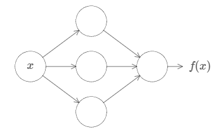

这个特性可以推广到多个输入和多个输出，$f = f(x_1, \dots, x_m)$。例如，下面这个网络有 $m = 3$ 个输入，$n = 2$ 个输出：

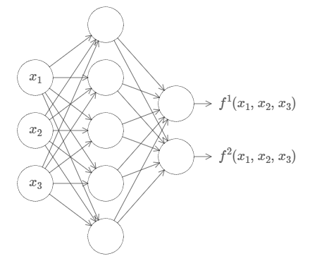

这个结果告诉我们，神经网络具有某种*普遍性（universality）*。不管要计算什么函数，我们知道总有一个神经网络可以做到这一点。

更多的，这种普遍性原理甚至在我们限制网络的结构下仍然成立，比如在输入层和输出层之间只有一层的神经网络，即单隐层神经网络。所以说，非常简单的网络结构，也可以拥有极度强大的能力。

这种普遍性原理广为人知，但很少有人理解这种原理。现有的解释通常都很专业。例如，有一篇论文*使用哈恩-巴拿赫定理（Hahn-Banach theorem）、里斯表示定理（Riesz Representation theorem）以及傅里叶分析（Fourier analysis）来证明这一点。如果你是一名数学家，那么这些证明也许并不复杂，但对大多数人来说，这似乎难了那么一点。其实，蕴藏于神经网络背后的普遍性并不复杂，反而具有一种简单和美丽的形式。

> *[Approximation by superpositions of a sigmoidal function](http://www.dartmouth.edu/~gvc/Cybenko_MCSS.pdf), by George Cybenko (1989)
> 在当时这个观点非常流行，有很多团队都证明了相似的理论，Cybenko的论文包含了对它们的讨论。还有一篇重要的论文是
> [Multilayer feedforward networks are universal approximators](http://www.sciencedirect.com/science/article/pii/0893608089900208), by Kurt Hornik, Maxwell Stinchcombe, and Halbert White (1989)
> 这篇论文利用Stone-Weierstrass定理得到了类似的结论。

在本章中，我将给出一个简单，并且可视化的对普遍性原理的解释。你会理解为什么神经网络可以计算任何函数。你会理解这个原理有哪些局限性。以及你会理解为什么这个原理与深度神经网络有关。（译者注：致命三连。）

在本章的学习过程中，你不需要已经阅读过本书前面的章节。本章的结构非常独立。当然，我默认你对神经网络已经有了一个基本的理解。我也会在内容中加入一些链接来帮助你回忆必要的知识。

普遍性原理在计算机科学中是一个老生常谈的话题，所以有时候我们甚至已经忘了这个原理是多么的惊人。你能想象到的任何过程都可以被看做是一种函数计算。设想给出一首歌的片段来得到歌名，这是一种函数计算。或者设想把中文翻译成英文，这也是一种函数计算\*。或者设想给出一个MP4电影文件，输出一段对这个电影情节的描述，以及对电影动作特效的质量讨论，这也可以被看做是某种函数计算。也就是说，神经网络的普遍性，意味着它可以完成任何事情。

> *事实上，是计算许多函数中的一种，因为翻译的结果并不是唯一的，你翻译的和我翻译的，不一定相同。

当然，现在已经有神经网络可以把中文翻译成英文，但这并不意味着我们知道如何去构建这样一个网络，我们甚至不知道如何去识别这样一个网络。这个限制在传统的普遍性原理中也存在，例如布尔电路（Boolean circuits）。但是，如我们在本书前几章中看到的那样，神经网络拥有强大的算法去学习函数。将学习算法和普遍性结合起来，似乎是一个美好的愿景。之前，本书主要聚焦于学习算法（learning algorithms）。在本章中，我们主要讨论普遍性原理，以及普遍性原理意味着什么。

## 两个陷阱
在解释为什么普遍性原理成立之前，我想先解释一下“一个神经网络可以计算任何函数”这句话中的两个陷阱。

第一，这并不意味着一个网络可以*完全*准确地计算任何函数。而是说，我们可以获得一个比较好的*近似*。增加隐藏神经元的数量，可以不断地提升这个近似的准确度。例如，之前我提及到一个拥有三个隐藏神经元的网络可以计算某些函数 $f(x)$。对于大多数函数来说，这个网络只能获得一个低质量的近似。在增加隐藏神经元的数目（例如增加到五）之后，我们一般会得到更好的近似：

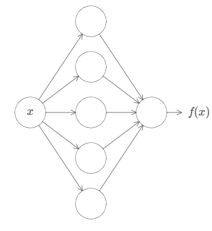

增加更多的隐藏神经元，我们可以得到更好的近似。

为了将这个叙述定义的更为准确，设想对于某个函数 $f(x)$，我们希望结果达到某个精度 $\epsilon > 0$。在使用足够多的隐藏神经元之后，我们总可以保证，对于所有的输入 $x$，有一个神经网络的输出 $g(x)$ 满足 $|g(x) - f(x)| < \epsilon$。换句话说，对于任何输入，我们总可以获得满足某个精度的输出。

第二个陷阱是，函数的类型得是*连续函数（continuous functions）*。如果一个函数是不连续的，例如会突然大范围地跳动，那么一般来说，这样的函数不能用神经网络来近似。不过，就算我们想要去计算的函数是不连续的，一个连续的近似在大多数情况下也是很不错的。在这种情况下，我们仍旧可以使用神经网络。在实际中，这个限制的影响很小。

总的来说，对于普遍性原理的一个更准确的叙述为：一个拥有单隐藏层的神经网络可以在任何期望的精度下被用来近似任何连续函数。在本章中，我们会实际证明这个结果，不过有一些微小的不同，我们会使用一个拥有两层隐藏层的神经网络，而不是单隐藏层。我也会简要地指出，在经过同样几处微小的变化后，这个证明同样适用于单隐藏层网络。

## 在单个输入和单个输出下的普遍性
为了理解为什么普遍性原理是正确的，让我们从构建一个只拥有单个输入和单个输出的神经网络开始：

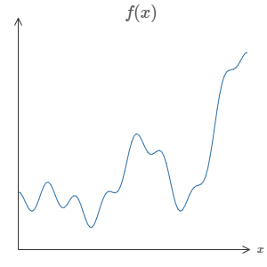

这是普遍性原理问题的核心。一旦我们理解这个特殊的情况，它可以被很容易地推广到多个输入和多个输出。

为了说明如何构建一个网络去计算 $f$，让我们从一个仅含有两个隐藏神经元、一个输出神经元的单隐藏层神经网络开始：

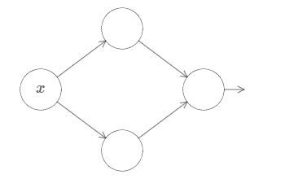

为了理解这个网络是如何进行工作的，我们先关注最上面的隐藏神经元。在下图中（因为CSDN不支持H5的Canvas画布，所以我用Gif动画作为一种替代方案，你也可以点击后面的链接到原网页实际操作：[Xovee很酷！](http://neuralnetworksanddeeplearning.com/chap4.html#universality_with_one_input_and_one_output)），点击权值 $w$，然后向右移动鼠标去增加 $w$。你可以直接看到最上面的隐藏神经元是如何计算这个函数的：

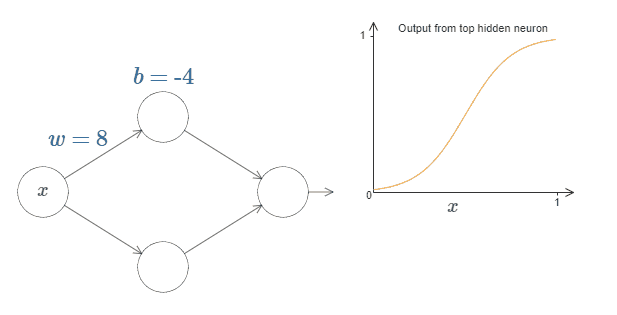

如同我们之前介绍过的一样，隐藏神经元计算的是 $\sigma(wx + b)$，其中 $\sigma(z) \equiv 1 / (1 + e^{-z})$ 是sigmoid函数。到现在为止，我们频繁地用到这个代数形式。但是忽略这个代数形式可以帮助我们更好地证明普遍性原理，我们将主要关注于图像中线条的变化。这不仅给我们一种更好的途径去感受实际发生了什么，还告诉我们普遍性原理的证明*可以应用地更广泛而不是单单在sigmoid函数上。
> *严格地说，我正在使用的可视化方法并不是一种传统形式上的证明。但我相信这种证明方法可以让你更好地理解到底发生了什么。理解到底发生了什么要比单纯的证明更有作用，这是我的真正目的。当然，可视化地证明并不严谨，如果你感到困扰的话，尝试去拟补这种不严谨性是一个很好的挑战。不过，不要忘了我们目的：理解为什么普遍性原理是正确的。

点击bias $b$，然后向右拖动鼠标去增加 $b$，你会发现随着 $b$ 的增加，图像会向左移动，但是图像的形状没有发生改变。

如果减少 $b$，你会发现图像会向右移动，但其形状同样没有发生改变。

接下来，将权值移动为 $2$ 或 $3$。你会发现当你减少权值的时候，曲线会变宽。你可能需要同时调节bias，来保证曲线在框内的正常显示。

最后，将权值增加到大于 $100$。当你这样做的时候，曲线会变得陡峭，最后看起来像一个阶跃函数。尝试改变bias，让曲线近似垂直于 $x = 0.3$ 处。下面的图像展示了你的结果应该是什么样子。点击play按钮去播放视频。（译者注：请读者不要做傻事。）

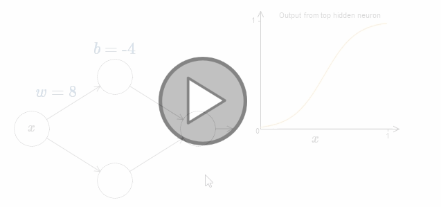

我们可以无限地增加权值，从而让其的表现无限地近似于阶跃函数。下面展示的是我将权值调整为 $w = 999$ 时的情况。这个展示是静态的，你不能改变其中的参数。


模仿阶跃函数要比模仿sigmoid函数简单多了！其原因是在输出层中，我们从所有的隐藏神经元中对贡献进行求和。分析一系列阶跃函数的和是很简单的，如果情况是一系列sigmoid函数的曲线的和，对其进行分析是很难的。更具体地说，我们给权值 $w$ 一个非常大的值，然后改变bias $b$ 来调整台阶的位置。当然，这只是对阶跃函数的一个近似，但这个近似非常的好。我随后会讨论对于这个近似的偏差的影响。

$x$ 取什么值的时候，台阶（step）会出现呢？换句话说，权值和bias是如何确认台阶的位置呢？

为了回答这个问题，尝试调整上面图片中的权值和bias（请向上滚动一段距离！）（译者注：请回原网页尝试！）。你能回答出权值和bias是如何影响台阶的位置吗？事实上，台阶的位置与 $b$ 成*正比*，与 $w$ 成*反比*。

即，台阶位于 $s = -b/w$。如下图所示：

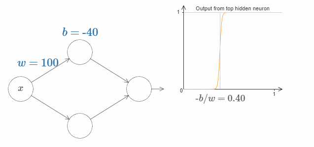

这样的话，我们只用一个参数 $s$ 就可以很好地描述隐藏神经元，即台阶的位置 $s = -b/w$。试着调整下图中 $s$ 的值：

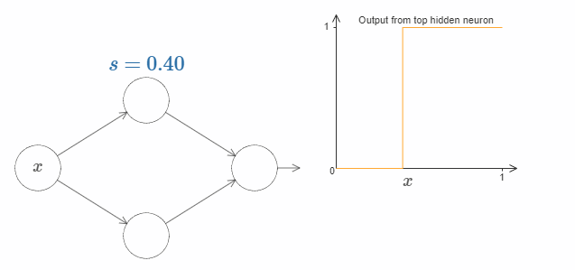

我们隐含地给输入 $x$ 一个非常大的权值 $w$，大到一个足够好的阶跃函数的近似。通过选择合适的bias $b= -ws$，在传统的模型中，我们也可以轻松地转用这种方式转换神经元的参数。

到现在为止，我们主要关注的仅仅是最上面的隐藏神经元的输出。让我们看看整个网络的行为是什么样的。特别地，我们假设最上面的隐藏神经元由参数阶跃点（step point）$s_1$ 定义，最下面的隐藏神经元由参数阶跃点 $s_2$ 定义。它们各自的输出权值为 $w_1$ 和 $w_2$。

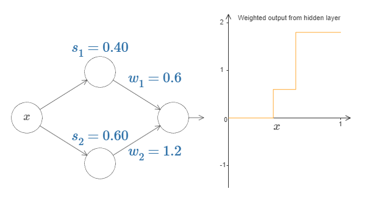

上图的右侧即为来自隐藏层的*加权输出 $w_1a_1 + w_2a_2$*。其中 $a_1$ 和 $a_2$ 分别是顶部的隐藏神经元和底部的隐藏神经元的输出*。这些输出用 $a$ 来表示，因为它们通常被认为是神经元的*激活（activations）*。
> *顺便说一下，整个网络的输出为 $\sigma (w_1a_1 + w_2a_2 + b)$，其中 $b$ 是输出神经元的bias。显然，这与隐藏层的加权输出不一样。现在我们仅关注于隐藏层的加权输出，随后我们会考虑其与整个网络的输出的关系。
>

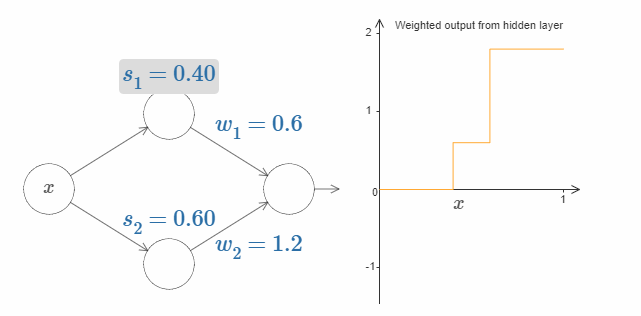

现在试着增加或者减少顶部隐藏神经元的阶跃点 $s_1$。感受改变它会对隐藏层的加权输出有什么影响。尤其是当 $s_1$ 超过 $s_2$ 的时候，曲线的形状发生了变化。因为我们从顶部神经元会先被激活的状态下转移到了底部神经元会先被激活的状态。

相同的，改变阶跃点 $s_2$，感受隐藏神经元输出值的变化。

试着改变输出权值。你会发现，改变输出权值和改变阶跃点对曲线有着不同的作用。如果某个权值为 $0$ 时会发生什么呢？

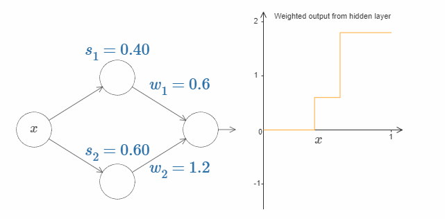

最后，试着把 $w_1$ 设为 $0.8$，$w_2$ 设为 $-0.8$。你会得到一个“bump”（凸起）函数，它从点 $s_1$ 开始，结束与点 $s_2$，高度为 $0.8$。其加权输出就像下图一样：


当然，我们可以改变这个凸起的高度。让我们用参数 $h$ 来表示它的高度。为了简化，我同样会移除类似于 $s_1 = \dots$ 或 $w_1 = \dots$ 这样的表示。

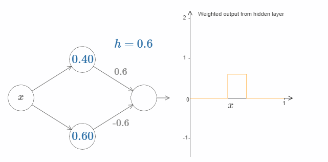

试着改变 $h$ 的大小，看看它对凸起的高度有什么影响。让 $h$ 变为负数，看看会发生什么。你也可以尝试改变阶跃点，看看会对凸起的形状有什么影响。

你会发现，我们使用神经元的方式可以被想象为不仅仅是一种图像 表示，它更像是传统的编程表示，就像是`if-then-else`语句一样：
```python
if input >= step point:
	add 1 to the weighted output
else:
	add 0 to the weighted output
```
虽然大多数情况下我会用可视化地角度来描述事物，但是有时候换一种思路也很有帮助，例如把它想象为`if-then-else`语句。

利用这种构造凸起的方法，我们可以使用两队隐藏神经元，来构造两个凸起：

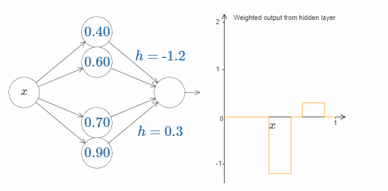

在图中我用 $h$ 替代了权值的显示。试着增加或减少 $h$ 的值，看看会发生什么。阶跃点的值影响着凸起的位置。

更一般地，我们可以使用这种想法来获得许多任意高度的凸起。特别地，我们把范围 $[0, 1]$ 分割为 $N$ 个部分，然后使用 $N$ 对隐藏神经元去构造这些凸起。让我们看看 $N = 5$ 的情况。网络中的神经元并不多，所以我把它们都显示出来了。我得为下图的复杂性对你们道歉：因为我可以把它画的更为简单抽象一点，但是我认为有一些复杂性也很有好处，这样的话我们可以得到一个更完整的对于网络行为的理解。

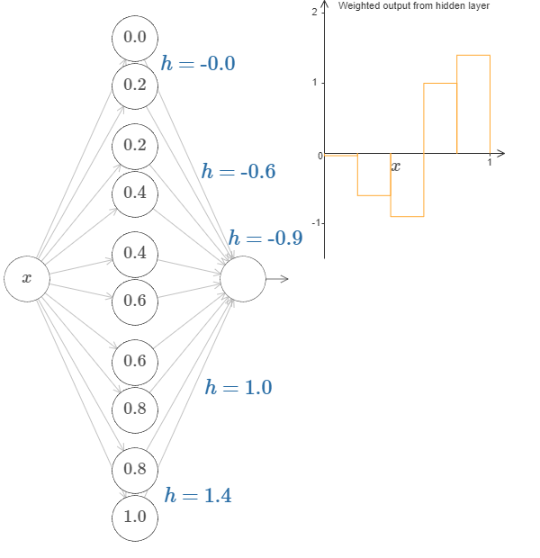

在图中有五对隐藏神经元。凸起的位置为 $0, 1/5$，然后是 $1/5, 2/5$，一直到 $4/5, 5/5$。这些值是固定的，这样我们可以获得宽度相等的五个凸起。

每一对神经元都有一个相应的 $h$ 值。点击某个 $h$，然后拖动鼠标对其大小做出改变，然后观察函数的变化。通过改变输出权值，我们实际上是在*设计*函数！


反之，试着在图中拖动凸起，改变其高度。在你改变凸起的高度后，你会发现相应的 $h$ 值发生了变化。虽然在图中没有显示，但是相应的输出权值也发生了变化，它们是 $+h$ 和 $-h$。

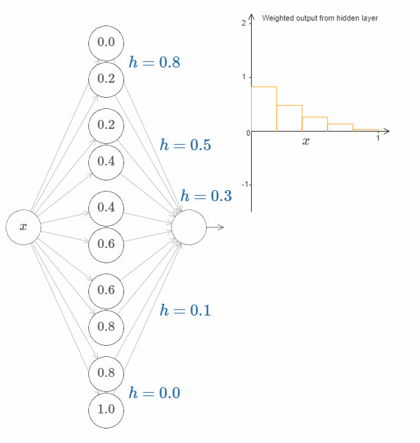

换句话说，我们可以直接操作上图右侧的函数。一件有趣的事情是，你可以按住鼠标，从图的一边移动到另一边，就像画出一条函数曲线一样。在你画完之后，网络的权值也得到了更新。

是时候来个挑战了。

回想本章开头所提及的函数：


当时我并没有提及，这个函数的真实形式是：
$$
f(x) = 0.2 + 0.4x^2 + 0.3x \sin(15x) + 0.05 \cos(50x), \tag{113}
$$
其中 $x$ 和 $y$ 的范围都是从 $0$ 到 $1$。

这显然不是一个简单的函数。

想想我们该如何利用神经网络来计算它呢？

在上述的网络中，我们分析了隐藏神经元的加权输出组合 $\sum_j w_j a_j$。我们现在知道了如何去控制这个数值。但是，正如我前面提到的，这个值并不是*网络*的输出。网络的真实输出为 $\sigma (\sum_j w_j a_j + b)$，其中 $b$ 是输出神经元的bias。有没有什么方法，可以让我们控制网络的输出呢？

解决办法是设计这样一个网络，其隐藏层的加权输出可以用 $\sigma^{-1} \circ f(x)$ 表示，其中 $\sigma^{-1}$ 是 $\sigma$ 函数的反函数。这也就是说，我们希望隐藏层的加权输出为：


如果我们能做到这一点，那么整个网络的输出就会是 $f(x)$ 的一个非常好的近似*。
> *需要注意的是，我将输出神经元的bias设为了 $0$。

接下来的挑战是，设计一个神经网络来近似上面展示的目标函数。为了学习到更多，我希望你解决这个问题两次。第一次是，直接点击图片，改变凸起（译者注：凹陷？凑合翻译着看吧。）的高度。你会发现这是一个非常简单的办法。如何来衡量得到的结果呢？我们将使用*平均偏差（average deviation）* 这个指标来衡量目标函数和网络真实输出之间的差异。你的目标是将平均偏差降低到 $0.40$ 或更低。

当你完成这个目标之后，点击"Reset"按钮去随机地再次初始化凸起，然后开始第二次解决问题：与第一次不同，我们不再直接调整凸起的高度，而是调整图中左边 $h$ 的值，再次尝试将平均偏差降低到 $0.40$ 或更低。

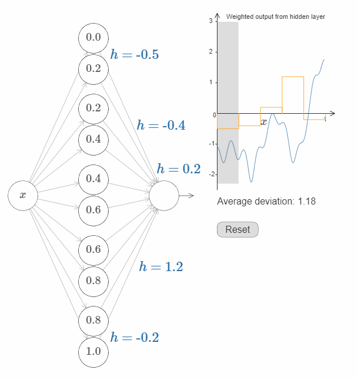

你现在应该明白了如何让网络去近似函数 $f(x)$ 所有必要的基础！虽然这个近似还很粗糙，但是在经过一些很容易的改进之后，我们可以做的更好，即增加隐藏神经元的个数，允许更多的凸起（bumps）！

将我们发现的所有数据转换为神经网络所使用的标准参数化非常简单。让我快速地概括一下它是如何运作的。

第一层的权值都拥有一个非常大的常数，例如 $w = 1000$。

隐藏神经元的biases设置为 $b = - w s$。举例来说，如果第二个隐藏神经元的 $s = 0.2$，则其 $b = -1000 \times 0.2 = -200$。

最后一层的权值由 $h$ 的值决定。假设，你对一个 $h$ 所选的值为 $h = 0.9$，这就是说最上面的两个隐藏神经元的输出权值分别为 $0.9$ 和 $-0.9$。

最后，输出神经元的bias为 $0$。

这就是所有的事情：我们现在拥有一个神经网络的完整描述，它可以很好地近似我们的目标函数。以及我们知道，在增加隐藏神经元的个数之后，我们可以提升近似的表现。

我们的目标函数并没有什么特别的地方，$f(x) = 0.2 + 0.4x^2 + 0.3 \sin (15x) + 0.05 \cos (50x)$。我们可以利用这个步骤，去计算其他输入和输出的范围为 $[0, 1]$ 的任何连续函数。本质上，我们的单层神经网络构建了一个函数的查询表。在这个基础上，我们可以对普遍性原理作出更为一般地证明。

## 多个输入变量
让我们把上面得到的结果推广到拥有多个输入变量的情况。这听起来似乎有点复杂，但是我们只需要去理解在两个输入变量的情况下就可以了。来看看两个输入的情况是如何定义的。

设想我们的神经元拥有两个输入：

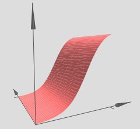

在这里，我们拥有输入 $x$ 和 $y$，相应的权值分别为 $w_1$ 和 $w_2$，神经元的bias为 $b$。让我们先把 $w_2$ 的权值设为 $0$，只操作 $w_1$ 和 $b$，看看它们是如何影响网络的输出的：


如你所看到的，当 $y$ 的 $w_2 = 0$ 的时候，网络的行为与只有一个输入的网络并没有什么区别。

在这个情况下，当 $w_1$ 的权值增加到 $100$，$w_2$ 保持 $0$ 不变，你觉得会发生什么？如果你不能马上想象出来，请思索一会！然后再观看下面的视频。（译者注：抱歉，GIF图片是自动播放的！Hiahiahia！）

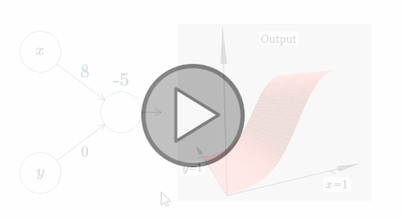

如同我们之前讨论过的，在输入权值边的很大的时候，网络的输出就像一个阶跃函数一样。区别是，现在阶跃函数是三维的。在这个例子里，我们仍旧可以用鼠标在图中操作，例如改变bias的大小来移动阶跃点的位置，即 $s_x \equiv -b / w_1$。

让我们实际操作一下：

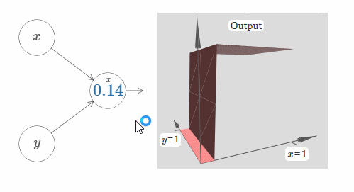

在这里，我们假设输入 $x$ 拥有一个很大的权值，$w_1 = 100, w_2 = 0$。神经元上显示的数字即是阶跃点的大小，数字上面的符号 $x$ 表示阶跃点处于 $x$ 的方向。当然，让阶跃点位于 $y$ 的方向非常简单，只需要给 $w_2$ 一个很大的值，以及让 $w_1 = 0$：

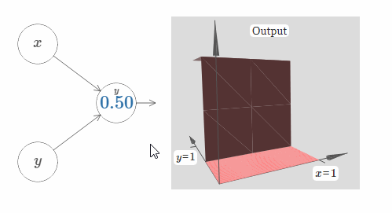

神经元上的数字即是阶跃点的位置，在这个例子中，数字上方的 $y$ 表示了阶跃点的方向与 $y$ 的方向相同。我本来可以在图中标示出 $x$ 和 $y$ 的权值大小，但是我最后决定不这样做，因为这会让图片显得过于混乱。但是你得记住，符号 $y$ 隐含地告诉我们 $y$ 的权值很大，而 $x$ 的权值为 $0$。

我们可以使用刚刚构建的阶跃函数来计算一个三维凸起函数（three-dimensional bump function）。为了做到这一点，我将使用两个神经元，每一个神经元都会计算一个方向与 $x$ 相同的阶跃函数。然后我们分别用权值 $h$ 和 $-h$ 将这些阶跃函数结合起来，$h$ 即为我们所期望的凸起的高度。请看下图：

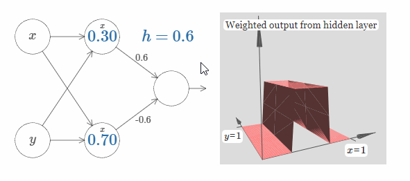

试着改变高度 $h$ 的值，观察它是如何影响网络的权值的，以及它是如何影响凸起函数的高度的。

你也可以试着改变最上隐藏神经元的阶跃点的值。观察凸起的形状会发生什么样地改变。改变最下隐藏神经元的阶跃点的值，会发生什么？

现在我们已经搞清楚如何在 $x$ 的方向构造一个凸起。当然，在 $y$ 的方向构造一个凸起也同样简单：给输入 $y$ 一个大的权值，给输入 $x$ 一个等于 $0$ 的权值。结果如下图所示：


看起来似乎和上面的网络一模一样，唯一的区别是神经元上显示的符号由 $x$ 变为了 $y$。这提醒着我们，生成的是 $y$ 阶跃函数，而不是 $x$ 阶跃函数，输入 $y$ 的权值很大，输入 $x$ 的权值为零。为了避免图表示地过于复杂，我没有在图中标示出这些量值。

现在，让我们添加一个 $x$ 方向的凸起，再添加一个 $y$ 方向的凸起，它们的高度都为 $h$：

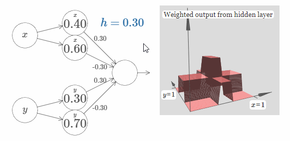

为了简化图片，我没有标出值为零的权值。现在，我仍旧保留了神经元上的 $x$ 和 $y$ 符号，来提醒你凸起的方向。在随后的图片中，这些符号不会再显示，因为输入变量已经隐含地表达了它们的方向。

试着改变参数 $h$ 的值。正如你所看到的，这样会改变输出的权值，以及 $x$ 和 $y$ 凸起函数的高度。

我们所构建的就像是一个*塔函数（tower function）*：


如果我们可以构建这样的塔函数，那么我们就可以使用它们来近似任何函数。只需要添加足够多，在不同位置，有不同高度的塔即可：


当然，现在我们还没有搞清楚如何去构建一个塔函数。我们实际构建的像是一个*中心塔（central tower）*，高度为 $2h$，而它旁边的塔只有 $h$ 的高度。

怎么办呢？回想之前的内容，神经元可以被应用为像是`if-then-else`语句：
```python
if input >= threshold:
	output 1
else:
	output 0
```
这是在神经元只有一个输入的情况下。而我们期望的是把相似的想法应用到隐藏神经元的组合输出里：
```python
if combined output from hidden neurons >= threshold:
	output 1
else:
	output 0
```
如果我们恰当地选择`threshold`的值，例如，$3h/2$，一个介于中心塔和周边塔的高度，我们就可以把周边塔的高度一直挤压到零，最后只留下中心塔。

你知道如何做到这一点吗？在下面的网络中做做实验吧。需要注意的是，我们现在实时地画出了整个网络的输出，而不仅仅是隐藏层的输出。这意味着我们在隐藏层的加权输出后添加了一个bias项，然后应用了sigma函数。你能找到合适的 $h$ 和 $b$ 的值来生成一个塔吗？为了做到这一点，需要一些技巧，所以如果你想了好一会都没有想出来的话，我给你两个小提示：（1）为了让输出神经元表现地像`if-then-else`一样，我们需要输入权值（包括 $h$ 和 $-h$）都变的很大；（2）$b$ 的值决定着`if-then-else`阈值的范围。

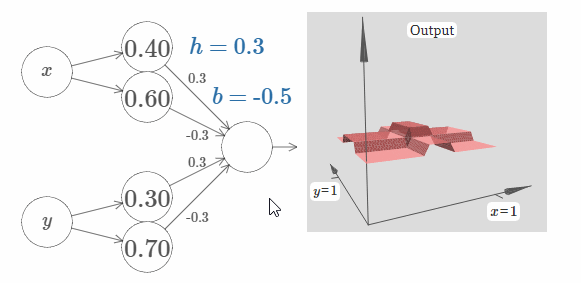

在我们的初始参数下，其输出像是一个之前图像的扁平化版本。为了获得期望的输出，我们先增加参数 $h$ 的值，直到它变得很大。这类似于`if-then-else`阈值的行为。第二，为了获得一个合适的阈值，让我们选择 $b \approx -3h/2$。试一下，看看它效果如何。

下面展示了 $h = 10$ 的情况：

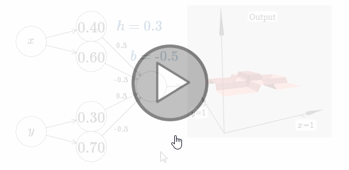

对于这个不算太大的 $h$，我们仍旧获得了一个非常好的塔函数。我们可以不断地增加 $h$ 的值，只需要让 $b = -3h/2$，就可以获得非常不错的结果。

现在让我们尝试使用两个这样的网络，将它们结合起来，从而计算两个不同的塔函数。为了将这两个子网络的行为区分开来，我将它们放于分开的箱子里：每个箱子使用上面介绍的技巧，来计算一个塔函数。而图片右侧展示的是第二个隐藏层的加权输出，也就是说，它是塔函数的加权组合。

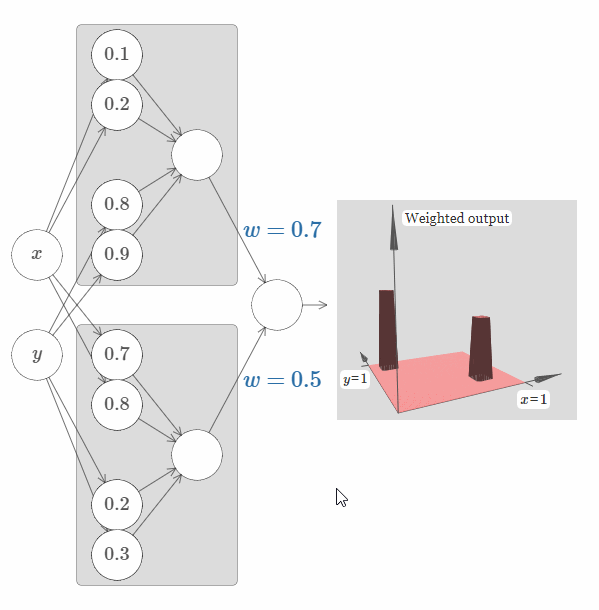

特别地，你可以修改最后一层的权值，从而改变输出的塔的高度。

使用这个技巧，我们可以计算任意多数量的塔。我们也可以定制这些塔的粗细和高度。从而，我们可以保证，第二个隐藏层的加权输出，可以近似任何拥有两个输入的函数：

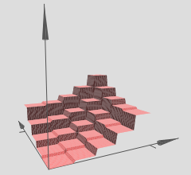

特别地，使第二个隐藏层的加权输出近似于 $\sigma^{-1} \circ f$，我们就可以保证网路的输出将会是任意函数 $f$ 的一个非常好的近似。

如果函数拥有多于两个的输入变量呢？

让我们试试三个变量 $x_1, x_2, x_3$。下面的网络可以用来计算一个四维的塔函数：

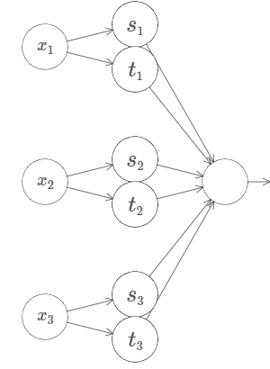

其中，$x_1, x_2, x_3$ 表示网络的输入。$s_1, t_1$ 等表示神经元的阶跃点，也就是说，第一层中的所有权值都很大，biases被用来设置阶跃点 $s_1, t_1, s_2, \dots$。第二层中的权值轮流为 $+h, -h$，其中 $h$ 是某个很大的值。最后，输出bias的值为 $-5h/2$。

这个网络计算的函数有如下行为：在下述三种情况下都满足的时候，输出为 $1$：$x_1$ 介于 $s_1$ 和 $t_1$ 之间；$x_2$ 介于 $s_2$ 和 $t_2$ 之间；以及 $x_3$ 介于 $s_3$ 和 $t_3$ 之间。其他情况下，网络的输出均为 $0$。这也就是说，只有在输入空间中的某个很小的地区里输出为 $1$，其它情况皆为 $0$。

如果使用足够多这样的网络，我们就可以近似任何拥有三个输入变量的函数。同样地，这个结论适用于输入时 $m$ 维的函数。唯一的区别仅仅是让输出bias的值为 $(-m + 1/2)h$。

至此，我们知道了如何利用神经网络来近似任何一个拥有任意多变量的实值函数。这个结论对于向量值函数 $f(x_1, \dots, x_m) \in \mathbb{R}^n$ 也适用吗？当然了，这样的函数可以被认为是 $n$ 个单独的实值函数，$f^1(x_1, \dots, x_m), f^2(x_1, \dots, x_m)$，等等。所以我们可以创建一个近似 $f^1$ 的网络，然后创建一个近似 $f^2$ 的网络，如此反复进行，最后把它们组合在一起。

<h4>难题</h4>

- 我们已经见识到如何利用一个拥有两个隐藏层的神经网络来近似任何函数。你能否证明，只拥有一个隐藏层的神经网络，也可以近似任何函数呢？给你一个提示：先试着解决两个输入变量的情况，然后试着证明：（a）阶跃函数不仅仅可以在 $x$ 或 $y$ 的方向，它可以指向任何方向；（b）在添加类似于（a）这样足够多的组件之后，它可以近似一个形状像圆形（circular）的塔函数，而不是像矩形（rectangular）；（c）使用这样的圆形的塔，就可以近似任意函数。

## 对sigmoid神经元的拓展
我们已经证明了由sigmoid神经元组成的网络可以计算任何函数。对于一个sigmoid神经元，其输出是 $x_1, x_2, \dots$，输出是 $\sigma (\sum_j w_j x_j + b)$，其中 $w_j$ 是权值，$b$ 是bias，$\sigma$ 是sigmoid函数：

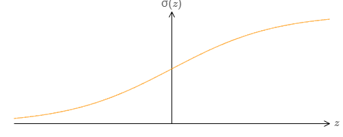

如果我们考虑不同类型的神经元，例如使用其他的激活函数，$s(z)$：

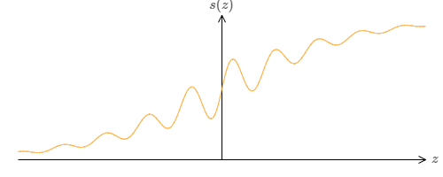

这也就是说，我们假定如果神经元的输入是 $x_1, x_2, \dots$，权值是 $w_1, w_2, \dots$，bias是 $b$，则其输出为 $s(\sum_j w_j x_j + b)$。

我们可以使用这种激活函数来得到一个阶跃函数，就像使用sigmoid一样。试着增加下图中的权值，例如 $w = 100$：

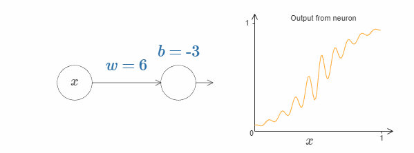

就像sigmoid一样，这会让激活函数收缩，最后非常好地近似于阶跃函数。试着改变bias，你会发现阶跃点的位置会随着变化。使用我们之前的技巧，我们同样可以构造出可以计算任何函数的网络。

那么，函数 $s(z)$ 需要满足什么样的条件呢？我们需要函数 $s(z)$ 在 $z \rarr - \infin$ 和 $z \rarr \infin$ 的时候仍旧有明确的定义。这两个极限是我们的阶跃函数所能承受的两个值。我们仍然需要去确保这两个极限是不相等的。如果它们相等，那么阶跃就会消失，剩下的就是一个平面图（flat graph）了！如果激活函数 $s(z)$ 满足上述的条件，那么基于这些激活函数的神经元，将具有计算上的普遍性。

<h4>难题</h4>

- 在本书的前面部分，我们遇到过另外一种类型的神经元，即纠正线性单元（rectified linear unit, ReLU）。请解释为什么这类神经元不满足上述的普遍性原理的条件。找到一个对于普遍性的证明，证明纠正线性单元对于计算是普遍性的。
- 对于线性神经元，即那些激活函数 $s(z) = z$ 的神经元，请解释为什么线性神经元不满足普遍性原理的条件。证明这些神经元不能用来做普遍性的计算。

## 阶跃函数

到现在为止，我们一直假设我们的神经元可以准确地模仿阶跃函数。当然，这是一个很好的近似，但不管有多好，它仍旧只是一个近似，而不是阶跃函数。事实上，错误的情况也有很小的几率发生，下图表明，在某些情况下，我们生成的函数与阶跃函数表现的非常不同：

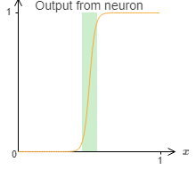

在这些错误的窗口里，我所解释的普遍性将会失效。

现在，这还不是一个特别失败的错误。让加权输入尽可能低大，我们可以让错误窗口尽可能地小。我们可以让上图中的窗口更小更小，小到我们的眼睛都看不见。我们似乎不需要太去关心这个问题。

尽管如此，到底有没有什么办法可以解决这个问题呢？

事实上，这个问题很好去修正。我们首先修正只有一个输入和一个输出的情况。同样的观点可以拓展到多个输入和多个输出。

特别地，设想我们希望网络可以计算某个函数 $f$。在之前，我们试着让网络隐藏层的加权输出为 $\sigma^{-1} \circ f(x)$：

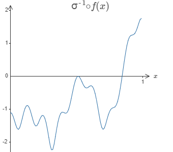

如果我们使用之前介绍的技巧，则隐藏神经元会试着产生如下的凸起函数：

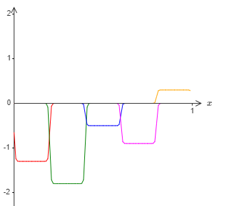

当然，在图里我调大了错误窗口的尺寸，为了让它显示的更为清楚。如果我们使用这些凸起，除了那些窗口处的错误以外，我们最终会得到一个合理的对 $\sigma^{-1} \circ f(x)$ 的近似。

如果我们不使用刚刚描述的近似，而是使用一系列隐藏神经元去近似原始目标函数的一半，即 $\sigma^{-1} \circ f(x) / 2$。这看起来像是上张图片的一个缩小的版本：

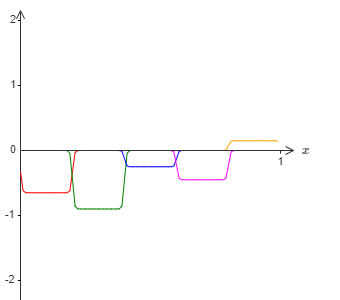

然后我们再用另外一系列隐藏神经元，同样计算 $\sigma^{-1} \circ f(x) / 2$，但是相对于上张图，我们将其平移凸起宽度一半的距离：

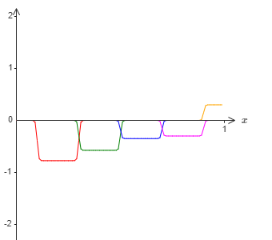

现在我们拥有两个不同的对 $\sigma^{-1} \circ f(x) / 2$ 的近似。如果我们将这两个近似加起来，就会得到一个总体的对 $\sigma^{-1} \circ f(x)$ 的近似。这个总体的近似虽然仍旧存在小窗口的错误，但是错误的程度大大减轻了。其原因在于，位于其中一个窗口的错误的点，在另外一个窗口里不会是错误的。所以我们的近似大致上要比之前的近似要好两倍。

在使用更多的重叠的对于函数 $\sigma^{-1} \circ f(x) / M$ 的近似后，我们还可以得到更好的结果。

## 总结
我们刚刚讨论过的证明，显然不是一个实际的做法。所以，我尽量使的上面的描述更为清晰和容易理解，而不是注重于优化或细节。不过，你也可以试着做做类似的事情，也许会很有启发。

我们得到的结果并不是一个直接有效的构造网络的方式，它的重要性在于回答了神经网络为什么能计算任何函数的问题。所以这个问题由“神经网络能否计算任何函数”变成了“如何让神经网络*更好地*计算函数”。

我们使用了含有两个隐藏层的神经网络证明了其普遍性。类似的结果也适用于仅含有一个隐藏层的神经网络。你也许会好奇，既然这样，那么我们为什么还对深层的网络非常感兴趣呢？我们能不能把这些深层网络替换为浅层或者单层网络？

虽然在原理上这个想法没什么问题，但是使用深层网络有着更为实际的原因。如同在第一章中讨论过的，深层网络拥有一个层级的结构，从而在某些现实的拥有层级知识架构的问题上表现的非常好。更具体地说，在类似于图像识别的问题上，它理解的不只包括单个像素，而是更为复杂的信息：从简单的几何图形到复杂的多目标场景。在下一章中，我们会看到，在学习拥有复杂层级结构的问题上，深层网络要比浅层网络表现的更为出色。总结如下：普遍性原理告诉我们，神经网络可以计算任何函数；实际的结果告诉我们，在许多现实问题中，深度神经网络拥有更杰出的效果。

> **本章致谢**：感谢[Jen Dodd](http://jendodd.com/)和[Chris Olah](http://colah.github.io/about.html)对神经网络中的普遍性原理所作出的许多讨论。尤其是，感谢Chris，她建议用一种查询表（lookup table）的观点来证明普遍性原理。[Mike Bostock](http://bost.ocks.org/mike/algorithms/)、[Amit Patel](http://www-cs-students.stanford.edu/~amitp/)、[Bret Victor](http://worrydream.com/)和[Steven Wittens](http://acko.net/)等人的工作启发了我在本章中使用交互式的视觉形式。

***
**Next：**
[第五章 为什么深度神经网络难以训练？](Chapter-5)
