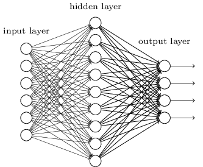
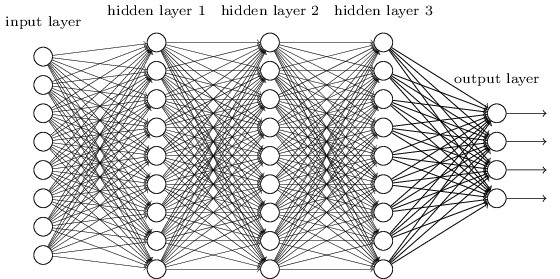
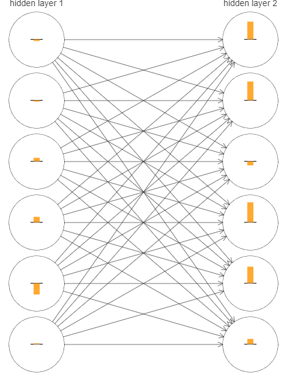
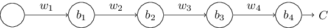
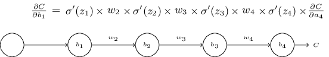
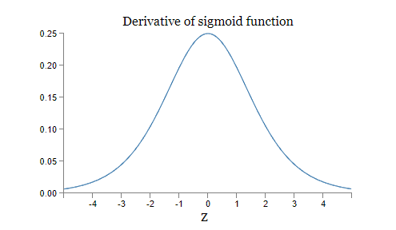

# 为什么深层神经网络难以训练？
设想现在你是一名工程师，你的上司要求你去设计一台计算机。当你在办公室里设计逻辑电路，摆弄各种门电路的时候，你的上司带着一个坏消息走了进来：顾客提出了一个新的设计需求，整个计算机中的电路最多只能有两层！


你表示很吃惊，对上司说：“这个顾客肯定疯了！”

你的上司回复：“我也认为他疯了~不过，顾客是上帝，他要什么就给他什么！”

其实，在某种程度上说，顾客并没有疯。设想你有一个特殊的逻辑电路，可以允许你对任意多的输入进行求和（$\text{AND}$）。而且你还有一个特殊的允许多输入的与非门（$\text{NAND}$），它可以对输出进行求和（$\text{AND}$），然后对输出取非（negate）。在拥有这样的特殊的逻辑电路之后，使用一个仅深为两层的电路，就可以计算任何的函数。

但在实际中，这可能并不是一个好的主意，在解决类似于电路设计问题或者其他任何相似的算法问题时，我们通常从如何解决它的子问题开始思考，然后逐渐把它们整合起来。换句话说，我们构建一个多层抽象来解决问题。

举例来说，设想我们要设计一个逻辑电路，它可以对两个数字进行相乘。我们可以先构建一个子电路，它可以对两个数进行相加。然后，再把它分解为更小的子问题，例如对两个比特进行相加。这样，我们可以非常粗糙的说，电路就像这样：


这也就是说，我们最终的电路最少包含三层组件。当然，随着子问题的不断增多，电路的层数也会随之增加。

看起来，深层的电路，可以让设计的过程变的简单。其实它的作用不仅如此，已经有数学上的证明，对于某些函数的计算，相比于深层电路，浅层的电路需要更多的成指数增长的组件。例如，上世纪八十年代发表的一系列著名的论文*证明了对于比特的奇偶校验计算，浅层的电路需要指数级增长的门组件。换句话说，如果你使用深层电路，只需要很少的电路组件就可以轻松地计算奇偶校验：你只需要先计算一部分比特的奇偶性，然后使用计算的结果再去计算更多的比特，如此反复，可以快速地得到最终的奇偶性。从而深层电路的表现从本质上真正超越了浅层电路。

> *这一段历史比较复杂，所以我不会给出具体的参考。如果你实在有兴趣的话，可以看看Johan Håstad在2012年发表的论文[On the correlation of parity and small-depth circuits](http://eccc.hpi-web.de/report/2012/137/)。

到现在为止，本书表现的就像那个疯狂的顾客一样，我们使用过的所有网络几乎都只有一个隐藏层：



网络虽然简单，但是表现得很不错，在之前的章节里，我们使用的网络在识别手写数字问题上达到了百分之九十八的准确率！尽管表现的已经够好了，但是我们期望一个深层网络会表现的更为强大：



我们可以用之前使用的多层的抽象来构建这样的网络。例如，如果我们打算做视觉模式识别，那么网络中第一层的神经元可能被用来学习识别物体的边，第二层中的神经元被用来识别更复杂的形状，比如三角形或者矩形，第三层用来识别更更复杂的形状，如此类推。这种多层抽象的概念似乎告诉我们，深层网络在解决复杂模式识别问题上会表现的很好。与电路的情况相同，有一些理论上的证明*，深层网络在本质上要比浅层网络更强大。

> *Razvan Pascanu、Guido Montúfar 和 Yoshua Bengio 在一些问题和一些网络结构上证明了这一点，详见 [On the number of response regions of deep feed forward networks with piece-wise linear activations](http://arxiv.org/pdf/1312.6098.pdf)（2014）。更多的讨论，参见 Yoshua Bengio 所写的 [Learning deep architectures for AI](http://www.iro.umontreal.ca/~bengioy/papers/ftml_book.pdf)（2009）的第二章

那么，我们该如何训练这样的深层网络呢？在本章中，我们会尝试使用之前介绍的强大的学习算法——随机梯度下降和反向传播，来训练深层网络。但是结果表明，深层的网络并没有比浅层的网络表现的多好。

为什么会得到这样的结果呢？我们一开始的讨论不是证明深层网络很强大吗？我们会一步一步了解到，为什么我们的深层网络难以训练。当我们看的更仔细的时候，我们会发现，网络中不同层的学习速率有着很大的不同。特别地，当后面的层学习的非常快的时候，前面的层的学习陷入了停滞，它们几乎学不到任何东西了。这种学习上的停滞并不是因为运气不好，随后我们会发现，其中有一些基础的原因导致了学习停滞，而且与我们使用的基于梯度的学习技巧有关。

在我们深入问题之前，我们先来看看另外一个可能发生的相反的现象：前面的层可能学的很好，而后面的层的学习则陷入了停滞。事实上，我们会发现，在深的、多层的网络中用梯度下降进项学习，会有一个内在的不稳定性因素。这种不稳定性因素即有可能导致前面的层的学习陷入停滞，也有可能导致后面的层的学习陷入停滞。

这虽然听起来是个不好的消息，但是在深入了解这种不确定性因素后，我们可以尝试解决这个问题，从而有效率地训练深层的网络。这种探索，将为我们在下一章的内容，图像识别问题，打下良好的基础。

## 梯度消失问题

那么，是什么问题阻碍了我们去训练深层网络呢？

为了回答这个问题，让我们首先考虑只有一个隐藏层的网络。我们依旧使用MNIST数字分类问题来学习和实验。

如果可以的话，你可以在你自己的电脑上训练网络。当然，只阅读本文也是可以的。训练网络需要`Python 2.7`，`Numpy`，以及相应的代码。你可以根据下面的地址来克隆一份代码：

```python
git clone https://github.com/mnielsen/neural-networks-and-deep-learning.git
```

如果你不使用`git`的话，你也可以点击[这里](https://github.com/mnielsen/neural-networks-and-deep-learning/archive/master.zip)下载数据和代码，这需要更改`src`子目录。

> 译者注：Michal Daniel Dobrzanski提供了一份Python 3的代码，地址如下：
>
> ```python
> git clone https://github.com/MichalDanielDobrzanski/DeepLearningPython35.git
> ```
>
> 或点击[这里](https://github.com/MichalDanielDobrzanski/DeepLearningPython35)下载。

然后，在Python命令行中加载MNIST数据：

```python
>>> import mnist_loader
>>> training_data, validation_data, test_data =\
... mnist_loader.load_data_wrapper()
```

设置网络：

```python
>>> import network2
net = network2.Network([784, 30, 10])
```

这个网络的输入层有 $784$ 个神经元，对应图片中 $28 \times 28 = 784$ 个像素。我们使用 $30$ 个隐藏神经元，以及 $10$ 个输出神经元，对应图片中 $10$ 种可能的数字分类，$(0, 1, 2, \dots , 9)$。

让我们试着对网络训练30次完整的epochs，使用大小为10的mini-batch训练样本，学习率设置为 $\eta = 0.1$，正则化系数设置为 $\lambda = 5.0$。在训练的时候，我们跟踪`validation_data`*上分类准确度的变化。

> *这可能花费一些时间去训练网络，取决于你机器的性能。所以在训练的时候，你可以继续阅读本书，无需等待程序运行结束。

```python
>>> net.SGD(training_data, 30, 10, 0.1, lmbda=5.0,
... evaluation_data=validation_data, monitor_evaluation_accuracy=True)
```

最后，我们获得的分类准确度为 $96.48\%​$（实际的结果可能会稍有出入，因为每次运行的结果不会完全相同），与我们之前训练的结果大致相同。

现在，让我们增加一个拥有 $30$ 个神经元的隐藏层，在相同的参数下再训练一次：

```python
>>> net = network2.Network([784, 30, 30, 10])
>>> net.SGD(training_data, 30, 10, 0.1, lmbda=5.0,
... evaluation_data=validation_data, monitor_evaluation_accuracy=True)
```

我们的结果有了一些提升，大约为 $96.90\%$。

这是个令人振奋的结果：多了一层，我们的结果就好了一些！让我们试着再增加一层：

```python
>>> net = network2.Network([784, 30, 30, 30, 10])
>>> net.SGD(training_data, 30, 10, 0.1, lmbda=5.0,
... evaluation_data=validation_data, monitor_evaluation_accuracy=True)
```

我们并没有得到更好的结果！事实上，结果比以前更差，只有 $96.57\%$，和我们原始的浅层网络的表现差不多。让我们试着再加一层：

```python
>>> net = network2.Network([784, 30, 30, 30, 30, 10])
>>> net.SGD(training_data, 30, 10, 0.1, lmbda=5.0,
... evaluation_data=validation_data, monitor_evaluation_accuracy=True)
```

分类准确度又降低了，现在是 $96.53\%$。虽然在数值上并不是一个很显著的降低，但这个结果很糟糕。

网络的表现看起来很奇怪。增加更多的隐藏层，网络应该可以学习到更多更复杂的分类函数，分类效果应该更好才对。就算增加的隐藏层不能提升效果，但为什么效果还会降低？这不科学！

所以到底发生了什么？假如增加的隐藏层真的可以帮助模型去学习，是不是我们的学习算法不能找到正确的权值和biases呢？我们想要搞清楚学习算法到底出了什么问题，以及如何做才能解决这个问题。

为了更好的理解哪里出了错，让我们把网络学习的过程可视化。下面，我画了一个网络的局部图，这个网络的结构是 $[784, 30, 30, 10]$，也就是说，这个网络拥有两个隐藏层，每层拥有 $30$ 个隐藏神经元。图中每个神经元上都有一个很小的矩形标识，它表示神经元在学习的过程中变化的速度。大的矩形意味着神经元的权值和bias变化的非常快，而小的矩形意味着权值和bias变化的非常慢。更准确地说，矩形表示每个神经元的梯度 $\partial C / \partial b$， 即代价的变化对神经元bias的比率。在第二章中，我们知道梯度的大小不仅控制着bias的变化速率，还控制着神经元加权输入的变化速率。如果你没有回忆起这些细节的话，不要担心：你只需要简单地记住，这些矩形代表着在网络学习的过程中，神经元权值和bias的变化速率。

为了让下图更简洁，我只展示了两个隐藏层中最上面的十二个神经元。我忽略了输入神经元，因为它们没有可供学习的权值或biases。我也忽略了输出神经元，因为我们做的是层之间的比较，如果对比的层之间拥有相同的神经元数量，结果会更有意义。图中展示的是网络刚开始训练时的情形*：

> *图片由程序`generate_gradient.py`生成。本节后面的图片也是由该程序生成。



因为该网络是随机初始化的，所以有很多神经元在快速地进行变化。以及，我们发现，第二个隐藏层中神经元的矩形要比第一个隐藏层中神经元的矩形更大。也就是说，第二层中的神经元要比第一层中的神经元变化地更快。这只是一种巧合，还是普遍地，第二层中的神经元要比第一层中的神经元学习的更快？

为了搞清楚其中的原因，我们需要有一种比较不同层学习速率的方法。为了做到这一点，让我们把梯度表示为 $\delta_j^l = \partial C / \partial b_j^l$，即第 $i$ 层中第 $j$ 个神经元的梯度*。我们可以把梯度 $\delta^1$ 看做是一种向量，它代表着第一个隐藏层中神经元学习的速率，$\delta^2$ 看做是第二个隐藏层中神经元学习的速率。然后把这些向量的长度（粗糙地！）看做是每一个隐藏层总的学习速率。例如，长度 $||\delta^1||$ 衡量了第一个隐藏层学习的速率，$||\delta^2||$ 衡量了第二个隐藏层学习的速率。

> *在第二章中我们把这个叫做误差（error），但是在这里我们使用梯度（gradient）这个不正式地叫法。说其”不正式“是因为它显然不是代价对于权值的偏导，$\partial C / \partial w$。

根据这些定义，在上图中我们发现 $||\delta^1|| = 0.07 \dots, ||\delta^2|| = 0.31 \dots$。这证明了我们之前的猜想：第二个隐藏层中的神经元确实要比第一个隐藏层中的神经元学习的快。

如果我们添加更多的隐藏层呢？假设我们的网络有三个隐藏层，$[784, 30, 30, 30, 10]$，则最终得到的学习速度分别是 $0.012, 0.060, 0.283$。我们再次发现，前面的层要比后面的层学的更慢。如果再加一层的话，相应的学习速度分别是 $0.003, 0.017, 0.070, 0.285$。我们确信：前面的层学的更慢。

我们一直关注的是刚开始训练的时候网络的学习速度，也就是说，在网络刚刚初始化之后。那么，在随后训练的过程中，学习速度会有什么变化呢？让我们回到只有两个隐藏层的情况，学习速度的变化如下图所示：


为了得到上述结果，我在 $1,000$ 个训练图片上使用梯度下降，训练了 $500$ 个epochs。这与我们之前通常的训练方法有所不同：我没有使用mini-batch，只利用了 $1,000$ 个训练图片，而不是完整的 $50,000$ 个图片训练集。当然，我并不是想去做一些奇怪的事情，这是因为使用基于mini-batch的随机梯度下降会导致非常多的噪声（如果你能把噪声整合的话，结果与上图是相似的）。所以使用这样的实验设置可以帮助我们更好地理解到底发生了什么。

总之，你可以看到，两个隐藏层在开始训练的时候，学习速度有着很大的差异。然后学习速度有了一个很大的下降，之后开始持续地回升。总的来说，第一个隐藏层的学习速度要慢得多。

如果是更复杂的网络呢？下面展示了拥有三个隐藏层的网络的情况，在相似的设置下：


相似地，前面的隐藏层要比后面的隐藏层学的慢。最后，让我们添加第四个隐藏层：


结果又一次表明，早先的隐藏层学的更慢。在这个示例中，第一层大约要比第四层慢一百倍以上。显然，我们的网络（尤其是前面的隐藏层）遇到了棘手的训练问题！

我们在这里观测到了一个非常重要的现象：至少对于某些深层神经网络来说，其梯度在隐藏层中进行反向传播时，会变得越来越小。这意味着前面的隐藏层中的神经元会学习地非常慢。这个现象出现在很多神经网络中，即 *梯度消失问题\*（vanishing gradient problem）*。

> *你可以参考 Sepp Hochreiter、Yoshua Bengio、Paolo Frasconi 和 Jürgen Schmidhuber 在2001年撰写的论文 [Gradient flow in recurrent nets: the difficulty of learning long-term dependencies](http://citeseerx.ist.psu.edu/viewdoc/summary?doi=10.1.1.24.7321)。以及 Sepp Hochreiter 在1991年于德国发表的学位论文 [Untersuchungen zu dynamischen neuronalen Netzen](http://www.idsia.ch/~juergen/SeppHochreiter1991ThesisAdvisorSchmidhuber.pdf)。

为什么会发生梯度消失问题呢？有没有什么办法可以避免这个问题？在训练深层神经网络的时候该如何解决它呢？事实上，待会我们会知道，这并不是无法避免的。还有一个与此对立的问题，有时候前面的层的梯度会变得非常的大！这也被称为 *梯度爆炸问题（exploding gradient problem）*。更一般地说，在深层神经网络中，梯度表现的非常 *不稳定*，有时候会爆炸，而有时候又会消失。对于深层神经网络来说，这种不稳定性是一个非常重要的问题。我们需要去理解这个问题，并且尝试去解决它。

关于梯度消失或者梯度不稳定，还有另外一种说法：它们真的是有害的吗？先把神经网络放在一边，设想我们试着去最小化一个单变量的函数 $f(x)$。如果它的导数 $f'(x)$ 很小的话，这不应该是一个好消息吗？这不是意味着，我们已经接近了一个极值？所以说，神经网络中前面的层拥有比较小的梯度，是不是说明那些权值和biases已经不需要进行调整了？

当然，情况不是这样。网络中的权值和biases是随机进行初始化的。它们几乎不可能在一开始就调整为合适的值。具体来说，设想在 MNIST 问题中结构为 $[784, 30, 30, 30, 10]$ 的一个网络，对第一个隐藏层中的权值进行随机初始化意味着该层几乎把输入图片中所有的信息都丢弃了。就算后面的层的训练速度很快，它们在辨识输入图片时会非常地困难，因为它们几乎没有得到任何有用的信息。所以说，第一个隐藏层不需要进行学习的说法是不正确的。如果我们想要训练一个深层网络，我们需要知道如何去解决梯度消失问题。

## 是什么导致了梯度消失问题？神经网络中不稳定的梯度

为了深入理解消失问题的原理，让我们来考虑一个最简单的深层神经网络：每一层中只有一个神经元。下面是一个拥有三个隐藏层的网络：



其中，$w_1, w_2, \dots$ 是权值，$b_1, b_2, \dots$ 是 biases， $C$ 是某个代价函数，第 $j$ 个神经元的输出 $a_j$ 是 $\sigma(z_j)$，其中 $\sigma$ 是经常使用的 sigmoid 激活函数，$z_j = w_j a_{j-1} + b_j$ 是神经元的加权输入。我在图中的末尾画出了代价 $C$，是为了强调网络中的代价是网络输出 $a_4$ 的一个函数：如果网络的实际输出接近于期望值，那么代价将会变得很小，反之亦然。

我们现在来看看第一个隐藏神经元的梯度 $\partial C / \partial b_1$。在计算出 $\partial C / \partial b_1$ 的表达式之后，我们将会理解为什么会发生梯度消失问题。

$\partial C / \partial b_1$ 的表达式看起来非常复杂，但其实它有一个很简单的结构，我待会会详细解释它。下面是具体的表达式（先暂时忽略网络，表达式中的 $\sigma'$ 仅仅是 $\sigma$ 函数的导数）：



表达式的结构是这样的：在网络中每一个神经元的乘积中，都有一个 $\sigma'(z_j)$ 项；网络中每一个权值都有一个 $w_j$ 项；以及最后的 $\partial C / \partial a_4$ 项，它对应于最终的代价函数。我把公式中的每一项都放在了图中对应组件的上方，这样也许可以帮助你更好地理解。

你可以忽略下面对表达式的解释，跳到下一节去阅读。这样做并没有什么问题，因为这个例子是我们之前讨论过的反向传播算法的一个特殊例子。当然，这是一个非常简单的对于这个表达式为什么是正确的的解释，所以看看下面这个解释其实是很有趣的（也许可以带给你一些启发）。

设想我们对 bias $b_1$ 做了一个微小的调整 $\Delta b_1$。这会导致网络中产生一系列的级联反应。第一，它使网络中第一个隐藏神经元的输出发生了大小为 $\Delta a_1$ 的改变，这使得第二个隐藏神经元的加权输入发生了大小为 $\Delta z_2$ 的改变。然后第二个隐藏神经元的输出也发生了大小为 $\Delta a_2$ 的改变。如此反复，一直影响到网络最终的代价发生大小为 $\Delta C$ 的改变。我们有
$$
\frac {\partial C}{\partial b_1} \approx \frac {\Delta C}{\Delta b_1}.
\tag{114}
$$
这告诉我们，在小心地跟踪级联中的每一步的影响之后，我们可以计算出梯度 $\partial C / \partial b_1$。

为了做到这一点，让我们思考 $\Delta b_1$ 是如何影响了第一个隐藏神经元的输出 $a_1$。因为 $a_1 = \sigma(z_1) = \sigma(w_1 a_0 + b_1)$，所以
$$
\begin{aligned}
\Delta a_1 &\approx \frac {\partial \sigma(w_1 a_0 + b_1)}{\partial b_1} \Delta b_1 \\
&= \sigma' (z_1) \Delta b_1.
\end{aligned}
\tag{115, 116}
$$
其中 $\sigma`(z_1)$ 项应该看起来非常熟悉：它是我们梯度 $\partial C / \partial b_1$ 表达式中的第一项。直观地说，这一项把 bias 的改变 $\Delta b_1$ 转移到输出激活的改变 $\Delta a_1$。而输出激活的改变 $\Delta a_1$ 相应地对第二个隐藏神经元的加权输入 $z_2 = w_2 a_1 + b_2$ 造成了大小如下的改变：
$$
\begin{aligned}
\Delta z_2 &\approx \frac {\partial z_2}{\partial a_1} \Delta a_1 \\
&= w_2 \Delta a_1.
\end{aligned}
\tag {117, 118}
$$
把 $\Delta z_2$ 和 $\Delta a_1$ 的表达式结合起来，我们可以看到 bias $b_1$ 的改变是如何在网络中传播并对 $z_2$ 产生了影响：
$$
\Delta z_2 \approx \sigma'(z_1) w_2 \Delta b_1.
\tag{119}
$$
这应该看起来依旧很熟悉：我们现在获得了梯度 $\partial C / \partial b_1​$ 表达式中前两项。

我们可以继续这个过程，跟踪网络中其余部分的变化。对于每一个神经元，我们选择 $\sigma'(z_j)$ 项，对于每一个权值，我们选择 $w_j$ 项。最后我们得到在 bias 发生一个大小为 $\Delta b_1$ 的改变后，对最终的代价发生的改变值 $\Delta C$ 的表达式：
$$
\Delta C \approx \sigma'(z_1) w_2 \sigma'(z_2) \dots \sigma'(z_4) \frac {\partial C}{\partial a_4} \Delta b_1. \tag{120}
$$
在除以 $\Delta b_1$ 之后，我们得到了期望的对于梯度的表达式：
$$
\frac {\partial C}{\partial b_1} = \sigma'(z_1) w_2 \sigma'(z_2) \dots \sigma'(z_4) \frac {\partial C}{\partial a_4}. \tag{121}
$$
**为什么会发生梯度消失问题**：为了理解为什么会发生梯度消失问题，我们先写出梯度完整的表达式：
$$
\frac {\partial C}{\partial b_1} = \sigma'(z_1) w_2 \sigma'(z_2) w_3 \sigma'(z_3) w_4 \sigma'(z_4) \frac {\partial C}{\partial a_4}. \tag{122}
$$
除了最后一项，这个表达式是 $w_j \sigma'(z_j)$ 项的乘积。为了理解每一项的行为，让我们看一看函数 $\sigma'$ 是如何变化的：



导数在 $\sigma'(0) = 1 / 4$ 处达到了最大值。现在，我们使用我们标准的方法去初始化网络的权值，即均值为0，标准差为1的高斯分布。所以权值将一直满足 $|w_j| < 1$。我们观察到，$w_j \sigma'(z_j)$ 将一直满足 $|w_j \sigma'(z_j)| < 1 / 4$。如果我们对这样的项进行多次相乘之后，结果将会越来越小。这似乎是梯度消失问题的一种可能的解释。

让我们说的更清楚一点，比较表达式 $\partial C / \partial b_1$ 和之后的某一个梯度对 bias 的表达式，例如 $\partial C / \partial b_3$。当然，我们还没有算出 $\partial C / \partial b_3$ 的表达式，但这个过程和 $\partial C / \partial b_1$ 没什么两样。下面是两个表达式的比较：


这两个表达式有很多相似之处。但是梯度 $\partial C / \partial b_1$ 包含两个额外的项，形式为 $w_j \sigma'(z_j)$。如我们所看到的，这些项的大小都比 $1 / 4$ 要小。所以相应的梯度 $\partial C / \partial b_1$ 将会一直比 $\partial C / \partial b_3$ 小十六分之一以上。这便是梯度消失问题的本质所在。

当然，这是一个不正式的论证，并不是梯度消失问题的一个严谨的证明。这里还有很多其他的问题。特别是，在训练的过程中，梯度 $w_j$ 也可能越来越大。如果是这样的话，那么 $w_j \sigma'(z_j)$ 项也可能不再满足 $|w_j \sigma'(z_j)| < 1 / 4$。确实，如果这些项足够大的话（比1大），那么我们就不会遇到梯度消失问题了。相反，梯度在反向传播的过程中，会指数级地不断增长。所以，虽然没有了梯度消失问题，但梯度爆炸的问题出现了。

**梯度爆炸问题**：让我们看一个梯度爆炸的例子。这个例子是经过特殊设置的：我调整了网络的权值，从而让梯度爆炸发生。虽然这个梯度爆炸的例子是我特意制作的，但是梯度爆炸问题并不仅仅是一种可能的假设，它有时候真的会发生。

模拟梯度爆炸总共有两个步骤。首先，我们让网络中的所有权值都变得很大，例如 $w_1 = w_2 = w_3 = w_4 = 100$。第二，改变 biases 的值，使得 $\sigma'(z_j)$ 项的值不会太小。这很容易去实现：我们只需要保证每个神经元的加权输入 $z_j = 0$，这样的话 $\sigma'(z_j) = 1 / 4$。例如，我们希望 $z_1 = w_1 a_0 + b_1 = 0$。让 $b_1 = - 100 * a_0$ 就可以做到这一点。我们可以使用类似的想法去设置其他 biases 的值。最后我们会看到，所有的 $w_j \sigma'(z_j)$ 项都等于 $100 * \frac 1 4 = 25$。在这样的设置之下，我们就会遇到梯度爆炸问题。

**梯度不稳定问题**：问题的关键并不在于梯度消失问题或者是梯度爆炸问题，而在于网络中前面的层的梯度是网络中所有层的项的乘积。当网络的层很多的时候，就会出现一种不稳定的情况。只有一个办法可以让所有的层拥有相近的学习速度，就是让它们的项的乘积处于一种平衡。如果没有一种机制去做到这一点的话，让它们处于平衡状态几乎是不可能的。所以说，神经网络真正遇到的问题是，*梯度不稳定问题*。如果我们使用标准的基于梯度的学习技巧，网络中不同的层将会拥有差异非常大的学习速度。

<h4>习题</h4>

- 在我们讨论梯度消失问题的时候，我们使用了这样一个表述：$|\sigma'(z)| < 1 / 4$。如果我们使用了一个不同的激活函数，这个激活函数的导数会非常的大。这可以帮助我们避免梯度不稳定问题吗？

**梯度消失问题的盛行**：我们已经看到了梯度在网络中前面的层上可能会发生消失或者爆炸问题。事实上，如果使用 sigmoid 神经元的话，梯度更多会发生消失问题而不是爆炸问题。考虑 $|w \sigma'(z)|$ 项。为了避免梯度消失问题，我们需要 $|w \sigma'(z)| \ge 1$。如果权值非常大的话，你也许会认为这种情况很可能会发生。然而，这种情况发生的可能性很小。原因在于 $\sigma'(z)$ 项还依赖于 $w$：$\sigma'(z) = \sigma'(w a + b)$，其中 $a$ 是输入激活。所以当我们让 $w$ 很大的时候，我们同时需要保证 $\sigma'(w a + b)$ 不会太小。这是一个值得考虑的限制。在 $\sigma $ 函数的图像上，我们可以看到，当 $x$ 非常大或者非常小的时候，其导数会变得非常小。唯一的解决办法是给输入值一个合适的限制范围（见下面的难题）。输入值符合这个范围是有可能的 。但大多数情况下，它并不符合，所以，进而导致了梯度消失问题。

<h4>难题</h4>

- 考虑 $|w \sigma'(wa + b)|$。如果 $|w \sigma'(wa + b)| \ge 1$ 的话，（1）证明在这种情况下 $|w| \ge 4$；（2）如果 $|w| \ge 4$，当 $|w \sigma'(wa+b)| \ge 1$ 的时候，证明输入激活 $a$ 取值范围的长度不大于
  $$
  \frac {2}{|w|} \ln \left ( \frac {|w| (1 + \sqrt{1-4/|w|})}{2} -1  \right ). \tag{123}
  $$
  （3）证明上面的式子在 $|w| \approx 6.9$ 是达到最大，约为 $0.45$。所以就算所有的条件都恰好满足，能避免梯度消失问题的输入激活的取值范围还是很小。

- **恒等神经元（Identity Neuron）**：考虑这样一个神经元，它只有一个输入 $x$，相应的权值为 $w_1$，bias 为 $b$，以及一个输出权值 $w_2$。证明，如果选择合适的权值和 bias，我们可以保证在 $x \in [0, 1]$ 的时候，$w_2 \sigma'(w_1 x + b) \approx x$。这样的神经元可以被看做是恒等神经元，也就是说，它的输出与输入相同（或者有相同的比例）。*提示：你可以把 $x$ 写作 $1 / 2 + \Delta$，假设 $w_1$ 是一个很小的值，然后对 $w_1 \Delta$ 使用泰勒级数展开（Taylor series expansion）来辅助证明。*

## 复杂网络中不稳定的梯度

我们之前实验的网络非常简单，每一层中只有一个隐藏神经元。如果是一个非常复杂的网络，每一层中都有着许多隐藏神经元，情况会有什么变化？


事实上，情况与之前的简单网络并没有什么不同。在前面的章节里，我们知道反向传播的过程中，对于一个 $L$ 层网络，其 $l$ 层的梯度由下面这个公式给出：
$$
\delta^l = \sum'(z^l)(w^{l+1})^T \sum'(z^{l+1})(w^{l+2})^T \dots \sum'(z^L) \nabla_aC. \tag{124}
$$
其中，$\sum'(z^l)$ 是一个对角矩阵，对角元素是第 $l$ 层中 $\sigma'(z)$ 的值。$w^l$ 是不同层的权值矩阵，$\nabla_aC$ 是 $C$ 对输出激活的偏导向量。

相对于单神经元情况下的网络，这是一个非常复杂的表达式。但是其基本的形式是相似的，有着许许多多的 $(w^j)^T \sum'(z^j)​$ 项。以及，矩阵 $\sum'(z^j)​$ 对角线上的值都非常小，不超过 $\frac 1 4​$。当权值矩阵 $w^j​$ 不很大的时候，每一个额外的 $(w^j)^T \sum'(z^l)​$ 项都会让梯度向量变得更小，最后导致梯度消失问题的发生。一般来说，如果这样的项很多的话，其乘积的结果会导致梯度变得不再稳定。在实际中，梯度消失问题一般发生在 sigmoid 网络中，进而导致学习缓慢问题。这种学习缓慢问题并不是巧合，它来自于我们所采用的学习方法。

## 使用深度学习的其他障碍

在本章中我们主要关注了剃度消失问题，或者更一般地说，梯度不稳定问题，是深度学习中的一个障碍。事实上，虽然梯度不稳定问题是深度学习中的一个主要障碍，在深度学习中还有很多其他的障碍。越来越多的研究开始关注于理解和解决这些障碍，我不会在这里完整地总结这些研究，而是简要地介绍几篇论文，给你一个大概的研究者们正在关注的话题。

第一个例子是 Glorot 和 Bengio 在2010年发现*，在深层网络中使用 sigmoid 激活函数会导致一系列问题。特别是，他们发现使用 sigmoid 函数会导致在训练的早期，最后一个隐藏层中的激活会在 0 处饱和，进而发生学习缓慢问题。他们建议使用一些其他的激活函数来避免或减轻这这个饱和问题。

> *[Understanding the difficulty of training deep feedforward neural networks](http://jmlr.org/proceedings/papers/v9/glorot10a/glorot10a.pdf), by Xavier Glorot and Yoshua Bengio (2010). See also the earlier discussion of the use of sigmoids in [Efficient BackProp](http://yann.lecun.com/exdb/publis/pdf/lecun-98b.pdf), by Yann LeCun, Léon Bottou, Genevieve Orr and Klaus-Robert Müller (1998).

第二个例子是 Sutskever、Martens、Dahl 和 Hinton 在2013年*研究了在深度学习下的随机权值初始化和基于动量的随机梯度下降方法中的动量安排（momentum schedule）。在这两种情况下，不同的选择会对训练深层网络的能力造成巨大的影响。

> *[On the importance of initialization and momentum in deep learning](http://www.cs.toronto.edu/~hinton/absps/momentum.pdf), by Ilya Sutskever, James Martens, George Dahl and Geoffrey Hinton (2013).

这些例子都表明，“为什么深层网络难以训练”是一个非常复杂的问题。在本章中，我们主要关注的问题是在基于梯度下降学习算法下的深层网络中的不稳定性。上面两段的结果表明，除了不稳定性，如何选择激活函数，如何初始化权值，甚至是如何计算梯度下降，网络结构的选择，以及其他的超参数的设置等，都是深度学习中非常重要的挑战和障碍。在下一章中，我们会试着去解决这些挑战和障碍，让深度学习真正变得强大起来。

**Next:**
[第六章 深度学习](./Chapter-6.md)